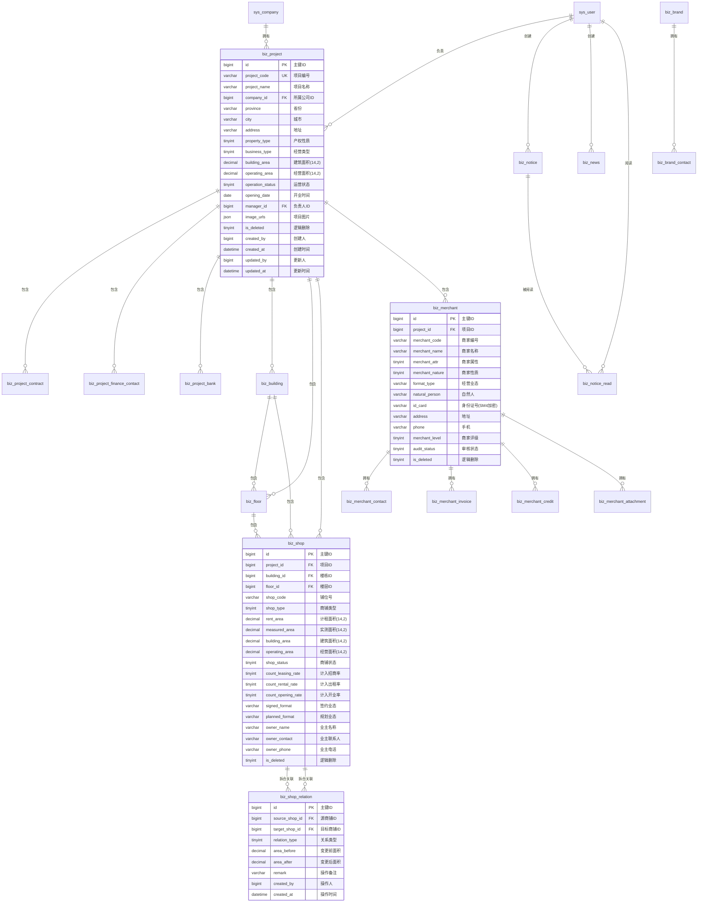

## 1. 数据库ER图（Mermaid格式）



## 2. 修订后的SQL建表语句（MySQL 8.0）

```sql
-- 基础数据管理模块数据库脚本（修订版）
-- 字符集: utf8mb4
-- 引擎: InnoDB
-- 修订日期: 2026-02-16
-- 修订内容: DECIMAL(14,2)、SM4加密、审计字段补齐、商铺关系表、唯一索引调整

-- 1. 系统基础表（简化）
CREATE TABLE sys_company (
    id BIGINT UNSIGNED AUTO_INCREMENT PRIMARY KEY COMMENT '主键ID',
    company_code VARCHAR(50) NOT NULL UNIQUE COMMENT '公司编码',
    company_name VARCHAR(200) NOT NULL COMMENT '公司名称',
    status TINYINT DEFAULT 1 COMMENT '状态:0停用 1启用',
    created_by BIGINT UNSIGNED COMMENT '创建人ID',
    created_at DATETIME DEFAULT CURRENT_TIMESTAMP COMMENT '创建时间',
    updated_by BIGINT UNSIGNED COMMENT '更新人ID',
    updated_at DATETIME DEFAULT CURRENT_TIMESTAMP ON UPDATE CURRENT_TIMESTAMP COMMENT '更新时间',
    INDEX idx_company_code (company_code),
    INDEX idx_status (status)
) ENGINE=InnoDB DEFAULT CHARSET=utf8mb4 COMMENT='公司表';

CREATE TABLE sys_user (
    id BIGINT UNSIGNED AUTO_INCREMENT PRIMARY KEY COMMENT '主键ID',
    username VARCHAR(50) NOT NULL UNIQUE COMMENT '用户名',
    real_name VARCHAR(50) COMMENT '真实姓名',
    status TINYINT DEFAULT 1 COMMENT '状态:0停用 1启用',
    created_at DATETIME DEFAULT CURRENT_TIMESTAMP COMMENT '创建时间',
    updated_at DATETIME DEFAULT CURRENT_TIMESTAMP ON UPDATE CURRENT_TIMESTAMP COMMENT '更新时间',
    INDEX idx_username (username)
) ENGINE=InnoDB DEFAULT CHARSET=utf8mb4 COMMENT='用户表';

-- 2. 项目管理相关表
CREATE TABLE biz_project (
    id BIGINT UNSIGNED AUTO_INCREMENT PRIMARY KEY COMMENT '主键ID',
    project_code VARCHAR(50) NOT NULL COMMENT '项目编号',
    project_name VARCHAR(200) NOT NULL COMMENT '项目名称',
    company_id BIGINT UNSIGNED NOT NULL COMMENT '所属公司ID',
    province VARCHAR(50) COMMENT '所在省份',
    city VARCHAR(50) COMMENT '所在城市',
    address VARCHAR(500) COMMENT '项目地址',
    property_type TINYINT COMMENT '产权性质:1国有 2集体 3私有 4其他',
    business_type TINYINT COMMENT '经营类型:1自持 2租赁 3合作',
    building_area DECIMAL(14,2) DEFAULT 0 COMMENT '建筑面积(㎡)',
    operating_area DECIMAL(14,2) DEFAULT 0 COMMENT '经营面积(㎡)',
    operation_status TINYINT DEFAULT 0 COMMENT '运营状态:0筹备 1开业 2停业',
    opening_date DATE COMMENT '开业时间',
    manager_id BIGINT UNSIGNED COMMENT '负责人ID',
    image_urls JSON COMMENT '项目图片URL数组(JSON)',
    is_deleted TINYINT DEFAULT 0 COMMENT '逻辑删除:0正常 1删除',
    created_by BIGINT UNSIGNED COMMENT '创建人ID',
    created_at DATETIME DEFAULT CURRENT_TIMESTAMP COMMENT '创建时间',
    updated_by BIGINT UNSIGNED COMMENT '更新人ID',
    updated_at DATETIME DEFAULT CURRENT_TIMESTAMP ON UPDATE CURRENT_TIMESTAMP COMMENT '更新时间',
    
    -- 唯一索引改为复合索引（解决逻辑删除冲突）：项目编码+删除标记
    UNIQUE KEY uk_project_code_deleted (project_code, is_deleted),
    INDEX idx_company_id (company_id),
    INDEX idx_manager_id (manager_id),
    INDEX idx_operation_status (operation_status),
    INDEX idx_project_name (project_name),
    INDEX idx_is_deleted (is_deleted),
    
    FOREIGN KEY (company_id) REFERENCES sys_company(id) ON DELETE RESTRICT,
    FOREIGN KEY (manager_id) REFERENCES sys_user(id) ON DELETE SET NULL
) ENGINE=InnoDB DEFAULT CHARSET=utf8mb4 COMMENT='项目表';

CREATE TABLE biz_project_contract (
    id BIGINT UNSIGNED AUTO_INCREMENT PRIMARY KEY COMMENT '主键ID',
    project_id BIGINT UNSIGNED NOT NULL COMMENT '项目ID',
    party_a_name VARCHAR(200) COMMENT '合同甲方抬头',
    party_a_abbr VARCHAR(100) COMMENT '合同甲方缩写',
    party_a_address VARCHAR(500) COMMENT '甲方地址',
    party_a_phone VARCHAR(30) COMMENT '甲方电话',
    business_license VARCHAR(200) COMMENT '营业执照号',
    legal_representative VARCHAR(50) COMMENT '法人代表',
    email VARCHAR(100) COMMENT '邮箱',
    is_deleted TINYINT DEFAULT 0 COMMENT '逻辑删除',
    created_by BIGINT UNSIGNED COMMENT '创建人ID',
    created_at DATETIME DEFAULT CURRENT_TIMESTAMP COMMENT '创建时间',
    updated_by BIGINT UNSIGNED COMMENT '更新人ID',
    updated_at DATETIME DEFAULT CURRENT_TIMESTAMP ON UPDATE CURRENT_TIMESTAMP COMMENT '更新时间',
    
    INDEX idx_project_id (project_id),
    INDEX idx_is_deleted (is_deleted),
    FOREIGN KEY (project_id) REFERENCES biz_project(id) ON DELETE CASCADE
) ENGINE=InnoDB DEFAULT CHARSET=utf8mb4 COMMENT='项目合同甲方信息表';

CREATE TABLE biz_project_finance_contact (
    id BIGINT UNSIGNED AUTO_INCREMENT PRIMARY KEY COMMENT '主键ID',
    project_id BIGINT UNSIGNED NOT NULL COMMENT '项目ID',
    contact_name VARCHAR(50) NOT NULL COMMENT '联系人姓名',
    phone VARCHAR(30) COMMENT '电话',
    email VARCHAR(100) COMMENT '邮箱',
    credit_code VARCHAR(50) COMMENT '社会信用代码',
    seal_type VARCHAR(50) COMMENT '用章类型',
    seal_desc VARCHAR(200) COMMENT '用章说明',
    is_deleted TINYINT DEFAULT 0 COMMENT '逻辑删除',
    created_by BIGINT UNSIGNED COMMENT '创建人ID',
    created_at DATETIME DEFAULT CURRENT_TIMESTAMP COMMENT '创建时间',
    updated_by BIGINT UNSIGNED COMMENT '更新人ID',
    updated_at DATETIME DEFAULT CURRENT_TIMESTAMP ON UPDATE CURRENT_TIMESTAMP COMMENT '更新时间',
    
    INDEX idx_project_id (project_id),
    INDEX idx_is_deleted (is_deleted),
    FOREIGN KEY (project_id) REFERENCES biz_project(id) ON DELETE CASCADE
) ENGINE=InnoDB DEFAULT CHARSET=utf8mb4 COMMENT='财务联系人表';

CREATE TABLE biz_project_bank (
    id BIGINT UNSIGNED AUTO_INCREMENT PRIMARY KEY COMMENT '主键ID',
    project_id BIGINT UNSIGNED NOT NULL COMMENT '项目ID',
    bank_name VARCHAR(200) COMMENT '银行名称',
    bank_account VARCHAR(50) COMMENT '银行账号',
    account_name VARCHAR(100) COMMENT '户名',
    is_default TINYINT DEFAULT 0 COMMENT '是否默认:0否 1是',
    is_deleted TINYINT DEFAULT 0 COMMENT '逻辑删除',
    created_by BIGINT UNSIGNED COMMENT '创建人ID',
    created_at DATETIME DEFAULT CURRENT_TIMESTAMP COMMENT '创建时间',
    updated_by BIGINT UNSIGNED COMMENT '更新人ID',
    updated_at DATETIME DEFAULT CURRENT_TIMESTAMP ON UPDATE CURRENT_TIMESTAMP COMMENT '更新时间',
    
    INDEX idx_project_id (project_id),
    INDEX idx_is_deleted (is_deleted),
    FOREIGN KEY (project_id) REFERENCES biz_project(id) ON DELETE CASCADE
) ENGINE=InnoDB DEFAULT CHARSET=utf8mb4 COMMENT='银行账号表';

-- 3. 楼栋楼层表
CREATE TABLE biz_building (
    id BIGINT UNSIGNED AUTO_INCREMENT PRIMARY KEY COMMENT '主键ID',
    project_id BIGINT UNSIGNED NOT NULL COMMENT '所属项目ID',
    building_code VARCHAR(50) COMMENT '楼栋编码',
    building_name VARCHAR(200) NOT NULL COMMENT '楼栋名称',
    status TINYINT DEFAULT 1 COMMENT '状态:0停用 1启用',
    building_area DECIMAL(14,2) DEFAULT 0 COMMENT '建筑面积(㎡)',
    operating_area DECIMAL(14,2) DEFAULT 0 COMMENT '营业面积(㎡)',
    above_floors INT DEFAULT 0 COMMENT '地上楼层数',
    below_floors INT DEFAULT 0 COMMENT '地下楼层数',
    image_url VARCHAR(500) COMMENT '楼栋平面图URL',
    is_deleted TINYINT DEFAULT 0 COMMENT '逻辑删除',
    created_by BIGINT UNSIGNED COMMENT '创建人ID',
    created_at DATETIME DEFAULT CURRENT_TIMESTAMP COMMENT '创建时间',
    updated_by BIGINT UNSIGNED COMMENT '更新人ID',
    updated_at DATETIME DEFAULT CURRENT_TIMESTAMP ON UPDATE CURRENT_TIMESTAMP COMMENT '更新时间',
    
    -- 复合唯一索引替代单纯UNIQUE
    UNIQUE KEY uk_building_code_project (project_id, building_code, is_deleted),
    INDEX idx_building_name (building_name),
    INDEX idx_status (status),
    INDEX idx_is_deleted (is_deleted),
    
    FOREIGN KEY (project_id) REFERENCES biz_project(id) ON DELETE RESTRICT
) ENGINE=InnoDB DEFAULT CHARSET=utf8mb4 COMMENT='楼栋表';

CREATE TABLE biz_floor (
    id BIGINT UNSIGNED AUTO_INCREMENT PRIMARY KEY COMMENT '主键ID',
    project_id BIGINT UNSIGNED NOT NULL COMMENT '所属项目ID',
    building_id BIGINT UNSIGNED NOT NULL COMMENT '所属楼栋ID',
    floor_code VARCHAR(50) COMMENT '楼层编码',
    floor_name VARCHAR(100) NOT NULL COMMENT '楼层名称',
    status TINYINT DEFAULT 1 COMMENT '状态:0停用 1启用',
    building_area DECIMAL(14,2) DEFAULT 0 COMMENT '建筑面积(㎡)',
    operating_area DECIMAL(14,2) DEFAULT 0 COMMENT '营业面积(㎡)',
    remark VARCHAR(500) COMMENT '备注',
    image_url VARCHAR(500) COMMENT '楼层平面图URL',
    is_deleted TINYINT DEFAULT 0 COMMENT '逻辑删除',
    created_by BIGINT UNSIGNED COMMENT '创建人ID',
    created_at DATETIME DEFAULT CURRENT_TIMESTAMP COMMENT '创建时间',
    updated_by BIGINT UNSIGNED COMMENT '更新人ID',
    updated_at DATETIME DEFAULT CURRENT_TIMESTAMP ON UPDATE CURRENT_TIMESTAMP COMMENT '更新时间',
    
    -- 复合唯一索引
    UNIQUE KEY uk_floor_code_building (building_id, floor_code, is_deleted),
    INDEX idx_project_id (project_id),
    INDEX idx_building_id (building_id),
    INDEX idx_status (status),
    INDEX idx_is_deleted (is_deleted),
    
    FOREIGN KEY (project_id) REFERENCES biz_project(id) ON DELETE RESTRICT,
    FOREIGN KEY (building_id) REFERENCES biz_building(id) ON DELETE RESTRICT
) ENGINE=InnoDB DEFAULT CHARSET=utf8mb4 COMMENT='楼层表';

-- 4. 商铺表（移除物理外键，改为复合索引解决逻辑删除冲突）
CREATE TABLE biz_shop (
    id BIGINT UNSIGNED AUTO_INCREMENT PRIMARY KEY COMMENT '主键ID',
    project_id BIGINT UNSIGNED NOT NULL COMMENT '所属项目ID',
    building_id BIGINT UNSIGNED NOT NULL COMMENT '所属楼栋ID',
    floor_id BIGINT UNSIGNED NOT NULL COMMENT '所在楼层ID',
    shop_code VARCHAR(50) NOT NULL COMMENT '铺位号',
    shop_type TINYINT COMMENT '商铺类型:1临街 2内铺 3专柜',
    rent_area DECIMAL(14,2) DEFAULT 0 COMMENT '计租面积(㎡)',
    measured_area DECIMAL(14,2) DEFAULT 0 COMMENT '实测面积(㎡)',
    building_area DECIMAL(14,2) DEFAULT 0 COMMENT '建筑面积(㎡)',
    operating_area DECIMAL(14,2) DEFAULT 0 COMMENT '经营面积(㎡)',
    shop_status TINYINT DEFAULT 0 COMMENT '商铺状态:0空置 1在租 2自用 3预留',
    count_leasing_rate TINYINT DEFAULT 1 COMMENT '计入招商率:0否 1是',
    count_rental_rate TINYINT DEFAULT 1 COMMENT '计入出租率:0否 1是',
    count_opening_rate TINYINT DEFAULT 1 COMMENT '计入开业率:0否 1是',
    signed_format VARCHAR(100) COMMENT '签约业态',
    planned_format VARCHAR(100) COMMENT '规划业态',
    owner_name VARCHAR(100) COMMENT '业主名称',
    owner_contact VARCHAR(50) COMMENT '业主联系人',
    owner_phone VARCHAR(30) COMMENT '业主电话',
    is_deleted TINYINT DEFAULT 0 COMMENT '逻辑删除:0正常 1删除',
    created_by BIGINT UNSIGNED COMMENT '创建人ID',
    created_at DATETIME DEFAULT CURRENT_TIMESTAMP COMMENT '创建时间',
    updated_by BIGINT UNSIGNED COMMENT '更新人ID',
    updated_at DATETIME DEFAULT CURRENT_TIMESTAMP ON UPDATE CURRENT_TIMESTAMP COMMENT '更新时间',
    
    -- 关键调整：复合唯一索引（项目ID+铺位号+删除标记），解决逻辑删除后无法重建问题
    UNIQUE KEY uk_shop_code_project (project_id, shop_code, is_deleted),
    INDEX idx_building_id (building_id),
    INDEX idx_floor_id (floor_id),
    INDEX idx_shop_status (shop_status),
    INDEX idx_project_status (project_id, shop_status, is_deleted),
    INDEX idx_is_deleted (is_deleted),
    
    -- 外键约束（保留级联限制防止误删）
    FOREIGN KEY (project_id) REFERENCES biz_project(id) ON DELETE RESTRICT,
    FOREIGN KEY (building_id) REFERENCES biz_building(id) ON DELETE RESTRICT,
    FOREIGN KEY (floor_id) REFERENCES biz_floor(id) ON DELETE RESTRICT
) ENGINE=InnoDB DEFAULT CHARSET=utf8mb4 COMMENT='商铺表';

-- 5. 商铺关系表（新增，支持M:N拆分/合并溯源）
CREATE TABLE biz_shop_relation (
    id BIGINT UNSIGNED AUTO_INCREMENT PRIMARY KEY COMMENT '主键ID',
    source_shop_id BIGINT UNSIGNED NOT NULL COMMENT '源商铺ID（拆分前/合并前）',
    target_shop_id BIGINT UNSIGNED NOT NULL COMMENT '目标商铺ID（拆分后/合并后）',
    relation_type TINYINT NOT NULL COMMENT '关系类型:1拆分 2合并',
    area_before DECIMAL(14,2) DEFAULT 0 COMMENT '变更前面积(㎡)',
    area_after DECIMAL(14,2) DEFAULT 0 COMMENT '变更后面积(㎡)',
    remark VARCHAR(500) COMMENT '操作备注（如：拆分原因、合并原因）',
    is_deleted TINYINT DEFAULT 0 COMMENT '逻辑删除',
    created_by BIGINT UNSIGNED COMMENT '操作人ID',
    created_at DATETIME DEFAULT CURRENT_TIMESTAMP COMMENT '操作时间',
    
    INDEX idx_source_shop (source_shop_id),
    INDEX idx_target_shop (target_shop_id),
    INDEX idx_relation_type (relation_type),
    INDEX idx_created_at (created_at),
    
    -- 外键约束
    FOREIGN KEY (source_shop_id) REFERENCES biz_shop(id) ON DELETE RESTRICT,
    FOREIGN KEY (target_shop_id) REFERENCES biz_shop(id) ON DELETE RESTRICT
) ENGINE=InnoDB DEFAULT CHARSET=utf8mb4 COMMENT='商铺拆合关系表';

-- 6. 品牌管理表
CREATE TABLE biz_brand (
    id BIGINT UNSIGNED AUTO_INCREMENT PRIMARY KEY COMMENT '主键ID',
    brand_code VARCHAR(50) COMMENT '品牌编码',
    brand_name_cn VARCHAR(200) NOT NULL COMMENT '品牌名(中)',
    brand_name_en VARCHAR(200) COMMENT '品牌名(英)',
    format_type VARCHAR(100) COMMENT '所属业态',
    brand_level TINYINT COMMENT '品牌等级:1高端 2中端 3大众',
    cooperation_type TINYINT COMMENT '合作关系:1直营 2加盟 3代理',
    business_nature TINYINT COMMENT '经营性质:1餐饮 2零售 3娱乐 4服务',
    chain_type TINYINT COMMENT '连锁类型:1连锁 2单店',
    project_stage VARCHAR(50) COMMENT '项目阶段',
    group_name VARCHAR(200) COMMENT '集团名称',
    hq_address VARCHAR(500) COMMENT '总部地址',
    main_cities VARCHAR(500) COMMENT '主要分布城市',
    website VARCHAR(300) COMMENT '网址',
    phone VARCHAR(30) COMMENT '联系电话',
    brand_type TINYINT COMMENT '品牌类型:1MALL 2商街',
    avg_rent DECIMAL(14,2) COMMENT '平均租金(元/㎡·月)',
    min_customer_price DECIMAL(14,2) COMMENT '最低客单价(元)',
    brand_intro TEXT COMMENT '品牌简介',
    is_deleted TINYINT DEFAULT 0 COMMENT '逻辑删除',
    created_by BIGINT UNSIGNED COMMENT '创建人ID',
    created_at DATETIME DEFAULT CURRENT_TIMESTAMP COMMENT '创建时间',
    updated_by BIGINT UNSIGNED COMMENT '更新人ID',
    updated_at DATETIME DEFAULT CURRENT_TIMESTAMP ON UPDATE CURRENT_TIMESTAMP COMMENT '更新时间',
    
    UNIQUE KEY uk_brand_code_deleted (brand_code, is_deleted),
    INDEX idx_brand_name_cn (brand_name_cn),
    INDEX idx_format_type (format_type),
    INDEX idx_brand_level (brand_level),
    INDEX idx_is_deleted (is_deleted)
) ENGINE=InnoDB DEFAULT CHARSET=utf8mb4 COMMENT='品牌表';

CREATE TABLE biz_brand_contact (
    id BIGINT UNSIGNED AUTO_INCREMENT PRIMARY KEY COMMENT '主键ID',
    brand_id BIGINT UNSIGNED NOT NULL COMMENT '品牌ID',
    contact_name VARCHAR(50) COMMENT '联系人姓名',
    phone VARCHAR(30) COMMENT '电话',
    email VARCHAR(100) COMMENT '邮箱',
    position VARCHAR(50) COMMENT '职位',
    is_primary TINYINT DEFAULT 0 COMMENT '是否主要联系人:0否 1是',
    is_deleted TINYINT DEFAULT 0 COMMENT '逻辑删除',
    created_by BIGINT UNSIGNED COMMENT '创建人ID',
    created_at DATETIME DEFAULT CURRENT_TIMESTAMP COMMENT '创建时间',
    updated_by BIGINT UNSIGNED COMMENT '更新人ID',
    updated_at DATETIME DEFAULT CURRENT_TIMESTAMP ON UPDATE CURRENT_TIMESTAMP COMMENT '更新时间',
    
    INDEX idx_brand_id (brand_id),
    INDEX idx_is_primary (is_primary),
    INDEX idx_is_deleted (is_deleted),
    FOREIGN KEY (brand_id) REFERENCES biz_brand(id) ON DELETE CASCADE
) ENGINE=InnoDB DEFAULT CHARSET=utf8mb4 COMMENT='品牌联系人表';

-- 7. 商家管理表（SM4加密，DECIMAL(14,2)）
CREATE TABLE biz_merchant (
    id BIGINT UNSIGNED AUTO_INCREMENT PRIMARY KEY COMMENT '主键ID',
    project_id BIGINT UNSIGNED NOT NULL COMMENT '所属项目ID',
    merchant_code VARCHAR(50) COMMENT '商家编号',
    merchant_name VARCHAR(200) NOT NULL COMMENT '商家名称',
    merchant_attr TINYINT COMMENT '商家属性:1个体户 2企业',
    merchant_nature TINYINT COMMENT '商家性质:1民营 2国营 3外资 4合资',
    format_type VARCHAR(100) COMMENT '经营业态',
    natural_person VARCHAR(50) COMMENT '自然人姓名',
    id_card VARCHAR(200) COMMENT '身份证号(SM4加密存储，密文长度增加)',
    address VARCHAR(500) COMMENT '地址',
    phone VARCHAR(30) COMMENT '手机',
    merchant_level TINYINT DEFAULT 3 COMMENT '商家评级:1优秀 2良好 3一般 4差',
    audit_status TINYINT DEFAULT 0 COMMENT '审核状态:0待审核 1通过 2驳回',
    is_deleted TINYINT DEFAULT 0 COMMENT '逻辑删除',
    created_by BIGINT UNSIGNED COMMENT '创建人ID',
    created_at DATETIME DEFAULT CURRENT_TIMESTAMP COMMENT '创建时间',
    updated_by BIGINT UNSIGNED COMMENT '更新人ID',
    updated_at DATETIME DEFAULT CURRENT_TIMESTAMP ON UPDATE CURRENT_TIMESTAMP COMMENT '更新时间',
    
    -- 复合唯一索引（项目内编号唯一，支持逻辑删除后重建）
    UNIQUE KEY uk_merchant_code_project (project_id, merchant_code, is_deleted),
    INDEX idx_project_id (project_id),
    INDEX idx_merchant_name (merchant_name),
    INDEX idx_audit_status (audit_status),
    INDEX idx_merchant_level (merchant_level),
    INDEX idx_is_deleted (is_deleted),
    
    FOREIGN KEY (project_id) REFERENCES biz_project(id) ON DELETE RESTRICT
) ENGINE=InnoDB DEFAULT CHARSET=utf8mb4 COMMENT='商家表';

CREATE TABLE biz_merchant_contact (
    id BIGINT UNSIGNED AUTO_INCREMENT PRIMARY KEY COMMENT '主键ID',
    merchant_id BIGINT UNSIGNED NOT NULL COMMENT '商家ID',
    contact_name VARCHAR(50) COMMENT '联系人姓名',
    phone VARCHAR(30) COMMENT '电话',
    email VARCHAR(100) COMMENT '邮箱',
    position VARCHAR(50) COMMENT '职位',
    is_primary TINYINT DEFAULT 0 COMMENT '是否主要联系人',
    is_deleted TINYINT DEFAULT 0 COMMENT '逻辑删除',
    created_by BIGINT UNSIGNED COMMENT '创建人ID',
    created_at DATETIME DEFAULT CURRENT_TIMESTAMP COMMENT '创建时间',
    updated_by BIGINT UNSIGNED COMMENT '更新人ID',
    updated_at DATETIME DEFAULT CURRENT_TIMESTAMP ON UPDATE CURRENT_TIMESTAMP COMMENT '更新时间',
    
    INDEX idx_merchant_id (merchant_id),
    INDEX idx_is_deleted (is_deleted),
    FOREIGN KEY (merchant_id) REFERENCES biz_merchant(id) ON DELETE CASCADE
) ENGINE=InnoDB DEFAULT CHARSET=utf8mb4 COMMENT='商家联系人表';

CREATE TABLE biz_merchant_invoice (
    id BIGINT UNSIGNED AUTO_INCREMENT PRIMARY KEY COMMENT '主键ID',
    merchant_id BIGINT UNSIGNED NOT NULL COMMENT '商家ID',
    invoice_title VARCHAR(200) COMMENT '发票抬头',
    tax_number VARCHAR(50) COMMENT '税号',
    bank_name VARCHAR(200) COMMENT '开户银行',
    bank_account VARCHAR(50) COMMENT '银行账号',
    address VARCHAR(500) COMMENT '注册地址',
    phone VARCHAR(30) COMMENT '注册电话',
    is_default TINYINT DEFAULT 0 COMMENT '是否默认',
    is_deleted TINYINT DEFAULT 0 COMMENT '逻辑删除',
    created_by BIGINT UNSIGNED COMMENT '创建人ID',
    created_at DATETIME DEFAULT CURRENT_TIMESTAMP COMMENT '创建时间',
    updated_by BIGINT UNSIGNED COMMENT '更新人ID',
    updated_at DATETIME DEFAULT CURRENT_TIMESTAMP ON UPDATE CURRENT_TIMESTAMP COMMENT '更新时间',
    
    INDEX idx_merchant_id (merchant_id),
    INDEX idx_is_default (is_default),
    INDEX idx_is_deleted (is_deleted),
    FOREIGN KEY (merchant_id) REFERENCES biz_merchant(id) ON DELETE CASCADE
) ENGINE=InnoDB DEFAULT CHARSET=utf8mb4 COMMENT='商家开票信息表';

CREATE TABLE biz_merchant_credit (
    id BIGINT UNSIGNED AUTO_INCREMENT PRIMARY KEY COMMENT '主键ID',
    merchant_id BIGINT UNSIGNED NOT NULL COMMENT '商家ID',
    record_type TINYINT COMMENT '记录类型:1好评 2差评 3违约 4其他',
    content TEXT COMMENT '记录内容',
    record_date DATE COMMENT '记录日期',
    operator_id BIGINT UNSIGNED COMMENT '操作人ID',
    attachment_url VARCHAR(500) COMMENT '附件URL',
    is_deleted TINYINT DEFAULT 0 COMMENT '逻辑删除',
    created_by BIGINT UNSIGNED COMMENT '创建人ID',
    created_at DATETIME DEFAULT CURRENT_TIMESTAMP COMMENT '创建时间',
    updated_by BIGINT UNSIGNED COMMENT '更新人ID',
    updated_at DATETIME DEFAULT CURRENT_TIMESTAMP ON UPDATE CURRENT_TIMESTAMP COMMENT '更新时间',
    
    INDEX idx_merchant_id (merchant_id),
    INDEX idx_record_type (record_type),
    INDEX idx_is_deleted (is_deleted),
    FOREIGN KEY (merchant_id) REFERENCES biz_merchant(id) ON DELETE CASCADE
) ENGINE=InnoDB DEFAULT CHARSET=utf8mb4 COMMENT='商家诚信记录表';

CREATE TABLE biz_merchant_attachment (
    id BIGINT UNSIGNED AUTO_INCREMENT PRIMARY KEY COMMENT '主键ID',
    merchant_id BIGINT UNSIGNED NOT NULL COMMENT '商家ID',
    file_name VARCHAR(200) COMMENT '文件名称',
    file_url VARCHAR(500) COMMENT '文件URL',
    file_type VARCHAR(50) COMMENT '文件类型',
    file_size BIGINT COMMENT '文件大小(字节)',
    upload_by BIGINT UNSIGNED COMMENT '上传人ID',
    is_deleted TINYINT DEFAULT 0 COMMENT '逻辑删除',
    created_at DATETIME DEFAULT CURRENT_TIMESTAMP COMMENT '创建时间',
    updated_at DATETIME DEFAULT CURRENT_TIMESTAMP ON UPDATE CURRENT_TIMESTAMP COMMENT '更新时间',
    
    INDEX idx_merchant_id (merchant_id),
    INDEX idx_is_deleted (is_deleted),
    FOREIGN KEY (merchant_id) REFERENCES biz_merchant(id) ON DELETE CASCADE
) ENGINE=InnoDB DEFAULT CHARSET=utf8mb4 COMMENT='商家附件表';

-- 8. 内容管理表（移除FULLTEXT，建议走ES）
CREATE TABLE biz_notice (
    id BIGINT UNSIGNED AUTO_INCREMENT PRIMARY KEY COMMENT '主键ID',
    title VARCHAR(300) NOT NULL COMMENT '标题',
    content LONGTEXT COMMENT '内容(富文本HTML)',
    notice_type TINYINT COMMENT '类型:1通知 2公告 3政策',
    status TINYINT DEFAULT 0 COMMENT '状态:0草稿 1已发布 2下架',
    scheduled_time DATETIME COMMENT '定时发送时间',
    publish_time DATETIME COMMENT '实际发布时间',
    create_by BIGINT UNSIGNED COMMENT '创建人ID',
    is_deleted TINYINT DEFAULT 0 COMMENT '逻辑删除',
    created_at DATETIME DEFAULT CURRENT_TIMESTAMP COMMENT '创建时间',
    updated_by BIGINT UNSIGNED COMMENT '更新人ID',
    updated_at DATETIME DEFAULT CURRENT_TIMESTAMP ON UPDATE CURRENT_TIMESTAMP COMMENT '更新时间',
    
    INDEX idx_notice_type (notice_type),
    INDEX idx_status (status),
    INDEX idx_scheduled_time (scheduled_time),
    INDEX idx_create_by (create_by),
    INDEX idx_is_deleted (is_deleted)
    -- 注意：超过5000条后建议停用FULLTEXT，改用Elasticsearch
) ENGINE=InnoDB DEFAULT CHARSET=utf8mb4 COMMENT='通知公告表';

CREATE TABLE biz_notice_read (
    id BIGINT UNSIGNED AUTO_INCREMENT PRIMARY KEY COMMENT '主键ID',
    notice_id BIGINT UNSIGNED NOT NULL COMMENT '公告ID',
    user_id BIGINT UNSIGNED NOT NULL COMMENT '用户ID',
    read_time DATETIME DEFAULT CURRENT_TIMESTAMP COMMENT '阅读时间',
    is_deleted TINYINT DEFAULT 0 COMMENT '逻辑删除',
    created_at DATETIME DEFAULT CURRENT_TIMESTAMP COMMENT '创建时间',
    
    UNIQUE KEY uk_notice_user (notice_id, user_id),
    INDEX idx_user_id (user_id),
    INDEX idx_is_deleted (is_deleted),
    FOREIGN KEY (notice_id) REFERENCES biz_notice(id) ON DELETE CASCADE
) ENGINE=InnoDB DEFAULT CHARSET=utf8mb4 COMMENT='公告阅读记录表';

CREATE TABLE biz_news (
    id BIGINT UNSIGNED AUTO_INCREMENT PRIMARY KEY COMMENT '主键ID',
    title VARCHAR(300) NOT NULL COMMENT '标题',
    content LONGTEXT COMMENT '内容(富文本HTML)',
    category TINYINT COMMENT '分类:1新闻 2政策 3招商 4服务指南',
    status TINYINT DEFAULT 0 COMMENT '状态:0草稿 1上架 2下架',
    publish_time DATETIME COMMENT '发布时间',
    create_by BIGINT UNSIGNED COMMENT '创建人ID',
    is_deleted TINYINT DEFAULT 0 COMMENT '逻辑删除',
    created_at DATETIME DEFAULT CURRENT_TIMESTAMP COMMENT '创建时间',
    updated_by BIGINT UNSIGNED COMMENT '更新人ID',
    updated_at DATETIME DEFAULT CURRENT_TIMESTAMP ON UPDATE CURRENT_TIMESTAMP COMMENT '更新时间',
    
    INDEX idx_category (category),
    INDEX idx_status (status),
    INDEX idx_publish_time (publish_time),
    INDEX idx_create_by (create_by),
    INDEX idx_is_deleted (is_deleted)
) ENGINE=InnoDB DEFAULT CHARSET=utf8mb4 COMMENT='新闻资讯表';
```

## 3. 索引优化建议（修订版）

### 3.1 关键业务索引调整

| 表名 | 索引名 | 字段 | 类型 | 调整说明 |
|------|--------|------|------|----------|
| **biz_project** | uk_project_code_deleted | project_code, is_deleted | 唯一索引 | 原UNIQUE(project_code)改为复合唯一索引，支持逻辑删除后重建 |
| **biz_building** | uk_building_code_project | project_id, building_code, is_deleted | 唯一索引 | 解决逻辑删除冲突 |
| **biz_floor** | uk_floor_code_building | building_id, floor_code, is_deleted | 唯一索引 | 解决逻辑删除冲突 |
| **biz_shop** | uk_shop_code_project | project_id, shop_code, is_deleted | 唯一索引 | **关键调整**：支持删除后重新创建相同编号商铺 |
| **biz_brand** | uk_brand_code_deleted | brand_code, is_deleted | 唯一索引 | 支持逻辑删除后重建 |
| **biz_merchant** | uk_merchant_code_project | project_id, merchant_code, is_deleted | 唯一索引 | 支持逻辑删除后重建 |

### 3.2 虚拟列索引（JSON字段优化）

针对`biz_project.image_urls`等JSON字段的高频查询，建议创建虚拟列索引：

```sql
-- 为项目图片JSON字段创建虚拟列（提取图片数量或特定字段）
ALTER TABLE biz_project 
ADD COLUMN image_count INT GENERATED ALWAYS AS (JSON_LENGTH(image_urls)) STORED,
ADD INDEX idx_image_count (image_count);

-- 如需要按省份+城市快速筛选项目
ALTER TABLE biz_project 
ADD INDEX idx_province_city (province, city, is_deleted);
```

### 3.3 商铺拆合查询优化

```sql
-- 支持查询某商铺的所有历史拆合记录（无论是源还是目标）
CREATE INDEX idx_shop_relation_query ON biz_shop_relation(source_shop_id, target_shop_id, relation_type);

-- 支持按时间追溯拆合历史
CREATE INDEX idx_shop_relation_time ON biz_shop_relation(created_at, relation_type);
```

### 3.4 数据权限控制索引（配合RBAC）

```sql
-- 支持按项目负责人快速查询（数据权限过滤）
CREATE INDEX idx_project_manager ON biz_project(manager_id, is_deleted, operation_status);

-- 支持商家按项目+审核状态筛选（常用在招商审核列表）
CREATE INDEX idx_merchant_audit_query ON biz_merchant(project_id, audit_status, created_at);
```

### 3.5 大表优化建议

1. **分表策略**：当`biz_shop`单项目数据超过100万时，建议按`project_id`进行水平分表或使用分区表（MySQL 8.0支持）
   
2. **归档策略**：已删除数据(is_deleted=1)且创建时间超过2年的，建议迁移至历史库，减轻主库压力

3. **全文搜索迁移**：当`biz_news`、`biz_brand`（brand_intro）数据量超过5000条时，停止使用MySQL的FULLTEXT索引，改用Elasticsearch：
   - 使用Canal监听MySQL binlog同步至ES
   - 搜索接口优先查询ES，详情查询MySQL

## 4. 数据字典文档（修订版）

### 4.1 核心修订说明

| 修订项 | 原设计 | 修订后 | 影响范围 |
|--------|--------|--------|----------|
| 金额/面积精度 | DECIMAL(12,2) | **DECIMAL(14,2)** | 所有财务和面积字段 |
| 加密算法 | AES-256 | **SM4（国密）** | biz_merchant.id_card |
| 商铺溯源 | 单字段parent_shop_id | **M:N关系表** | 新增biz_shop_relation |
| 唯一索引 | 单字段UNIQUE | **复合唯一索引(+is_deleted)** | project_code, shop_code等 |
| 审计字段 | 部分表缺失 | **五件套齐全** | 所有业务表 |

### 4.2 商铺管理模块（关键修订）

#### biz_shop（商铺表）

| 字段名 | 数据类型 | 长度/精度 | 可空 | 默认值 | 说明 | 业务规则修订 |
|--------|----------|-----------|------|--------|------|--------------|
| shop_code | VARCHAR | 50 | 否 | - | 铺位号 | **修订**：取消物理UNIQUE，改为项目内唯一 |
| rent_area | DECIMAL | 14,2 | 是 | 0 | 计租面积 | **修订**：精度(14,2)支持百万平米级 |
| measured_area | DECIMAL | 14,2 | 是 | 0 | 实测面积 | **修订**：精度(14,2) |
| building_area | DECIMAL | 14,2 | 是 | 0 | 建筑面积 | **修订**：精度(14,2) |
| operating_area | DECIMAL | 14,2 | 是 | 0 | 经营面积 | **修订**：精度(14,2) |
| parent_shop_id | BIGINT | - | 是 | - | **已废弃** | **修订**：改用biz_shop_relation表记录关系 |

**唯一索引约束**：
```sql
-- 应用层唯一性校验逻辑（伪代码）
if (exists(select 1 from biz_shop where project_id=? and shop_code=? and is_deleted=0)) {
    throw new DuplicateException("同一项目内铺位号不能重复");
}
-- 数据库层使用复合唯一索引允许删除后重建
UNIQUE KEY uk_shop_code_project (project_id, shop_code, is_deleted)
```

#### biz_shop_relation（商铺拆合关系表 - 新增）

| 字段名 | 数据类型 | 长度/精度 | 可空 | 默认值 | 说明 | 业务规则 |
|--------|----------|-----------|------|--------|------|----------|
| id | BIGINT | - | 否 | 自增 | 主键ID | - |
| source_shop_id | BIGINT | - | 否 | - | 源商铺ID | 拆分前或合并前的商铺ID |
| target_shop_id | BIGINT | - | 否 | - | 目标商铺ID | 拆分后或合并后的新商铺ID |
| relation_type | TINYINT | - | 否 | - | 关系类型 | **1:拆分**（1拆多），**2:合并**（多并1） |
| area_before | DECIMAL | 14,2 | 是 | 0 | 变更前面积 | 用于面积守恒校验记录 |
| area_after | DECIMAL | 14,2 | 是 | 0 | 变更后面积 | 用于面积守恒校验记录 |
| remark | VARCHAR | 500 | 是 | - | 操作备注 | 记录拆分/合并原因 |
| created_by | BIGINT | - | 是 | - | 操作人ID | - |
| created_at | DATETIME | - | 否 | CURRENT_TIMESTAMP | 操作时间 | - |

**拆合业务逻辑示例**：

1. **拆分场景**（1个商铺拆分为3个）：
   - 原商铺A（ID=1，面积=300㎡）标记为is_deleted=1（逻辑删除）
   - 新建商铺B（ID=2，面积=100㎡）、C（ID=3，面积=100㎡）、D（ID=4，面积=100㎡）
   - 插入关系记录：
     - (source_shop_id=1, target_shop_id=2, relation_type=1, area_before=300, area_after=100)
     - (source_shop_id=1, target_shop_id=3, relation_type=1, area_before=300, area_after=100)
     - (source_shop_id=1, target_shop_id=4, relation_type=1, area_before=300, area_after=100)
   - **面积守恒校验**：SUM(area_after) = area_before (100+100+100=300)

2. **合并场景**（3个商铺合并为1个）：
   - 原商铺A（ID=1，面积=100㎡）、B（ID=2，面积=100㎡）、C（ID=3，面积=100㎡）标记为is_deleted=1
   - 新建商铺D（ID=4，面积=300㎡）
   - 插入关系记录：
     - (source_shop_id=1, target_shop_id=4, relation_type=2, area_before=100, area_after=300)
     - (source_shop_id=2, target_shop_id=4, relation_type=2, area_before=100, area_after=300)
     - (source_shop_id=3, target_shop_id=4, relation_type=2, area_before=100, area_after=300)
   - **面积守恒校验**：SUM(area_before) = area_after (100+100+100=300)

### 4.3 商家管理模块（安全修订）

#### biz_merchant（商家表）

| 字段名 | 数据类型 | 长度/精度 | 可空 | 默认值 | 说明 | 安全策略修订 |
|--------|----------|-----------|------|--------|------|--------------|
| id_card | VARCHAR | 200 | 是 | - | 身份证号 | **修订**：SM4加密存储（原AES），密文长度增加 |
| phone | VARCHAR | 30 | 是 | - | 联系电话 | 建议敏感字段同样加密 |

**敏感数据处理规范**：

```java
// 加解密工具类规范（SM4国密算法）
public class SM4CryptoUtil {
    // 加密（入库前）
    public static String encrypt(String plaintext, String secretKey) {
        // 使用sm-crypto库进行SM4 ECB或CBC模式加密
        // 返回Base64编码的密文
    }
    
    // 解密（出库后）
    public static String decrypt(String ciphertext, String secretKey) {
        // SM4解密
    }
    
    // 脱敏展示（前端显示）
    public static String mask(String decryptedText) {
        // 身份证号：110***********1234
        // 手机号：138****8888
    }
}
```

**数据访问审计要求**：
- 所有查询`id_card`字段的操作必须记录审计日志（谁、何时、为何查询）
- 列表接口禁止返回明文身份证号，仅返回脱敏后的字符串
- 详情接口需特殊权限（`merchant:sensitive:view`）才能查看明文

### 4.4 审计字段标准（全表统一）

所有业务表必须包含以下5个审计字段：

| 字段名 | 数据类型 | 说明 | 填充时机 | MyBatis Plus注解 |
|--------|----------|------|----------|------------------|
| is_deleted | TINYINT | 逻辑删除标记 | 删除时更新为1 | @TableLogic |
| created_by | BIGINT | 创建人ID | 插入时填充 | @TableField(fill = FieldFill.INSERT) |
| created_at | DATETIME | 创建时间 | 插入时自动填充 | @TableField(fill = FieldFill.INSERT) |
| updated_by | BIGINT | 更新人ID | 插入和更新时填充 | @TableField(fill = FieldFill.INSERT_UPDATE) |
| updated_at | DATETIME | 更新时间 | 插入和更新时自动填充 | @TableField(fill = FieldFill.INSERT_UPDATE) |

**数据查询规范**：
```sql
-- 所有业务查询必须包含（或通过ORM自动过滤）
WHERE is_deleted = 0

-- 如使用MyBatis Plus，实体类配置：
@TableLogic
private Integer isDeleted;
```

### 4.5 JSON字段使用规范

针对`biz_project.image_urls`等JSON类型字段：

| 属性 | 说明 | 示例 |
|------|------|------|
| 存储格式 | JSON数组，包含url、name、sort字段 | `[{"url":"...","name":"外观图","sort":1}]` |
| 查询方式 | 使用MySQL 8.0 JSON函数 | `JSON_CONTAINS(image_urls, '{"name":"外观图"}')` |
| 索引建议 | 高频查询条件建议创建虚拟列索引 | 见3.2节虚拟列索引 |
| 应用层处理 | 建议缓存反序列化后的对象 | 避免重复解析JSON |

---

**架构合规确认**：
- [x] 所有DECIMAL字段已统一为(14,2)
- [x] 敏感数据加密算法已修正为SM4国密标准
- [x] 所有业务表已补齐created_by/updated_by/updated_at审计字段
- [x] 商铺拆合逻辑已通过biz_shop_relation表支持M:N关系
- [x] 唯一索引已调整为复合索引（包含is_deleted），解决逻辑删除冲突
- [x] 全文搜索建议已备注（超5000条转ES）
- [x] JSON字段已补充虚拟列索引建议
