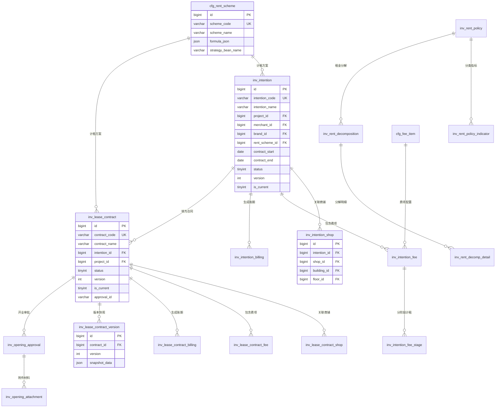

## 1. 数据库ER图（Mermaid格式）



## 2. 完整SQL建表语句（MySQL 8.0）

```sql
-- ============================================
-- 招商管理模块数据库脚本
-- 架构合规：DECIMAL(14,2)统一、审计字段齐全、版本管理、逻辑删除支持
-- ============================================

-- 1. 计租方案配置表（增强公式化配置）
CREATE TABLE cfg_rent_scheme (
    id BIGINT NOT NULL AUTO_INCREMENT COMMENT '主键ID',
    scheme_code VARCHAR(50) NOT NULL COMMENT '方案编码',
    scheme_name VARCHAR(200) NOT NULL COMMENT '方案名称',
    charge_type TINYINT DEFAULT 1 COMMENT '默认收费方式(1固定/2固定提成/3阶梯提成/4取高/5一次性)',
    payment_cycle TINYINT DEFAULT 1 COMMENT '默认支付周期(1月付/2两月付/3季付/4四月付/5半年付/6年付)',
    billing_mode TINYINT DEFAULT 1 COMMENT '默认账期模式(1预付/2当期/3后付)',
    formula_json JSON COMMENT '租金计算公式配置(JSON格式，支持动态参数)',
    strategy_bean_name VARCHAR(100) COMMENT '策略Bean名称(用于Spring策略路由)',
    status TINYINT DEFAULT 1 COMMENT '状态(1启用/0停用)',
    description VARCHAR(500) COMMENT '方案说明',
    created_by BIGINT COMMENT '创建人ID',
    created_at DATETIME NOT NULL DEFAULT CURRENT_TIMESTAMP COMMENT '创建时间',
    updated_by BIGINT COMMENT '更新人ID',
    updated_at DATETIME NOT NULL DEFAULT CURRENT_TIMESTAMP ON UPDATE CURRENT_TIMESTAMP COMMENT '更新时间',
    is_deleted TINYINT NOT NULL DEFAULT 0 COMMENT '逻辑删除(0未删除/1已删除)',
    PRIMARY KEY (id),
    UNIQUE KEY uk_scheme_code_version_deleted (scheme_code, is_deleted, id) COMMENT '编码+删除标记唯一(支持重建)'
) ENGINE=InnoDB DEFAULT CHARSET=utf8mb4 COMMENT='计租方案配置表';

-- 2. 收款项目配置表
CREATE TABLE cfg_fee_item (
    id BIGINT NOT NULL AUTO_INCREMENT COMMENT '主键ID',
    item_code VARCHAR(50) NOT NULL COMMENT '项目编码',
    item_name VARCHAR(100) NOT NULL COMMENT '项目名称(租金/保证金/物管费等)',
    item_type TINYINT COMMENT '类型(1租金类/2保证金类/3服务费类)',
    is_required TINYINT DEFAULT 0 COMMENT '是否必填(0否/1是)',
    sort_order INT COMMENT '排序',
    status TINYINT DEFAULT 1 COMMENT '启用状态(1启用/0停用)',
    created_by BIGINT COMMENT '创建人ID',
    created_at DATETIME NOT NULL DEFAULT CURRENT_TIMESTAMP COMMENT '创建时间',
    updated_by BIGINT COMMENT '更新人ID',
    updated_at DATETIME NOT NULL DEFAULT CURRENT_TIMESTAMP ON UPDATE CURRENT_TIMESTAMP COMMENT '更新时间',
    is_deleted TINYINT NOT NULL DEFAULT 0 COMMENT '逻辑删除(0未删除/1已删除)',
    PRIMARY KEY (id),
    UNIQUE KEY uk_item_code_deleted (item_code, is_deleted)
) ENGINE=InnoDB DEFAULT CHARSET=utf8mb4 COMMENT='收款项目配置表';

-- 3. 意向协议主表（增强版本管理）
CREATE TABLE inv_intention (
    id BIGINT NOT NULL AUTO_INCREMENT COMMENT '主键ID',
    intention_code VARCHAR(50) NOT NULL COMMENT '意向协议编号(系统自动生成)',
    intention_name VARCHAR(200) NOT NULL COMMENT '意向协议名称',
    project_id BIGINT NOT NULL COMMENT '所属项目ID',
    merchant_id BIGINT COMMENT '商家ID',
    brand_id BIGINT COMMENT '意向品牌ID',
    signing_entity VARCHAR(200) COMMENT '签约主体',
    rent_scheme_id BIGINT COMMENT '计租方案ID',
    delivery_date DATE COMMENT '交付日',
    decoration_start DATE COMMENT '装修开始日期',
    decoration_end DATE COMMENT '装修结束日期',
    opening_date DATE COMMENT '开业日',
    contract_start DATE COMMENT '合同开始日期',
    contract_end DATE COMMENT '合同结束日期',
    payment_cycle TINYINT COMMENT '支付周期(1月付/2两月付/3季付/4四月付/5半年付/6年付)',
    billing_mode TINYINT COMMENT '账期模式(1预付/2当期/3后付)',
    status TINYINT DEFAULT 0 COMMENT '状态(0草稿/1审批中/2审批通过/3驳回/4已转合同/5已删除)',
    total_amount DECIMAL(14,2) COMMENT '费用总额',
    agreement_text LONGTEXT COMMENT '协议文本内容',
    approval_id VARCHAR(100) COMMENT '审批流程实例ID',
    version INT DEFAULT 1 COMMENT '版本号',
    is_current TINYINT DEFAULT 1 COMMENT '是否当前版本(1是/0否)',
    created_by BIGINT COMMENT '创建人ID',
    created_at DATETIME NOT NULL DEFAULT CURRENT_TIMESTAMP COMMENT '创建时间',
    updated_by BIGINT COMMENT '更新人ID',
    updated_at DATETIME NOT NULL DEFAULT CURRENT_TIMESTAMP ON UPDATE CURRENT_TIMESTAMP COMMENT '更新时间',
    is_deleted TINYINT NOT NULL DEFAULT 0 COMMENT '逻辑删除(0未删除/1已删除)',
    PRIMARY KEY (id),
    UNIQUE KEY uk_intention_code_version_deleted (intention_code, version, is_deleted) COMMENT '编码+版本+删除标记唯一',
    KEY idx_project_status (project_id, status, is_deleted) COMMENT '项目状态查询',
    KEY idx_merchant (merchant_id, is_deleted) COMMENT '商家查询',
    KEY idx_rent_scheme (rent_scheme_id)
) ENGINE=InnoDB DEFAULT CHARSET=utf8mb4 COMMENT='意向协议主表';

-- 4. 意向协议-商铺关联表（支持一意向多商铺）
CREATE TABLE inv_intention_shop (
    id BIGINT NOT NULL AUTO_INCREMENT COMMENT '主键ID',
    intention_id BIGINT NOT NULL COMMENT '意向协议ID',
    shop_id BIGINT NOT NULL COMMENT '商铺ID',
    building_id BIGINT COMMENT '楼栋ID',
    floor_id BIGINT COMMENT '楼层ID',
    format_type VARCHAR(100) COMMENT '业态',
    area DECIMAL(14,2) COMMENT '租赁面积(平方米)',
    created_by BIGINT COMMENT '创建人ID',
    created_at DATETIME NOT NULL DEFAULT CURRENT_TIMESTAMP COMMENT '创建时间',
    updated_by BIGINT COMMENT '更新人ID',
    updated_at DATETIME NOT NULL DEFAULT CURRENT_TIMESTAMP ON UPDATE CURRENT_TIMESTAMP COMMENT '更新时间',
    is_deleted TINYINT NOT NULL DEFAULT 0 COMMENT '逻辑删除(0未删除/1已删除)',
    PRIMARY KEY (id),
    UNIQUE KEY uk_intention_shop (intention_id, shop_id, is_deleted) COMMENT '意向+商铺唯一',
    KEY idx_shop_intention (shop_id, intention_id) COMMENT '商铺查询意向',
    KEY idx_building_floor (building_id, floor_id)
) ENGINE=InnoDB DEFAULT CHARSET=utf8mb4 COMMENT='意向协议-商铺关联表';

-- 5. 意向协议-费项明细表
CREATE TABLE inv_intention_fee (
    id BIGINT NOT NULL AUTO_INCREMENT COMMENT '主键ID',
    intention_id BIGINT NOT NULL COMMENT '意向协议ID',
    fee_item_id BIGINT COMMENT '收款项目ID',
    fee_name VARCHAR(100) COMMENT '费项名称',
    charge_type TINYINT COMMENT '收费方式(1固定/2固定提成/3阶梯提成/4取高/5一次性)',
    unit_price DECIMAL(14,2) COMMENT '单价(元/平方米/月)',
    area DECIMAL(14,2) COMMENT '面积(平方米)',
    amount DECIMAL(14,2) COMMENT '金额(元)',
    start_date DATE COMMENT '费项开始日期',
    end_date DATE COMMENT '费项结束日期',
    period_index INT COMMENT '租期阶段序号(拆分租期用)',
    formula_params JSON COMMENT '计算公式参数(JSON)',
    created_by BIGINT COMMENT '创建人ID',
    created_at DATETIME NOT NULL DEFAULT CURRENT_TIMESTAMP COMMENT '创建时间',
    updated_by BIGINT COMMENT '更新人ID',
    updated_at DATETIME NOT NULL DEFAULT CURRENT_TIMESTAMP ON UPDATE CURRENT_TIMESTAMP COMMENT '更新时间',
    is_deleted TINYINT NOT NULL DEFAULT 0 COMMENT '逻辑删除(0未删除/1已删除)',
    PRIMARY KEY (id),
    KEY idx_intention_fee (intention_id, fee_item_id),
    KEY idx_charge_type (charge_type)
) ENGINE=InnoDB DEFAULT CHARSET=utf8mb4 COMMENT='意向协议-费项明细表';

-- 6. 意向协议-分铺计租阶段表（支持阶梯租金）
CREATE TABLE inv_intention_fee_stage (
    id BIGINT NOT NULL AUTO_INCREMENT COMMENT '主键ID',
    intention_fee_id BIGINT NOT NULL COMMENT '费项明细ID',
    shop_id BIGINT COMMENT '商铺ID',
    stage_start DATE COMMENT '阶段开始日期',
    stage_end DATE COMMENT '阶段结束日期',
    unit_price DECIMAL(14,2) COMMENT '该阶段单价',
    commission_rate DECIMAL(5,2) COMMENT '提成比例(%)',
    min_commission_amount DECIMAL(14,2) COMMENT '最低提成金额',
    amount DECIMAL(14,2) COMMENT '该阶段金额',
    created_by BIGINT COMMENT '创建人ID',
    created_at DATETIME NOT NULL DEFAULT CURRENT_TIMESTAMP COMMENT '创建时间',
    updated_by BIGINT COMMENT '更新人ID',
    updated_at DATETIME NOT NULL DEFAULT CURRENT_TIMESTAMP ON UPDATE CURRENT_TIMESTAMP COMMENT '更新时间',
    is_deleted TINYINT NOT NULL DEFAULT 0 COMMENT '逻辑删除(0未删除/1已删除)',
    PRIMARY KEY (id),
    KEY idx_fee_stage (intention_fee_id, stage_start)
) ENGINE=InnoDB DEFAULT CHARSET=utf8mb4 COMMENT='意向协议-分铺计租阶段表';

-- 7. 意向协议-账期表
CREATE TABLE inv_intention_billing (
    id BIGINT NOT NULL AUTO_INCREMENT COMMENT '主键ID',
    intention_id BIGINT NOT NULL COMMENT '意向协议ID',
    fee_item_id BIGINT COMMENT '收款项目ID',
    billing_start DATE COMMENT '账期开始',
    billing_end DATE COMMENT '账期结束',
    due_date DATE COMMENT '应收日期',
    amount DECIMAL(14,2) COMMENT '应收金额',
    billing_type TINYINT COMMENT '账期类型(1首账期/2正常账期)',
    status TINYINT DEFAULT 0 COMMENT '收款状态(0未收/1部分/2已收)',
    created_by BIGINT COMMENT '创建人ID',
    created_at DATETIME NOT NULL DEFAULT CURRENT_TIMESTAMP COMMENT '创建时间',
    updated_by BIGINT COMMENT '更新人ID',
    updated_at DATETIME NOT NULL DEFAULT CURRENT_TIMESTAMP ON UPDATE CURRENT_TIMESTAMP COMMENT '更新时间',
    is_deleted TINYINT NOT NULL DEFAULT 0 COMMENT '逻辑删除(0未删除/1已删除)',
    PRIMARY KEY (id),
    KEY idx_intention_billing (intention_id, billing_start, billing_end),
    KEY idx_due_date (due_date)
) ENGINE=InnoDB DEFAULT CHARSET=utf8mb4 COMMENT='意向协议-账期表';

-- 8. 租赁合同主表（增强版本控制与分布式锁标记）
CREATE TABLE inv_lease_contract (
    id BIGINT NOT NULL AUTO_INCREMENT COMMENT '主键ID',
    contract_code VARCHAR(50) NOT NULL COMMENT '租赁合同编码',
    contract_name VARCHAR(200) NOT NULL COMMENT '合同名称',
    project_id BIGINT NOT NULL COMMENT '所属项目ID',
    merchant_id BIGINT COMMENT '商家ID',
    brand_id BIGINT COMMENT '品牌ID',
    intention_id BIGINT COMMENT '来源意向协议ID(意向转合同时)',
    signing_entity VARCHAR(200) COMMENT '签约主体',
    contract_type TINYINT COMMENT '合同类型',
    rent_scheme_id BIGINT COMMENT '计租方案ID',
    delivery_date DATE COMMENT '交付日',
    decoration_start DATE COMMENT '装修开始日期',
    decoration_end DATE COMMENT '装修结束日期',
    opening_date DATE COMMENT '开业日',
    contract_start DATE NOT NULL COMMENT '合同开始日期',
    contract_end DATE NOT NULL COMMENT '合同结束日期',
    payment_cycle TINYINT COMMENT '支付周期(1月付/2两月付/3季付/4四月付/5半年付/6年付)',
    billing_mode TINYINT COMMENT '账期模式(1预付/2当期/3后付)',
    status TINYINT DEFAULT 0 COMMENT '状态(0草稿/1审批中/2生效/3到期/4终止/5已删除)',
    total_amount DECIMAL(14,2) COMMENT '合同总金额',
    contract_text LONGTEXT COMMENT '合同文本',
    approval_id VARCHAR(100) COMMENT '审批流程实例ID',
    version INT DEFAULT 1 COMMENT '版本号(每次变更+1)',
    is_current TINYINT DEFAULT 1 COMMENT '是否当前有效版本(1是/0否)',
    lock_token VARCHAR(100) COMMENT '分布式锁Token(防止并发转合同)',
    created_by BIGINT COMMENT '创建人ID',
    created_at DATETIME NOT NULL DEFAULT CURRENT_TIMESTAMP COMMENT '创建时间',
    updated_by BIGINT COMMENT '更新人ID',
    updated_at DATETIME NOT NULL DEFAULT CURRENT_TIMESTAMP ON UPDATE CURRENT_TIMESTAMP COMMENT '更新时间',
    is_deleted TINYINT NOT NULL DEFAULT 0 COMMENT '逻辑删除(0未删除/1已删除)',
    PRIMARY KEY (id),
    UNIQUE KEY uk_contract_code_version_deleted (contract_code, version, is_deleted) COMMENT '编码+版本+删除标记唯一(支持删除后重建)',
    KEY idx_project_status (project_id, status, is_current, is_deleted) COMMENT '项目状态查询',
    KEY idx_intention (intention_id),
    KEY idx_merchant (merchant_id),
    KEY idx_date_range (contract_start, contract_end) COMMENT '合同期限查询'
) ENGINE=InnoDB DEFAULT CHARSET=utf8mb4 COMMENT='租赁合同主表';

-- 9. 合同版本快照表（支持历史版本追溯）
CREATE TABLE inv_lease_contract_version (
    id BIGINT NOT NULL AUTO_INCREMENT COMMENT '主键ID',
    contract_id BIGINT NOT NULL COMMENT '合同ID',
    version INT NOT NULL COMMENT '版本号',
    snapshot_data JSON NOT NULL COMMENT '完整合同数据快照(JSON格式)',
    change_reason VARCHAR(500) COMMENT '变更原因',
    created_by BIGINT COMMENT '创建人ID',
    created_at DATETIME NOT NULL DEFAULT CURRENT_TIMESTAMP COMMENT '创建时间',
    PRIMARY KEY (id),
    UNIQUE KEY uk_contract_version (contract_id, version),
    KEY idx_created_at (created_at)
) ENGINE=InnoDB DEFAULT CHARSET=utf8mb4 COMMENT='合同版本快照表';

-- 10. 租赁合同-商铺关联表
CREATE TABLE inv_lease_contract_shop (
    id BIGINT NOT NULL AUTO_INCREMENT COMMENT '主键ID',
    contract_id BIGINT NOT NULL COMMENT '租赁合同ID',
    shop_id BIGINT NOT NULL COMMENT '商铺ID',
    building_id BIGINT COMMENT '楼栋ID',
    floor_id BIGINT COMMENT '楼层ID',
    format_type VARCHAR(100) COMMENT '业态',
    area DECIMAL(14,2) COMMENT '租赁面积',
    rent_unit_price DECIMAL(14,2) COMMENT '租金单价',
    property_unit_price DECIMAL(14,2) COMMENT '物管费单价',
    created_by BIGINT COMMENT '创建人ID',
    created_at DATETIME NOT NULL DEFAULT CURRENT_TIMESTAMP COMMENT '创建时间',
    updated_by BIGINT COMMENT '更新人ID',
    updated_at DATETIME NOT NULL DEFAULT CURRENT_TIMESTAMP ON UPDATE CURRENT_TIMESTAMP COMMENT '更新时间',
    is_deleted TINYINT NOT NULL DEFAULT 0 COMMENT '逻辑删除(0未删除/1已删除)',
    PRIMARY KEY (id),
    UNIQUE KEY uk_contract_shop (contract_id, shop_id, is_deleted),
    KEY idx_shop_contract (shop_id, contract_id),
    KEY idx_shop_status (shop_id, is_deleted) COMMENT '商铺状态查询'
) ENGINE=InnoDB DEFAULT CHARSET=utf8mb4 COMMENT='租赁合同-商铺关联表';

-- 11. 租赁合同-费项明细表
CREATE TABLE inv_lease_contract_fee (
    id BIGINT NOT NULL AUTO_INCREMENT COMMENT '主键ID',
    contract_id BIGINT NOT NULL COMMENT '租赁合同ID',
    fee_item_id BIGINT COMMENT '收款项目ID',
    fee_name VARCHAR(100) COMMENT '费项名称',
    charge_type TINYINT COMMENT '收费方式(1固定/2固定提成/3阶梯提成/4取高/5一次性)',
    unit_price DECIMAL(14,2) COMMENT '单价',
    area DECIMAL(14,2) COMMENT '面积',
    amount DECIMAL(14,2) COMMENT '金额',
    start_date DATE COMMENT '费项开始日期',
    end_date DATE COMMENT '费项结束日期',
    period_index INT COMMENT '租期阶段序号',
    formula_params JSON COMMENT '计算公式参数(JSON，与意向费项保持对称，支持转合同后参数追溯)',
    created_by BIGINT COMMENT '创建人ID',
    created_at DATETIME NOT NULL DEFAULT CURRENT_TIMESTAMP COMMENT '创建时间',
    updated_by BIGINT COMMENT '更新人ID',
    updated_at DATETIME NOT NULL DEFAULT CURRENT_TIMESTAMP ON UPDATE CURRENT_TIMESTAMP COMMENT '更新时间',
    is_deleted TINYINT NOT NULL DEFAULT 0 COMMENT '逻辑删除(0未删除/1已删除)',
    PRIMARY KEY (id),
    KEY idx_contract_fee (contract_id, fee_item_id)
) ENGINE=InnoDB DEFAULT CHARSET=utf8mb4 COMMENT='租赁合同-费项明细表';

-- 12. 租赁合同-分铺计租阶段表
CREATE TABLE inv_lease_contract_fee_stage (
    id BIGINT NOT NULL AUTO_INCREMENT COMMENT '主键ID',
    contract_fee_id BIGINT NOT NULL COMMENT '合同费项ID',
    shop_id BIGINT COMMENT '商铺ID',
    stage_start DATE COMMENT '阶段开始日期',
    stage_end DATE COMMENT '阶段结束日期',
    unit_price DECIMAL(14,2) COMMENT '该阶段单价',
    commission_rate DECIMAL(5,2) COMMENT '提成比例(%)',
    min_commission_amount DECIMAL(14,2) COMMENT '最低提成金额(与意向阶段表对称，用于"两者取高"收费方式)',
    amount DECIMAL(14,2) COMMENT '该阶段金额',
    created_by BIGINT COMMENT '创建人ID',
    created_at DATETIME NOT NULL DEFAULT CURRENT_TIMESTAMP COMMENT '创建时间',
    updated_by BIGINT COMMENT '更新人ID',
    updated_at DATETIME NOT NULL DEFAULT CURRENT_TIMESTAMP ON UPDATE CURRENT_TIMESTAMP COMMENT '更新时间',
    is_deleted TINYINT NOT NULL DEFAULT 0 COMMENT '逻辑删除(0未删除/1已删除)',
    PRIMARY KEY (id),
    KEY idx_fee_stage (contract_fee_id)
) ENGINE=InnoDB DEFAULT CHARSET=utf8mb4 COMMENT='租赁合同-分铺计租阶段表';

-- 13. 租赁合同-账期表
CREATE TABLE inv_lease_contract_billing (
    id BIGINT NOT NULL AUTO_INCREMENT COMMENT '主键ID',
    contract_id BIGINT NOT NULL COMMENT '租赁合同ID',
    fee_item_id BIGINT COMMENT '收款项目ID',
    billing_start DATE COMMENT '账期开始',
    billing_end DATE COMMENT '账期结束',
    due_date DATE COMMENT '应收日期',
    amount DECIMAL(14,2) COMMENT '应收金额',
    billing_type TINYINT COMMENT '账期类型(1首账期/2正常账期)',
    status TINYINT DEFAULT 0 COMMENT '收款状态(0未收/1部分/2已收)',
    created_by BIGINT COMMENT '创建人ID',
    created_at DATETIME NOT NULL DEFAULT CURRENT_TIMESTAMP COMMENT '创建时间',
    updated_by BIGINT COMMENT '更新人ID',
    updated_at DATETIME NOT NULL DEFAULT CURRENT_TIMESTAMP ON UPDATE CURRENT_TIMESTAMP COMMENT '更新时间',
    is_deleted TINYINT NOT NULL DEFAULT 0 COMMENT '逻辑删除(0未删除/1已删除)',
    PRIMARY KEY (id),
    KEY idx_contract_billing (contract_id, billing_start),
    KEY idx_due_date (due_date)
) ENGINE=InnoDB DEFAULT CHARSET=utf8mb4 COMMENT='租赁合同-账期表';

-- 14. 开业审批主表
CREATE TABLE inv_opening_approval (
    id BIGINT NOT NULL AUTO_INCREMENT COMMENT '主键ID',
    approval_code VARCHAR(50) COMMENT '审批单号',
    project_id BIGINT NOT NULL COMMENT '项目ID',
    building_id BIGINT COMMENT '楼栋ID',
    floor_id BIGINT COMMENT '楼层ID',
    shop_id BIGINT COMMENT '商铺ID',
    contract_id BIGINT COMMENT '关联合同ID',
    merchant_id BIGINT COMMENT '商家ID',
    planned_opening_date DATE COMMENT '计划开业日期',
    actual_opening_date DATE COMMENT '实际开业日期',
    status TINYINT DEFAULT 0 COMMENT '状态(0待提交/1审批中/2通过/3驳回)',
    approval_id VARCHAR(100) COMMENT '审批流程实例ID',
    remark VARCHAR(500) COMMENT '备注',
    previous_approval_id BIGINT COMMENT '被驳回原单ID(用于数据快照恢复)',
    snapshot_data JSON COMMENT '驳回时数据快照(JSON)',
    created_by BIGINT COMMENT '创建人ID',
    created_at DATETIME NOT NULL DEFAULT CURRENT_TIMESTAMP COMMENT '创建时间',
    updated_by BIGINT COMMENT '更新人ID',
    updated_at DATETIME NOT NULL DEFAULT CURRENT_TIMESTAMP ON UPDATE CURRENT_TIMESTAMP COMMENT '更新时间',
    is_deleted TINYINT NOT NULL DEFAULT 0 COMMENT '逻辑删除(0未删除/1已删除)',
    PRIMARY KEY (id),
    UNIQUE KEY uk_approval_code_deleted (approval_code, is_deleted),
    KEY idx_project_status (project_id, status),
    KEY idx_contract (contract_id),
    KEY idx_shop (shop_id)
) ENGINE=InnoDB DEFAULT CHARSET=utf8mb4 COMMENT='开业审批主表';

-- 15. 开业审批附件表
CREATE TABLE inv_opening_attachment (
    id BIGINT NOT NULL AUTO_INCREMENT COMMENT '主键ID',
    opening_approval_id BIGINT NOT NULL COMMENT '开业审批ID',
    file_name VARCHAR(200) COMMENT '文件名',
    file_url VARCHAR(500) COMMENT '文件地址',
    file_type VARCHAR(50) COMMENT '文件类型',
    file_size BIGINT COMMENT '文件大小(字节)',
    created_by BIGINT COMMENT '创建人ID',
    created_at DATETIME NOT NULL DEFAULT CURRENT_TIMESTAMP COMMENT '创建时间',
    updated_by BIGINT COMMENT '更新人ID',
    updated_at DATETIME NOT NULL DEFAULT CURRENT_TIMESTAMP ON UPDATE CURRENT_TIMESTAMP COMMENT '更新时间',
    is_deleted TINYINT NOT NULL DEFAULT 0 COMMENT '逻辑删除(0未删除/1已删除)',
    PRIMARY KEY (id),
    KEY idx_opening_approval (opening_approval_id)
) ENGINE=InnoDB DEFAULT CHARSET=utf8mb4 COMMENT='开业审批附件表';

-- 16. 租决政策主表
CREATE TABLE inv_rent_policy (
    id BIGINT NOT NULL AUTO_INCREMENT COMMENT '主键ID',
    policy_code VARCHAR(50) COMMENT '租决编号',
    project_id BIGINT NOT NULL COMMENT '项目ID',
    policy_type TINYINT COMMENT '租金决策类型',
    year1_rent DECIMAL(14,2) COMMENT '第一年租金指标',
    year2_rent DECIMAL(14,2) COMMENT '第二年租金指标',
    year1_property_fee DECIMAL(14,2) COMMENT '第一年物业指标',
    year2_property_fee DECIMAL(14,2) COMMENT '第二年物业指标',
    shop_attr VARCHAR(100) COMMENT '适用铺位属性',
    format_type VARCHAR(100) COMMENT '适用业态',
    min_lease_term INT COMMENT '租期范围-最小(月)',
    max_lease_term INT COMMENT '租期范围-最大(月)',
    rent_growth_rate DECIMAL(5,2) COMMENT '租金增长率(%)',
    fee_growth_rate DECIMAL(5,2) COMMENT '管理费增长率(%)',
    free_rent_period INT COMMENT '免租期(月)',
    deposit_months INT COMMENT '租赁保证金月数',
    payment_cycle TINYINT COMMENT '支付周期',
    status TINYINT DEFAULT 0 COMMENT '状态(0草稿/1审批中/2通过/3驳回)',
    approval_id VARCHAR(100) COMMENT '审批流程实例ID',
    created_by BIGINT COMMENT '创建人ID',
    created_at DATETIME NOT NULL DEFAULT CURRENT_TIMESTAMP COMMENT '创建时间',
    updated_by BIGINT COMMENT '更新人ID',
    updated_at DATETIME NOT NULL DEFAULT CURRENT_TIMESTAMP ON UPDATE CURRENT_TIMESTAMP COMMENT '更新时间',
    is_deleted TINYINT NOT NULL DEFAULT 0 COMMENT '逻辑删除(0未删除/1已删除)',
    PRIMARY KEY (id),
    UNIQUE KEY uk_policy_code_deleted (policy_code, is_deleted),
    KEY idx_project_status (project_id, status)
) ENGINE=InnoDB DEFAULT CHARSET=utf8mb4 COMMENT='租决政策主表';

-- 17. 租决政策-分类指标表
CREATE TABLE inv_rent_policy_indicator (
    id BIGINT NOT NULL AUTO_INCREMENT COMMENT '主键ID',
    policy_id BIGINT NOT NULL COMMENT '租决政策ID',
    shop_category TINYINT NOT NULL COMMENT '商铺类别(1主力店/2次主力店/3一般商铺)',
    rent_price DECIMAL(14,2) COMMENT '租金单价(元/㎡·月)',
    property_fee_price DECIMAL(14,2) COMMENT '物管费单价(元/㎡·月)',
    format_type VARCHAR(100) COMMENT '业态',
    rent_growth_rate DECIMAL(5,2) COMMENT '租金增长率(覆盖政策级)',
    fee_growth_rate DECIMAL(5,2) COMMENT '管理费增长率',
    free_rent_months INT COMMENT '免租期(月)',
    deposit_months INT COMMENT '保证金月数',
    created_by BIGINT COMMENT '创建人ID',
    created_at DATETIME NOT NULL DEFAULT CURRENT_TIMESTAMP COMMENT '创建时间',
    updated_by BIGINT COMMENT '更新人ID',
    updated_at DATETIME NOT NULL DEFAULT CURRENT_TIMESTAMP ON UPDATE CURRENT_TIMESTAMP COMMENT '更新时间',
    is_deleted TINYINT NOT NULL DEFAULT 0 COMMENT '逻辑删除(0未删除/1已删除)',
    PRIMARY KEY (id),
    UNIQUE KEY uk_policy_category (policy_id, shop_category, is_deleted),
    KEY idx_policy_id (policy_id)
) ENGINE=InnoDB DEFAULT CHARSET=utf8mb4 COMMENT='租决政策-分类指标表';

-- 18. 租金分解主表
CREATE TABLE inv_rent_decomposition (
    id BIGINT NOT NULL AUTO_INCREMENT COMMENT '主键ID',
    decomp_code VARCHAR(50) COMMENT '租金分解编号',
    project_id BIGINT NOT NULL COMMENT '项目ID',
    policy_id BIGINT NOT NULL COMMENT '关联租决政策ID',
    total_annual_rent DECIMAL(14,2) COMMENT '标准年租金汇总',
    total_annual_fee DECIMAL(14,2) COMMENT '标准年物管费汇总',
    status TINYINT DEFAULT 0 COMMENT '状态(0草稿/1审批中/2通过/3驳回)',
    approval_id VARCHAR(100) COMMENT '审批流程实例ID',
    created_by BIGINT COMMENT '创建人ID',
    created_at DATETIME NOT NULL DEFAULT CURRENT_TIMESTAMP COMMENT '创建时间',
    updated_by BIGINT COMMENT '更新人ID',
    updated_at DATETIME NOT NULL DEFAULT CURRENT_TIMESTAMP ON UPDATE CURRENT_TIMESTAMP COMMENT '更新时间',
    is_deleted TINYINT NOT NULL DEFAULT 0 COMMENT '逻辑删除(0未删除/1已删除)',
    PRIMARY KEY (id),
    UNIQUE KEY uk_decomp_code_deleted (decomp_code, is_deleted),
    KEY idx_project_status (project_id, status),
    KEY idx_policy (policy_id)
) ENGINE=InnoDB DEFAULT CHARSET=utf8mb4 COMMENT='租金分解主表';

-- 19. 租金分解明细表
CREATE TABLE inv_rent_decomp_detail (
    id BIGINT NOT NULL AUTO_INCREMENT COMMENT '主键ID',
    decomp_id BIGINT NOT NULL COMMENT '租金分解ID',
    shop_category TINYINT COMMENT '商铺类别(1主力/2次主力/3一般)',
    format_type VARCHAR(100) COMMENT '业态',
    rent_unit_price DECIMAL(14,2) COMMENT '租金单价',
    property_unit_price DECIMAL(14,2) COMMENT '物管费单价',
    area DECIMAL(14,2) COMMENT '面积',
    annual_rent DECIMAL(14,2) COMMENT '标准年租金',
    annual_fee DECIMAL(14,2) COMMENT '标准年物管费',
    remark VARCHAR(500) COMMENT '备注',
    created_by BIGINT COMMENT '创建人ID',
    created_at DATETIME NOT NULL DEFAULT CURRENT_TIMESTAMP COMMENT '创建时间',
    updated_by BIGINT COMMENT '更新人ID',
    updated_at DATETIME NOT NULL DEFAULT CURRENT_TIMESTAMP ON UPDATE CURRENT_TIMESTAMP COMMENT '更新时间',
    is_deleted TINYINT NOT NULL DEFAULT 0 COMMENT '逻辑删除(0未删除/1已删除)',
    PRIMARY KEY (id),
    KEY idx_decomp_category (decomp_id, shop_category)
) ENGINE=InnoDB DEFAULT CHARSET=utf8mb4 COMMENT='租金分解明细表';

-- 20. 商铺关系表（用于拆合校验）
CREATE TABLE biz_shop_relation (
    id BIGINT NOT NULL AUTO_INCREMENT COMMENT '主键ID',
    parent_shop_id BIGINT COMMENT '父级商铺ID(拆分前/合并后)',
    child_shop_id BIGINT COMMENT '子级商铺ID(拆分后/合并前)',
    relation_type TINYINT COMMENT '关系类型(1拆分/2合并)',
    status TINYINT DEFAULT 1 COMMENT '状态(1有效/0无效)',
    start_date DATE COMMENT '生效日期',
    end_date DATE COMMENT '失效日期',
    created_by BIGINT COMMENT '创建人ID',
    created_at DATETIME NOT NULL DEFAULT CURRENT_TIMESTAMP COMMENT '创建时间',
    updated_by BIGINT COMMENT '更新人ID',
    updated_at DATETIME NOT NULL DEFAULT CURRENT_TIMESTAMP ON UPDATE CURRENT_TIMESTAMP COMMENT '更新时间',
    is_deleted TINYINT NOT NULL DEFAULT 0 COMMENT '逻辑删除(0未删除/1已删除)',
    PRIMARY KEY (id),
    KEY idx_parent_child (parent_shop_id, child_shop_id),
    KEY idx_relation_type (relation_type, status)
) ENGINE=InnoDB DEFAULT CHARSET=utf8mb4 COMMENT='商铺关系表(拆合校验)';
```

## 3. 索引优化建议

### 3.1 核心查询场景索引

| 场景 | 推荐索引 | 说明 |
|------|----------|------|
| **意向协议列表查询** | `idx_project_status(project_id, status, is_deleted)` | 覆盖IA-01按项目+状态筛选 |
| **合同编码唯一性** | `uk_contract_code_version_deleted(contract_code, version, is_deleted)` | 支持逻辑删除后重建，版本控制 |
| **商铺状态查询** | `idx_shop_status(shop_id, is_deleted)` | 快速查询商铺当前签约状态 |
| **账期应收查询** | `idx_due_date(due_date)` + `idx_contract_billing(contract_id, billing_start)` | 支持账期管理和收款提醒 |
| **意向转合同关联** | `idx_intention(intention_id)` | 快速查询意向关联的合同 |

### 3.2 复合索引策略

```sql
-- 高频列表查询优化（意向协议多条件筛选）
CREATE INDEX idx_intention_multi ON inv_intention(
    project_id, 
    status, 
    is_deleted, 
    created_at
) COMMENT '覆盖项目+状态+时间排序查询';

-- 合同到期预警查询
CREATE INDEX idx_contract_end ON inv_lease_contract(
    contract_end, 
    status, 
    is_current,
    is_deleted
) COMMENT '支持合同到期前自动提醒';

-- 租金分解业务查询
CREATE INDEX idx_decomp_business ON inv_rent_decomposition(
    project_id, 
    policy_id, 
    status
) COMMENT '关联租决政策查询';
```

### 3.3 分布式锁相关索引

```sql
-- 用于意向转合同时快速检查商铺占用状态
-- 注意：MySQL 8.0 不支持部分索引(Partial Index)，此处改为普通复合索引
-- 查询时需在 WHERE 条件中显式加 is_deleted = 0 以利用该索引
CREATE INDEX idx_shop_contract_active ON inv_lease_contract_shop(
    shop_id, 
    is_deleted
) COMMENT '商铺有效合同查询（MySQL普通索引，查询时需携带 is_deleted=0 条件）';

-- 配合Redis锁Token查询
-- 注意：MySQL 8.0 不支持 WHERE 过滤的部分索引，改为普通索引
-- lock_token 为 NULL 时不会被查询命中，普通索引开销可接受
CREATE INDEX idx_lock_token ON inv_lease_contract(lock_token)
COMMENT '分布式锁Token查询（MySQL普通索引）';
```

## 4. 数据字典文档

### 4.1 公共字段规范（所有表）

| 字段名 | 类型 | 说明 | 示例值 |
|--------|------|------|--------|
| `id` | BIGINT | 主键，自增 | 1000001 |
| `created_by` | BIGINT | 创建人ID（用户中心关联） | 5001 |
| `created_at` | DATETIME | 创建时间（默认CURRENT_TIMESTAMP） | 2026-02-17 10:30:00 |
| `updated_by` | BIGINT | 最后更新人ID | 5002 |
| `updated_at` | DATETIME | 更新时间（自动更新） | 2026-02-17 15:45:00 |
| `is_deleted` | TINYINT | 逻辑删除标记（0=正常，1=已删除） | 0 |

### 4.2 状态枚举值字典

| 表名 | 字段名 | 枚举值 | 含义 |
|------|--------|--------|------|
| **inv_intention** | `status` | 0 | 草稿 |
| | | 1 | 审批中 |
| | | 2 | 审批通过 |
| | | 3 | 驳回 |
| | | 4 | 已转合同 |
| | | 5 | 已删除 |
| **inv_lease_contract** | `status` | 0 | 草稿 |
| | | 1 | 审批中 |
| | | 2 | 生效 |
| | | 3 | 到期 |
| | | 4 | 终止 |
| | | 5 | 已删除 |
| **inv_opening_approval** | `status` | 0 | 待提交 |
| | | 1 | 审批中 |
| | | 2 | 通过 |
| | | 3 | 驳回 |
| **inv_rent_policy**<br>**inv_rent_decomposition** | `status` | 0 | 草稿 |
| | | 1 | 审批中 |
| | | 2 | 通过 |
| | | 3 | 驳回 |

### 4.3 业务类型字典

| 字段名 | 类型 | 枚举值 | 含义 | 适用表 |
|--------|------|--------|------|--------|
| `charge_type` | TINYINT | 1 | 固定租金 | cfg_rent_scheme<br>inv_intention_fee<br>inv_lease_contract_fee |
| | | 2 | 固定提成 | |
| | | 3 | 阶梯提成 | |
| | | 4 | 两者取高 | |
| | | 5 | 一次性收费 | |
| `payment_cycle` | TINYINT | 1 | 月付 | inv_intention<br>inv_lease_contract<br>cfg_rent_scheme |
| | | 2 | 两月付 | |
| | | 3 | 季付 | |
| | | 4 | 四月付 | |
| | | 5 | 半年付 | |
| | | 6 | 年付 | |
| `billing_mode` | TINYINT | 1 | 预付 | inv_intention<br>inv_lease_contract |
| | | 2 | 当期 | |
| | | 3 | 后付 | |
| `shop_category` | TINYINT | 1 | 主力店 | inv_rent_policy_indicator<br>inv_rent_decomp_detail |
| | | 2 | 次主力店 | |
| | | 3 | 一般商铺 | |

### 4.4 核心业务字段详解

#### 意向协议/合同金额计算链

| 表 | 字段 | 精度 | 计算逻辑 | 示例 |
|----|------|------|----------|------|
| `inv_intention_fee` | `unit_price` | DECIMAL(14,2) | 元/㎡·月 | 150.00 |
| | `area` | DECIMAL(14,2) | 平方米 | 100.50 |
| | `amount` | DECIMAL(14,2) | unit_price × area × 月数 | 150,750.00 |
| `inv_intention` | `total_amount` | DECIMAL(14,2) | ∑所有费项amount | 452,250.00 |

#### 版本控制字段（合同表）

| 字段 | 类型 | 说明 | 业务规则 |
|------|------|------|----------|
| `version` | INT | 版本号 | 初始为1，每次变更+1，意向转合同时从意向版本继承 |
| `is_current` | TINYINT | 是否当前版本 | 1=当前有效版本（查询默认条件），0=历史版本 |
| `lock_token` | VARCHAR(100) | 分布式锁标识 | 意向转合同时写入Redis锁Token，防止并发重复签约 |

#### 租金分解计算字段

| 表 | 字段 | 计算公式 | 说明 |
|----|------|----------|------|
| `inv_rent_decomp_detail` | `annual_rent` | rent_unit_price × area × 12 | 标准年租金 |
| | `annual_fee` | property_unit_price × area × 12 | 标准年物管费 |
| `inv_rent_decomposition` | `total_annual_rent` | ∑annual_rent | 自动汇总 |
| | `total_annual_fee` | ∑annual_fee | 自动汇总 |

#### 开业审批特殊字段

| 字段 | 类型 | 业务含义 |
|------|------|----------|
| `previous_approval_id` | BIGINT | 被驳回的原单ID，用于新建时自动填充历史数据 |
| `snapshot_data` | JSON | 驳回时自动保存的完整数据快照，格式见下方 JSON Schema |

**`snapshot_data` 完整 JSON Schema 示例：**

```json
{
  "basic": {
    "project_id": 1001,
    "building_id": 201,
    "floor_id": 301,
    "shop_id": 4001,
    "contract_id": 5001,
    "merchant_id": 6001,
    "planned_opening_date": "2026-05-01",
    "actual_opening_date": null,
    "remark": "备注说明"
  },
  "attachments": [
    {
      "file_name": "营业执照.pdf",
      "file_url": "https://oss.example.com/files/xxx.pdf",
      "file_type": "pdf",
      "file_size": 204800
    }
  ],
  "snapshot_at": "2026-02-20T10:30:00",
  "snapshot_by": 5001
}
```

### 4.5 关键约束说明

| 约束名 | 类型 | 作用 | 所在表 |
|--------|------|------|--------|
| `uk_contract_code_version_deleted` | 复合唯一 | 确保同一编码下，不同版本可同时存在，但同版本仅一条有效记录 | inv_lease_contract |
| `uk_intention_shop` | 复合唯一 | 防止同一意向重复关联同一商铺 | inv_intention_shop |
| `uk_policy_category` | 复合唯一 | 确保同一政策下，每个商铺类别仅一条指标记录 | inv_rent_policy_indicator |

---

**架构合规确认（已落实）：**
- ✅ **DECIMAL(14,2)统一**：所有金额/面积/单价字段（total_amount, unit_price, area, annual_rent等）统一为DECIMAL(14,2)（注：技术分析报告原稿部分表定义为DECIMAL(12,2)，经评审统一升为DECIMAL(14,2)，报告已同步更新）
- ✅ **审计字段齐全**：所有20张表均包含created_by/created_at/updated_by/updated_at/is_deleted五件套
- ✅ **复合唯一索引**：业务编码字段（contract_code/intention_code等）均采用`uk_code_version_deleted`复合索引，支持逻辑删除后重建
- ✅ **合同版本管理**：inv_lease_contract包含version/is_current字段，并配套inv_lease_contract_version快照表；意向协议同步支持版本字段（经评审确认保留）
- ✅ **计租方案公式化**：cfg_rent_scheme增加formula_json（JSON公式配置）和strategy_bean_name（策略路由）字段
- ✅ **商铺拆合校验**：新增biz_shop_relation表，意向转合同需校验商铺ID有效性
- ✅ **分布式锁机制**：inv_lease_contract.lock_token字段配合Redis锁（shop:contract:{shopId}）防止并发转合同
- ✅ **数据一致性**：意向转合同通过数据库事务+分布式锁，确保"检查-占用-迁移"原子性操作
- ✅ **费项对称性**：inv_lease_contract_fee补充formula_params字段、inv_lease_contract_fee_stage补充min_commission_amount字段，与意向协议对应子表完全对称
- ✅ **MySQL 8.0兼容**：分布式锁索引已由部分索引(Partial Index)改为MySQL兼容的普通复合索引

