---

## 1. 数据库ER图（Mermaid格式）

```mermaid
erDiagram
    fin_receipt ||--o{ fin_receipt_detail : contains
    fin_receipt ||--o{ fin_write_off : generates
    fin_write_off ||--o{ fin_write_off_detail : contains
    fin_write_off_detail }o--|| fin_receivable : references
    fin_receivable ||--o{ fin_receivable_deduction : has_deductions
    fin_receivable ||--o{ fin_receivable_adjustment : has_adjustments
    fin_receivable }o--|| base_contract : belongs_to
    fin_receivable }o--|| base_merchant : belongs_to
    fin_receivable }o--|| base_project : belongs_to
    fin_receipt }o--|| base_contract : belongs_to
    fin_write_off }o--|| base_contract : belongs_to
    fin_voucher ||--o{ fin_voucher_entry : contains
    fin_deposit_account ||--o{ fin_deposit_transaction : records
    fin_prepay_account ||--o{ fin_prepay_transaction : records
    fin_deposit_account }o--|| base_contract : belongs_to
    fin_prepay_account }o--|| base_contract : belongs_to
    
    fin_receipt {
        bigint id PK
        varchar receipt_code UK
        bigint contract_id FK
        bigint project_id FK
        bigint merchant_id FK
        bigint brand_id FK
        varchar shop_code
        decimal total_amount
        tinyint payment_method
        varchar bank_serial_no
        varchar payer_name
        varchar bank_name
        varchar bank_account
        tinyint is_unnamed
        varchar accounting_entity
        date receipt_date
        varchar receiver
        tinyint status
        decimal write_off_amount
        decimal prepay_amount
        int version
        varchar created_by
        datetime created_at
        varchar updated_by
        datetime updated_at
        tinyint is_deleted
    }
    
    fin_receipt_detail {
        bigint id PK
        bigint receipt_id FK
        bigint fee_item_id FK
        varchar fee_name
        decimal amount
        varchar remark
        varchar created_by
        datetime created_at
        varchar updated_by
        datetime updated_at
        tinyint is_deleted
    }
    
    fin_write_off {
        bigint id PK
        varchar write_off_code UK
        bigint receipt_id FK
        bigint contract_id FK
        bigint merchant_id FK
        bigint project_id FK
        tinyint write_off_type
        decimal total_amount
        tinyint status
        tinyint upload_status
        datetime upload_time
        varchar approval_id
        int version
        varchar created_by
        datetime created_at
        varchar updated_by
        datetime updated_at
        tinyint is_deleted
    }
    
    fin_write_off_detail {
        bigint id PK
        bigint write_off_id FK
        bigint receivable_id FK
        bigint fee_item_id FK
        varchar accrual_month
        decimal write_off_amount
        decimal overpay_amount
        varchar created_by
        datetime created_at
        varchar updated_by
        datetime updated_at
        tinyint is_deleted
    }
    
    fin_receivable {
        bigint id PK
        varchar receivable_code UK
        bigint contract_id FK
        bigint ledger_id FK
        bigint project_id FK
        bigint merchant_id FK
        bigint shop_id FK
        bigint fee_item_id FK
        varchar fee_name
        date billing_start
        date billing_end
        varchar accrual_month
        date due_date
        decimal original_amount
        decimal adjust_amount
        decimal deduction_amount
        decimal actual_amount
        decimal received_amount
        decimal outstanding_amount
        tinyint status
        tinyint is_printed
        tinyint is_invoiced
        int version
        varchar created_by
        datetime created_at
        varchar updated_by
        datetime updated_at
        tinyint is_deleted
    }
    
    fin_receivable_deduction {
        bigint id PK
        varchar deduction_code UK
        bigint receivable_id FK
        bigint contract_id FK
        decimal deduction_amount
        varchar reason
        tinyint status
        varchar approval_id
        varchar created_by
        datetime created_at
        varchar updated_by
        datetime updated_at
        tinyint is_deleted
    }
    
    fin_receivable_adjustment {
        bigint id PK
        varchar adjustment_code UK
        bigint receivable_id FK
        bigint contract_id FK
        tinyint adjust_type
        decimal adjust_amount
        varchar reason
        tinyint status
        varchar approval_id
        varchar created_by
        datetime created_at
        varchar updated_by
        datetime updated_at
        tinyint is_deleted
    }
    
    fin_voucher {
        bigint id PK
        varchar voucher_code UK
        bigint project_id FK
        varchar account_set
        tinyint pay_type
        date voucher_date
        decimal total_debit
        decimal total_credit
        tinyint status
        datetime upload_time
        varchar remark
        int version
        varchar created_by
        datetime created_at
        varchar updated_by
        datetime updated_at
        tinyint is_deleted
    }
    
    fin_voucher_entry {
        bigint id PK
        bigint voucher_id FK
        tinyint source_type
        bigint source_id
        varchar account_code
        varchar account_name
        decimal debit_amount
        decimal credit_amount
        varchar summary
        varchar created_by
        datetime created_at
        varchar updated_by
        datetime updated_at
        tinyint is_deleted
    }
    
    fin_deposit_account {
        bigint id PK
        bigint contract_id FK
        bigint merchant_id FK
        bigint project_id FK
        bigint fee_item_id FK
        decimal balance
        decimal total_in
        decimal total_offset
        decimal total_refund
        decimal total_forfeit
        int version
        varchar created_by
        datetime created_at
        varchar updated_by
        datetime updated_at
        tinyint is_deleted
    }
    
    fin_deposit_transaction {
        bigint id PK
        bigint account_id FK
        tinyint trans_type
        decimal amount
        decimal balance_after
        date trans_date
        varchar source_code
        varchar reason
        tinyint status
        varchar approval_id
        varchar created_by
        datetime created_at
        varchar updated_by
        datetime updated_at
        tinyint is_deleted
    }
    
    fin_prepay_account {
        bigint id PK
        bigint contract_id FK
        bigint merchant_id FK
        bigint project_id FK
        bigint fee_item_id FK
        decimal balance
        int version
        varchar created_by
        datetime created_at
        varchar updated_by
        datetime updated_at
        tinyint is_deleted
    }
    
    fin_prepay_transaction {
        bigint id PK
        bigint account_id FK
        tinyint trans_type
        decimal amount
        decimal balance_after
        date trans_date
        varchar source_code
        varchar remark
        varchar created_by
        datetime created_at
        varchar updated_by
        datetime updated_at
        tinyint is_deleted
    }
    
    base_contract {
        bigint id PK
        varchar contract_code UK
        bigint merchant_id FK
        bigint project_id FK
        varchar created_by
        datetime created_at
        varchar updated_by
        datetime updated_at
        tinyint is_deleted
    }
    
    base_merchant {
        bigint id PK
        varchar merchant_code UK
        varchar merchant_name
        varchar created_by
        datetime created_at
        varchar updated_by
        datetime updated_at
        tinyint is_deleted
    }
    
    base_project {
        bigint id PK
        varchar project_code UK
        varchar project_name
        varchar created_by
        datetime created_at
        varchar updated_by
        datetime updated_at
        tinyint is_deleted
    }
```



---

## 2. 完整SQL建表语句（MySQL 8.0）

```sql
-- ==========================================
-- 财务管理模块数据库DDL
-- 架构规范：DECIMAL(14,2)金额精度 | 五件套审计字段 | 复合唯一索引
-- ==========================================

-- 收款单表
CREATE TABLE `fin_receipt` (
    `id` BIGINT UNSIGNED NOT NULL AUTO_INCREMENT COMMENT '主键ID',
    `receipt_code` VARCHAR(50) NOT NULL COMMENT '收款单号（系统自动生成）',
    `contract_id` BIGINT UNSIGNED NOT NULL COMMENT '合同ID',
    `project_id` BIGINT UNSIGNED DEFAULT NULL COMMENT '项目ID（自动带出）',
    `merchant_id` BIGINT UNSIGNED DEFAULT NULL COMMENT '商家ID（自动带出）',
    `brand_id` BIGINT UNSIGNED DEFAULT NULL COMMENT '品牌ID',
    `shop_code` VARCHAR(50) DEFAULT NULL COMMENT '店铺编号',
    `total_amount` DECIMAL(14,2) NOT NULL DEFAULT '0.00' COMMENT '实收总金额',
    `payment_method` TINYINT DEFAULT '1' COMMENT '收款方式：1银行转账/2现金/3支票/4POS',
    `bank_serial_no` VARCHAR(100) DEFAULT NULL COMMENT '银行流水号',
    `payer_name` VARCHAR(200) DEFAULT NULL COMMENT '收款单位（付款方名称）',
    `bank_name` VARCHAR(200) DEFAULT NULL COMMENT '收款银行',
    `bank_account` VARCHAR(50) DEFAULT NULL COMMENT '收款账号',
    `is_unnamed` TINYINT DEFAULT '0' COMMENT '是否未名款项：0否/1是',
    `accounting_entity` VARCHAR(200) DEFAULT NULL COMMENT '核算主体',
    `receipt_date` DATE NOT NULL COMMENT '收款日期',
    `receiver` VARCHAR(50) DEFAULT NULL COMMENT '收款人',
    `status` TINYINT DEFAULT '0' COMMENT '状态：0待核销/1部分核销/2已全部核销/3已作废',
    `write_off_amount` DECIMAL(14,2) DEFAULT '0.00' COMMENT '已核销金额',
    `prepay_amount` DECIMAL(14,2) DEFAULT '0.00' COMMENT '转预存款金额',
    `version` INT UNSIGNED DEFAULT '1' COMMENT '乐观锁版本号',
    `created_by` VARCHAR(50) NOT NULL DEFAULT 'system' COMMENT '创建人',
    `created_at` DATETIME NOT NULL DEFAULT CURRENT_TIMESTAMP COMMENT '创建时间',
    `updated_by` VARCHAR(50) NOT NULL DEFAULT 'system' COMMENT '更新人',
    `updated_at` DATETIME NOT NULL DEFAULT CURRENT_TIMESTAMP ON UPDATE CURRENT_TIMESTAMP COMMENT '更新时间',
    `is_deleted` TINYINT NOT NULL DEFAULT '0' COMMENT '逻辑删除：0正常/1删除',
    PRIMARY KEY (`id`),
    UNIQUE KEY `uk_receipt_code_version_deleted` (`receipt_code`,`version`,`is_deleted`) COMMENT '复合唯一索引：支持逻辑删除后重建',
    KEY `idx_contract_id` (`contract_id`),
    KEY `idx_project_id` (`project_id`),
    KEY `idx_merchant_id` (`merchant_id`),
    KEY `idx_receipt_date` (`receipt_date`),
    KEY `idx_status` (`status`),
    KEY `idx_is_unnamed` (`is_unnamed`)
) ENGINE=InnoDB DEFAULT CHARSET=utf8mb4 COMMENT='收款单表';

-- 收款拆分明细表
CREATE TABLE `fin_receipt_detail` (
    `id` BIGINT UNSIGNED NOT NULL AUTO_INCREMENT COMMENT '主键ID',
    `receipt_id` BIGINT UNSIGNED NOT NULL COMMENT '收款单ID',
    `fee_item_id` BIGINT UNSIGNED DEFAULT NULL COMMENT '费项ID',
    `fee_name` VARCHAR(100) DEFAULT NULL COMMENT '费项名称（冗余存储）',
    `amount` DECIMAL(14,2) NOT NULL DEFAULT '0.00' COMMENT '拆分金额',
    `remark` VARCHAR(500) DEFAULT NULL COMMENT '备注',
    `created_by` VARCHAR(50) NOT NULL DEFAULT 'system' COMMENT '创建人',
    `created_at` DATETIME NOT NULL DEFAULT CURRENT_TIMESTAMP COMMENT '创建时间',
    `updated_by` VARCHAR(50) NOT NULL DEFAULT 'system' COMMENT '更新人',
    `updated_at` DATETIME NOT NULL DEFAULT CURRENT_TIMESTAMP ON UPDATE CURRENT_TIMESTAMP COMMENT '更新时间',
    `is_deleted` TINYINT NOT NULL DEFAULT '0' COMMENT '逻辑删除',
    PRIMARY KEY (`id`),
    KEY `idx_receipt_id` (`receipt_id`),
    KEY `idx_fee_item_id` (`fee_item_id`)
) ENGINE=InnoDB DEFAULT CHARSET=utf8mb4 COMMENT='收款拆分明细表';

-- 核销单表
CREATE TABLE `fin_write_off` (
    `id` BIGINT UNSIGNED NOT NULL AUTO_INCREMENT COMMENT '主键ID',
    `write_off_code` VARCHAR(50) NOT NULL COMMENT '核销单号',
    `receipt_id` BIGINT UNSIGNED DEFAULT NULL COMMENT '关联收款单ID（现金核销时）',
    `contract_id` BIGINT UNSIGNED DEFAULT NULL COMMENT '合同ID',
    `merchant_id` BIGINT UNSIGNED DEFAULT NULL COMMENT '商家ID',
    `project_id` BIGINT UNSIGNED DEFAULT NULL COMMENT '项目ID',
    `write_off_type` TINYINT DEFAULT '1' COMMENT '核销类型：1收款核销/2保证金核销/3预收款核销/4负数核销',
    `total_amount` DECIMAL(14,2) NOT NULL DEFAULT '0.00' COMMENT '核销总金额',
    `status` TINYINT DEFAULT '0' COMMENT '状态：0待审核/1审核通过/2驳回',
    `upload_status` TINYINT DEFAULT '0' COMMENT '上传状态：0未上传/1已上传',
    `upload_time` DATETIME DEFAULT NULL COMMENT '上传时间',
    `approval_id` VARCHAR(100) DEFAULT NULL COMMENT '审批流程ID（OA系统）',
    `version` INT UNSIGNED DEFAULT '1' COMMENT '乐观锁版本号',
    `created_by` VARCHAR(50) NOT NULL DEFAULT 'system' COMMENT '创建人',
    `created_at` DATETIME NOT NULL DEFAULT CURRENT_TIMESTAMP COMMENT '创建时间',
    `updated_by` VARCHAR(50) NOT NULL DEFAULT 'system' COMMENT '更新人',
    `updated_at` DATETIME NOT NULL DEFAULT CURRENT_TIMESTAMP ON UPDATE CURRENT_TIMESTAMP COMMENT '更新时间',
    `is_deleted` TINYINT NOT NULL DEFAULT '0' COMMENT '逻辑删除',
    PRIMARY KEY (`id`),
    UNIQUE KEY `uk_write_off_code_version_deleted` (`write_off_code`,`version`,`is_deleted`),
    KEY `idx_receipt_id` (`receipt_id`),
    KEY `idx_contract_id` (`contract_id`),
    KEY `idx_merchant_id` (`merchant_id`),
    KEY `idx_status` (`status`),
    KEY `idx_upload_status` (`upload_status`),
    KEY `idx_write_off_type` (`write_off_type`)
) ENGINE=InnoDB DEFAULT CHARSET=utf8mb4 COMMENT='核销单表';

-- 核销明细表
CREATE TABLE `fin_write_off_detail` (
    `id` BIGINT UNSIGNED NOT NULL AUTO_INCREMENT COMMENT '主键ID',
    `write_off_id` BIGINT UNSIGNED NOT NULL COMMENT '核销单ID',
    `receivable_id` BIGINT UNSIGNED NOT NULL COMMENT '应收记录ID',
    `fee_item_id` BIGINT UNSIGNED DEFAULT NULL COMMENT '费项ID',
    `accrual_month` VARCHAR(7) DEFAULT NULL COMMENT '权责月（YYYY-MM）',
    `write_off_amount` DECIMAL(14,2) NOT NULL DEFAULT '0.00' COMMENT '核销金额',
    `overpay_amount` DECIMAL(14,2) DEFAULT '0.00' COMMENT '超出转预存款金额',
    `created_by` VARCHAR(50) NOT NULL DEFAULT 'system' COMMENT '创建人',
    `created_at` DATETIME NOT NULL DEFAULT CURRENT_TIMESTAMP COMMENT '创建时间',
    `updated_by` VARCHAR(50) NOT NULL DEFAULT 'system' COMMENT '更新人',
    `updated_at` DATETIME NOT NULL DEFAULT CURRENT_TIMESTAMP ON UPDATE CURRENT_TIMESTAMP COMMENT '更新时间',
    `is_deleted` TINYINT NOT NULL DEFAULT '0' COMMENT '逻辑删除',
    PRIMARY KEY (`id`),
    KEY `idx_write_off_id` (`write_off_id`),
    KEY `idx_receivable_id` (`receivable_id`),
    KEY `idx_accrual_month` (`accrual_month`),
    KEY `idx_fee_item_id` (`fee_item_id`)
) ENGINE=InnoDB DEFAULT CHARSET=utf8mb4 COMMENT='核销明细表';

-- 应收台账表（财务视角）
CREATE TABLE `fin_receivable` (
    `id` BIGINT UNSIGNED NOT NULL AUTO_INCREMENT COMMENT '主键ID',
    `receivable_code` VARCHAR(50) NOT NULL COMMENT '应收编码',
    `contract_id` BIGINT UNSIGNED NOT NULL COMMENT '合同ID',
    `ledger_id` BIGINT UNSIGNED DEFAULT NULL COMMENT '合同台账ID（业务台账关联）',
    `project_id` BIGINT UNSIGNED DEFAULT NULL COMMENT '项目ID',
    `merchant_id` BIGINT UNSIGNED DEFAULT NULL COMMENT '商家ID',
    `shop_id` BIGINT UNSIGNED DEFAULT NULL COMMENT '商铺ID',
    `fee_item_id` BIGINT UNSIGNED DEFAULT NULL COMMENT '费项ID',
    `fee_name` VARCHAR(100) DEFAULT NULL COMMENT '费项名称（冗余存储）',
    `billing_start` DATE DEFAULT NULL COMMENT '账期开始',
    `billing_end` DATE DEFAULT NULL COMMENT '账期结束',
    `accrual_month` VARCHAR(7) DEFAULT NULL COMMENT '权责月（YYYY-MM）',
    `due_date` DATE DEFAULT NULL COMMENT '应收日期',
    `original_amount` DECIMAL(14,2) NOT NULL DEFAULT '0.00' COMMENT '原始应收金额（不可修改）',
    `adjust_amount` DECIMAL(14,2) DEFAULT '0.00' COMMENT '累计调整金额',
    `deduction_amount` DECIMAL(14,2) DEFAULT '0.00' COMMENT '累计减免金额',
    `actual_amount` DECIMAL(14,2) DEFAULT '0.00' COMMENT '实际应收=原始+调整-减免',
    `received_amount` DECIMAL(14,2) DEFAULT '0.00' COMMENT '已收金额',
    `outstanding_amount` DECIMAL(14,2) DEFAULT '0.00' COMMENT '欠费金额=实际应收-已收',
    `status` TINYINT DEFAULT '0' COMMENT '状态：0待收/1部分收款/2已收清/3已减免/4已作废',
    `is_printed` TINYINT DEFAULT '0' COMMENT '是否已打印：0否/1是',
    `is_invoiced` TINYINT DEFAULT '0' COMMENT '是否已开票：0否/1是',
    `version` INT UNSIGNED DEFAULT '1' COMMENT '乐观锁版本号',
    `created_by` VARCHAR(50) NOT NULL DEFAULT 'system' COMMENT '创建人',
    `created_at` DATETIME NOT NULL DEFAULT CURRENT_TIMESTAMP COMMENT '创建时间',
    `updated_by` VARCHAR(50) NOT NULL DEFAULT 'system' COMMENT '更新人',
    `updated_at` DATETIME NOT NULL DEFAULT CURRENT_TIMESTAMP ON UPDATE CURRENT_TIMESTAMP COMMENT '更新时间',
    `is_deleted` TINYINT NOT NULL DEFAULT '0' COMMENT '逻辑删除',
    PRIMARY KEY (`id`),
    UNIQUE KEY `uk_receivable_code_version_deleted` (`receivable_code`,`version`,`is_deleted`),
    KEY `idx_contract_id` (`contract_id`),
    KEY `idx_project_id` (`project_id`),
    KEY `idx_merchant_id` (`merchant_id`),
    KEY `idx_fee_item_id` (`fee_item_id`),
    KEY `idx_accrual_month` (`accrual_month`),
    KEY `idx_due_date` (`due_date`),
    KEY `idx_status` (`status`),
    KEY `idx_outstanding_amount` (`outstanding_amount`)
) ENGINE=InnoDB DEFAULT CHARSET=utf8mb4 COMMENT='应收台账表';

-- 应收减免单表
CREATE TABLE `fin_receivable_deduction` (
    `id` BIGINT UNSIGNED NOT NULL AUTO_INCREMENT COMMENT '主键ID',
    `deduction_code` VARCHAR(50) NOT NULL COMMENT '减免单号',
    `receivable_id` BIGINT UNSIGNED NOT NULL COMMENT '应收记录ID',
    `contract_id` BIGINT UNSIGNED DEFAULT NULL COMMENT '合同ID',
    `deduction_amount` DECIMAL(14,2) NOT NULL DEFAULT '0.00' COMMENT '减免金额',
    `reason` VARCHAR(1000) DEFAULT NULL COMMENT '减免原因',
    `status` TINYINT DEFAULT '0' COMMENT '状态：0待审批/1通过/2驳回',
    `approval_id` VARCHAR(100) DEFAULT NULL COMMENT '审批流程ID',
    `version` INT UNSIGNED DEFAULT '1' COMMENT '乐观锁版本号',
    `created_by` VARCHAR(50) NOT NULL DEFAULT 'system' COMMENT '创建人',
    `created_at` DATETIME NOT NULL DEFAULT CURRENT_TIMESTAMP COMMENT '创建时间',
    `updated_by` VARCHAR(50) NOT NULL DEFAULT 'system' COMMENT '更新人',
    `updated_at` DATETIME NOT NULL DEFAULT CURRENT_TIMESTAMP ON UPDATE CURRENT_TIMESTAMP COMMENT '更新时间',
    `is_deleted` TINYINT NOT NULL DEFAULT '0' COMMENT '逻辑删除',
    PRIMARY KEY (`id`),
    UNIQUE KEY `uk_deduction_code_version_deleted` (`deduction_code`,`version`,`is_deleted`),
    KEY `idx_receivable_id` (`receivable_id`),
    KEY `idx_contract_id` (`contract_id`),
    KEY `idx_status` (`status`)
) ENGINE=InnoDB DEFAULT CHARSET=utf8mb4 COMMENT='应收减免单表';

-- 应收调整单表
CREATE TABLE `fin_receivable_adjustment` (
    `id` BIGINT UNSIGNED NOT NULL AUTO_INCREMENT COMMENT '主键ID',
    `adjustment_code` VARCHAR(50) NOT NULL COMMENT '调整单号',
    `receivable_id` BIGINT UNSIGNED NOT NULL COMMENT '应收记录ID',
    `contract_id` BIGINT UNSIGNED DEFAULT NULL COMMENT '合同ID',
    `adjust_type` TINYINT DEFAULT '1' COMMENT '调整类型：1增加/2减少',
    `adjust_amount` DECIMAL(14,2) NOT NULL DEFAULT '0.00' COMMENT '调整金额',
    `reason` VARCHAR(1000) DEFAULT NULL COMMENT '调整原因',
    `status` TINYINT DEFAULT '0' COMMENT '状态：0待审批/1通过/2驳回',
    `approval_id` VARCHAR(100) DEFAULT NULL COMMENT '审批流程ID',
    `version` INT UNSIGNED DEFAULT '1' COMMENT '乐观锁版本号',
    `created_by` VARCHAR(50) NOT NULL DEFAULT 'system' COMMENT '创建人',
    `created_at` DATETIME NOT NULL DEFAULT CURRENT_TIMESTAMP COMMENT '创建时间',
    `updated_by` VARCHAR(50) NOT NULL DEFAULT 'system' COMMENT '更新人',
    `updated_at` DATETIME NOT NULL DEFAULT CURRENT_TIMESTAMP ON UPDATE CURRENT_TIMESTAMP COMMENT '更新时间',
    `is_deleted` TINYINT NOT NULL DEFAULT '0' COMMENT '逻辑删除',
    PRIMARY KEY (`id`),
    UNIQUE KEY `uk_adjustment_code_version_deleted` (`adjustment_code`,`version`,`is_deleted`),
    KEY `idx_receivable_id` (`receivable_id`),
    KEY `idx_contract_id` (`contract_id`),
    KEY `idx_status` (`status`)
) ENGINE=InnoDB DEFAULT CHARSET=utf8mb4 COMMENT='应收调整单表';

-- 凭证表
CREATE TABLE `fin_voucher` (
    `id` BIGINT UNSIGNED NOT NULL AUTO_INCREMENT COMMENT '主键ID',
    `voucher_code` VARCHAR(50) NOT NULL COMMENT '凭证编号',
    `project_id` BIGINT UNSIGNED DEFAULT NULL COMMENT '项目ID',
    `account_set` VARCHAR(50) DEFAULT NULL COMMENT '账套',
    `pay_type` TINYINT DEFAULT '1' COMMENT '收付类型：1收款/2付款',
    `voucher_date` DATE DEFAULT NULL COMMENT '凭证日期',
    `total_debit` DECIMAL(14,2) DEFAULT '0.00' COMMENT '借方合计',
    `total_credit` DECIMAL(14,2) DEFAULT '0.00' COMMENT '贷方合计',
    `status` TINYINT DEFAULT '0' COMMENT '状态：0待审核/1已审核/2已上传',
    `upload_time` DATETIME DEFAULT NULL COMMENT '上传时间',
    `remark` VARCHAR(500) DEFAULT NULL COMMENT '摘要',
    `version` INT UNSIGNED DEFAULT '1' COMMENT '乐观锁版本号',
    `created_by` VARCHAR(50) NOT NULL DEFAULT 'system' COMMENT '创建人',
    `created_at` DATETIME NOT NULL DEFAULT CURRENT_TIMESTAMP COMMENT '创建时间',
    `updated_by` VARCHAR(50) NOT NULL DEFAULT 'system' COMMENT '更新人',
    `updated_at` DATETIME NOT NULL DEFAULT CURRENT_TIMESTAMP ON UPDATE CURRENT_TIMESTAMP COMMENT '更新时间',
    `is_deleted` TINYINT NOT NULL DEFAULT '0' COMMENT '逻辑删除',
    PRIMARY KEY (`id`),
    UNIQUE KEY `uk_voucher_code_version_deleted` (`voucher_code`,`version`,`is_deleted`),
    KEY `idx_project_id` (`project_id`),
    KEY `idx_voucher_date` (`voucher_date`),
    KEY `idx_status` (`status`),
    KEY `idx_account_set` (`account_set`)
) ENGINE=InnoDB DEFAULT CHARSET=utf8mb4 COMMENT='财务凭证表';

-- 凭证分录表
CREATE TABLE `fin_voucher_entry` (
    `id` BIGINT UNSIGNED NOT NULL AUTO_INCREMENT COMMENT '主键ID',
    `voucher_id` BIGINT UNSIGNED NOT NULL COMMENT '凭证ID',
    `source_type` TINYINT DEFAULT NULL COMMENT '来源类型：1收款单/2核销单/3应收单',
    `source_id` BIGINT UNSIGNED DEFAULT NULL COMMENT '来源单据ID',
    `account_code` VARCHAR(50) DEFAULT NULL COMMENT '会计科目编码',
    `account_name` VARCHAR(200) DEFAULT NULL COMMENT '会计科目名称',
    `debit_amount` DECIMAL(14,2) DEFAULT '0.00' COMMENT '借方金额',
    `credit_amount` DECIMAL(14,2) DEFAULT '0.00' COMMENT '贷方金额',
    `summary` VARCHAR(500) DEFAULT NULL COMMENT '摘要',
    `created_by` VARCHAR(50) NOT NULL DEFAULT 'system' COMMENT '创建人',
    `created_at` DATETIME NOT NULL DEFAULT CURRENT_TIMESTAMP COMMENT '创建时间',
    `updated_by` VARCHAR(50) NOT NULL DEFAULT 'system' COMMENT '更新人',
    `updated_at` DATETIME NOT NULL DEFAULT CURRENT_TIMESTAMP ON UPDATE CURRENT_TIMESTAMP COMMENT '更新时间',
    `is_deleted` TINYINT NOT NULL DEFAULT '0' COMMENT '逻辑删除',
    PRIMARY KEY (`id`),
    KEY `idx_voucher_id` (`voucher_id`),
    KEY `idx_source_type_id` (`source_type`,`source_id`),
    KEY `idx_account_code` (`account_code`)
) ENGINE=InnoDB DEFAULT CHARSET=utf8mb4 COMMENT='凭证分录表';

-- 保证金账户表
CREATE TABLE `fin_deposit_account` (
    `id` BIGINT UNSIGNED NOT NULL AUTO_INCREMENT COMMENT '主键ID',
    `contract_id` BIGINT UNSIGNED NOT NULL COMMENT '合同ID',
    `merchant_id` BIGINT UNSIGNED DEFAULT NULL COMMENT '商家ID',
    `project_id` BIGINT UNSIGNED DEFAULT NULL COMMENT '项目ID',
    `fee_item_id` BIGINT UNSIGNED DEFAULT NULL COMMENT '保证金费项ID',
    `balance` DECIMAL(14,2) DEFAULT '0.00' COMMENT '当前余额',
    `total_in` DECIMAL(14,2) DEFAULT '0.00' COMMENT '累计收入',
    `total_offset` DECIMAL(14,2) DEFAULT '0.00' COMMENT '累计冲抵',
    `total_refund` DECIMAL(14,2) DEFAULT '0.00' COMMENT '累计退款',
    `total_forfeit` DECIMAL(14,2) DEFAULT '0.00' COMMENT '累计罚没',
    `version` INT UNSIGNED DEFAULT '1' COMMENT '乐观锁版本号（并发控制）',
    `created_by` VARCHAR(50) NOT NULL DEFAULT 'system' COMMENT '创建人',
    `created_at` DATETIME NOT NULL DEFAULT CURRENT_TIMESTAMP COMMENT '创建时间',
    `updated_by` VARCHAR(50) NOT NULL DEFAULT 'system' COMMENT '更新人',
    `updated_at` DATETIME NOT NULL DEFAULT CURRENT_TIMESTAMP ON UPDATE CURRENT_TIMESTAMP COMMENT '更新时间',
    `is_deleted` TINYINT NOT NULL DEFAULT '0' COMMENT '逻辑删除',
    PRIMARY KEY (`id`),
    UNIQUE KEY `uk_contract_fee_version_deleted` (`contract_id`,`fee_item_id`,`version`,`is_deleted`) COMMENT '合同+费项维度唯一',
    KEY `idx_merchant_id` (`merchant_id`),
    KEY `idx_project_id` (`project_id`)
) ENGINE=InnoDB DEFAULT CHARSET=utf8mb4 COMMENT='保证金账户表';

-- 保证金流水表
CREATE TABLE `fin_deposit_transaction` (
    `id` BIGINT UNSIGNED NOT NULL AUTO_INCREMENT COMMENT '主键ID',
    `account_id` BIGINT UNSIGNED NOT NULL COMMENT '保证金账户ID',
    `trans_type` TINYINT NOT NULL COMMENT '交易类型：1收入/2冲抵/3退款/4罚没',
    `amount` DECIMAL(14,2) NOT NULL DEFAULT '0.00' COMMENT '交易金额',
    `balance_after` DECIMAL(14,2) DEFAULT '0.00' COMMENT '交易后余额',
    `trans_date` DATE DEFAULT NULL COMMENT '交易日期',
    `source_code` VARCHAR(50) DEFAULT NULL COMMENT '关联单据号（如收款单号/核销单号）',
    `reason` VARCHAR(500) DEFAULT NULL COMMENT '原因说明',
    `status` TINYINT DEFAULT '0' COMMENT '状态：0待审核/1已审核',
    `approval_id` VARCHAR(100) DEFAULT NULL COMMENT '审批流程ID',
    `created_by` VARCHAR(50) NOT NULL DEFAULT 'system' COMMENT '创建人',
    `created_at` DATETIME NOT NULL DEFAULT CURRENT_TIMESTAMP COMMENT '创建时间',
    `updated_by` VARCHAR(50) NOT NULL DEFAULT 'system' COMMENT '更新人',
    `updated_at` DATETIME NOT NULL DEFAULT CURRENT_TIMESTAMP ON UPDATE CURRENT_TIMESTAMP COMMENT '更新时间',
    `is_deleted` TINYINT NOT NULL DEFAULT '0' COMMENT '逻辑删除',
    PRIMARY KEY (`id`),
    KEY `idx_account_id` (`account_id`),
    KEY `idx_trans_type` (`trans_type`),
    KEY `idx_trans_date` (`trans_date`),
    KEY `idx_source_code` (`source_code`)
) ENGINE=InnoDB DEFAULT CHARSET=utf8mb4 COMMENT='保证金流水表';

-- 预收款账户表
CREATE TABLE `fin_prepay_account` (
    `id` BIGINT UNSIGNED NOT NULL AUTO_INCREMENT COMMENT '主键ID',
    `contract_id` BIGINT UNSIGNED NOT NULL COMMENT '合同ID',
    `merchant_id` BIGINT UNSIGNED DEFAULT NULL COMMENT '商家ID',
    `project_id` BIGINT UNSIGNED DEFAULT NULL COMMENT '项目ID',
    `fee_item_id` BIGINT UNSIGNED DEFAULT NULL COMMENT '费项ID（可按费项分别记余额，为空时通用）',
    `balance` DECIMAL(14,2) DEFAULT '0.00' COMMENT '当前余额',
    `version` INT UNSIGNED DEFAULT '1' COMMENT '乐观锁版本号',
    `created_by` VARCHAR(50) NOT NULL DEFAULT 'system' COMMENT '创建人',
    `created_at` DATETIME NOT NULL DEFAULT CURRENT_TIMESTAMP COMMENT '创建时间',
    `updated_by` VARCHAR(50) NOT NULL DEFAULT 'system' COMMENT '更新人',
    `updated_at` DATETIME NOT NULL DEFAULT CURRENT_TIMESTAMP ON UPDATE CURRENT_TIMESTAMP COMMENT '更新时间',
    `is_deleted` TINYINT NOT NULL DEFAULT '0' COMMENT '逻辑删除',
    PRIMARY KEY (`id`),
    UNIQUE KEY `uk_contract_fee_version_deleted` (`contract_id`,`fee_item_id`,`version`,`is_deleted'),
    KEY `idx_merchant_id` (`merchant_id`),
    KEY `idx_project_id` (`project_id`)
) ENGINE=InnoDB DEFAULT CHARSET=utf8mb4 COMMENT='预收款账户表';

-- 预收款流水表
CREATE TABLE `fin_prepay_transaction` (
    `id` BIGINT UNSIGNED NOT NULL AUTO_INCREMENT COMMENT '主键ID',
    `account_id` BIGINT UNSIGNED NOT NULL COMMENT '预收款账户ID',
    `trans_type` TINYINT NOT NULL COMMENT '类型：1转入（超额转预存）/2抵冲应收/3退款',
    `amount` DECIMAL(14,2) NOT NULL DEFAULT '0.00' COMMENT '金额',
    `balance_after` DECIMAL(14,2) DEFAULT '0.00' COMMENT '交易后余额',
    `trans_date` DATE DEFAULT NULL COMMENT '交易日期',
    `source_code` VARCHAR(50) DEFAULT NULL COMMENT '关联单据号',
    `remark` VARCHAR(500) DEFAULT NULL COMMENT '备注',
    `created_by` VARCHAR(50) NOT NULL DEFAULT 'system' COMMENT '创建人',
    `created_at` DATETIME NOT NULL DEFAULT CURRENT_TIMESTAMP COMMENT '创建时间',
    `updated_by` VARCHAR(50) NOT NULL DEFAULT 'system' COMMENT '更新人',
    `updated_at` DATETIME NOT NULL DEFAULT CURRENT_TIMESTAMP ON UPDATE CURRENT_TIMESTAMP COMMENT '更新时间',
    `is_deleted` TINYINT NOT NULL DEFAULT '0' COMMENT '逻辑删除',
    PRIMARY KEY (`id`),
    KEY `idx_account_id` (`account_id`),
    KEY `idx_trans_type` (`trans_type`),
    KEY `idx_trans_date` (`trans_date`),
    KEY `idx_source_code` (`source_code`)
) ENGINE=InnoDB DEFAULT CHARSET=utf8mb4 COMMENT='预收款流水表';
```

---

## 3. 索引优化建议

### 3.1 核心业务查询优化

| 场景 | 推荐索引 | 说明 |
|------|---------|------|
| **收款单列表查询** | `idx_project_status_date` (`project_id`, `status`, `receipt_date`) | 项目+状态+日期复合索引，覆盖PM-01列表查询 |
| **收款单高级搜索** | `idx_merchant_payment` (`merchant_id`, `payment_method`, `is_unnamed`) | 支持按商家/收款方式/未名款项筛选 |
| **应收明细多维查询** | `idx_receivable_composite` (`project_id`, `fee_item_id`, `accrual_month`, `status`) | 覆盖AR-01多维度查询 |
| **欠费平台查询** | `idx_outstanding_project` (`project_id`, `outstanding_amount`, `status`) | 欠费金额>0的快速筛选 |
| **核销单状态查询** | `idx_write_off_status` (`status`, `upload_status`, `write_off_type`) | 核销单列表页（PM-09）优化 |
| **权责月查询** | `idx_accrual_month` (`accrual_month`, `fee_item_id`) | 核销时按权责月匹配应收（PM-06） |

### 3.2 并发控制优化

```sql
-- 保证金账户余额更新（行锁优化）
-- 使用唯一索引+SELECT FOR UPDATE确保余额更新原子性
SELECT * FROM fin_deposit_account 
WHERE contract_id = ? AND fee_item_id = ? AND is_deleted = 0 
FOR UPDATE;

-- 预收款账户并发控制
SELECT * FROM fin_prepay_account 
WHERE contract_id = ? AND fee_item_id = ? AND is_deleted = 0 
FOR UPDATE;
```

### 3.3 统计报表优化

```sql
-- 欠费统计物化视图（MySQL 8.0+支持或应用层定时任务）
CREATE TABLE `mv_overdue_statistics` (
    `project_id` BIGINT NOT NULL,
    `fee_item_id` BIGINT NOT NULL,
    `total_outstanding` DECIMAL(14,2),
    `merchant_count` INT,
    `stat_date` DATE,
    PRIMARY KEY (`project_id`, `fee_item_id`, `stat_date`),
    KEY `idx_stat_date` (`stat_date`)
) ENGINE=InnoDB COMMENT='欠费统计物化视图';

-- 定期更新策略：每日凌晨2点重建
-- 或采用增量更新触发器（影响写入性能，需权衡）
```

### 3.4 全文检索优化

```sql
-- 对于减免/调整原因字段的全文检索（如需要）
ALTER TABLE fin_receivable_deduction ADD FULLTEXT INDEX `ft_reason` (`reason`);
ALTER TABLE fin_receivable_adjustment ADD FULLTEXT INDEX `ft_reason` (`reason`);
```

---

## 4. 数据字典文档

### 4.1 收款管理模块

#### fin_receipt（收款单表）

| 字段名 | 数据类型 | 长度/精度 | 可空 | 默认值 | 业务含义 | 枚举值/备注 |
|--------|---------|-----------|------|--------|----------|-------------|
| id | BIGINT | - | 否 | 自增 | 主键ID | |
| receipt_code | VARCHAR | 50 | 否 | - | 收款单号 | 系统生成，唯一 |
| contract_id | BIGINT | - | 否 | - | 合同ID | 关联合同表 |
| project_id | BIGINT | - | 是 | NULL | 项目ID | 自动带出 |
| merchant_id | BIGINT | - | 是 | NULL | 商家ID | 自动带出 |
| brand_id | BIGINT | - | 是 | NULL | 品牌ID | |
| shop_code | VARCHAR | 50 | 是 | NULL | 店铺编号 | |
| total_amount | DECIMAL | 14,2 | 否 | 0.00 | 实收总金额 | 单位：元 |
| payment_method | TINYINT | - | 是 | 1 | 收款方式 | 1:银行转账/2:现金/3:支票/4:POS |
| bank_serial_no | VARCHAR | 100 | 是 | NULL | 银行流水号 | 银行转账时必填 |
| payer_name | VARCHAR | 200 | 是 | NULL | 付款方名称 | |
| bank_name | VARCHAR | 200 | 是 | NULL | 收款银行 | |
| bank_account | VARCHAR | 50 | 是 | NULL | 收款账号 | |
| is_unnamed | TINYINT | - | 是 | 0 | 是否未名款项 | 0:正常/1:未名款项 |
| accounting_entity | VARCHAR | 200 | 是 | NULL | 核算主体 | |
| receipt_date | DATE | - | 否 | - | 收款日期 | 业务发生日期 |
| receiver | VARCHAR | 50 | 是 | NULL | 收款人 | 操作人员 |
| status | TINYINT | - | 是 | 0 | 核销状态 | 0:待核销/1:部分核销/2:已全部核销/3:已作废 |
| write_off_amount | DECIMAL | 14,2 | 是 | 0.00 | 已核销金额 | 累计核销金额 |
| prepay_amount | DECIMAL | 14,2 | 是 | 0.00 | 转预存款金额 | 超额部分自动转入 |
| version | INT | - | 是 | 1 | 版本号 | 乐观锁 |
| created_by | VARCHAR | 50 | 否 | system | 创建人 | |
| created_at | DATETIME | - | 否 | CURRENT_TIMESTAMP | 创建时间 | |
| updated_by | VARCHAR | 50 | 否 | system | 更新人 | |
| updated_at | DATETIME | - | 否 | CURRENT_TIMESTAMP | 更新时间 | |
| is_deleted | TINYINT | - | 否 | 0 | 逻辑删除 | 0:正常/1:已删除 |

#### fin_receipt_detail（收款拆分明细表）

| 字段名 | 数据类型 | 长度/精度 | 可空 | 默认值 | 业务含义 | 备注 |
|--------|---------|-----------|------|--------|----------|------|
| id | BIGINT | - | 否 | 自增 | 主键ID | |
| receipt_id | BIGINT | - | 否 | - | 收款单ID | 关联fin_receipt |
| fee_item_id | BIGINT | - | 是 | NULL | 费项ID | 租金/物管/保证金等 |
| fee_name | VARCHAR | 100 | 是 | NULL | 费项名称 | 冗余存储 |
| amount | DECIMAL | 14,2 | 否 | 0.00 | 拆分金额 | 单笔拆分金额 |
| remark | VARCHAR | 500 | 是 | NULL | 备注 | |

**业务规则**：拆分金额之和必须等于收款单total_amount

### 4.2 核销管理模块

#### fin_write_off（核销单表）

| 字段名 | 数据类型 | 长度/精度 | 可空 | 默认值 | 业务含义 | 枚举值 |
|--------|---------|-----------|------|--------|----------|--------|
| id | BIGINT | - | 否 | 自增 | 主键ID | |
| write_off_code | VARCHAR | 50 | 否 | - | 核销单号 | 系统生成 |
| receipt_id | BIGINT | - | 是 | NULL | 关联收款单ID | 现金核销时必填 |
| contract_id | BIGINT | - | 是 | NULL | 合同ID | |
| merchant_id | BIGINT | - | 是 | NULL | 商家ID | |
| project_id | BIGINT | - | 是 | NULL | 项目ID | |
| write_off_type | TINYINT | - | 是 | 1 | 核销类型 | 1:收款核销/2:保证金核销/3:预收款核销/4:负数核销 |
| total_amount | DECIMAL | 14,2 | 否 | 0.00 | 核销总金额 | |
| status | TINYINT | - | 是 | 0 | 审批状态 | 0:待审核/1:审核通过/2:驳回 |
| upload_status | TINYINT | - | 是 | 0 | 上传状态 | 0:未上传/1:已上传 |
| upload_time | DATETIME | - | 是 | NULL | 上传时间 | |
| approval_id | VARCHAR | 100 | 是 | NULL | 审批流程ID | OA系统流程ID |
| version | INT | - | 是 | 1 | 版本号 | 乐观锁 |

#### fin_write_off_detail（核销明细表）

| 字段名 | 数据类型 | 长度/精度 | 可空 | 默认值 | 业务含义 | 备注 |
|--------|---------|-----------|------|--------|----------|------|
| id | BIGINT | - | 否 | 自增 | 主键ID | |
| write_off_id | BIGINT | - | 否 | - | 核销单ID | |
| receivable_id | BIGINT | - | 否 | - | 应收记录ID | 关联fin_receivable |
| fee_item_id | BIGINT | - | 是 | NULL | 费项ID | |
| accrual_month | VARCHAR | 7 | 是 | NULL | 权责月 | 格式：YYYY-MM |
| write_off_amount | DECIMAL | 14,2 | 否 | 0.00 | 核销金额 | 本次核销金额 |
| overpay_amount | DECIMAL | 14,2 | 是 | 0.00 | 超额转预存 | 超出应收部分 |

**业务规则**：write_off_amount ≤ 应收 outstanding_amount，超出部分计入overpay_amount

### 4.3 应收管理模块

#### fin_receivable（应收台账表）

| 字段名 | 数据类型 | 长度/精度 | 可空 | 默认值 | 业务含义 | 计算逻辑 |
|--------|---------|-----------|------|--------|----------|----------|
| id | BIGINT | - | 否 | 自增 | 主键ID | |
| receivable_code | VARCHAR | 50 | 否 | - | 应收编码 | 系统生成 |
| contract_id | BIGINT | - | 否 | - | 合同ID | |
| ledger_id | BIGINT | - | 是 | NULL | 合同台账ID | 业务台账关联 |
| project_id | BIGINT | - | 是 | NULL | 项目ID | |
| merchant_id | BIGINT | - | 是 | NULL | 商家ID | |
| shop_id | BIGINT | - | 是 | NULL | 商铺ID | |
| fee_item_id | BIGINT | - | 是 | NULL | 费项ID | |
| fee_name | VARCHAR | 100 | 是 | NULL | 费项名称 | |
| billing_start | DATE | - | 是 | NULL | 账期开始 | |
| billing_end | DATE | - | 是 | NULL | 账期结束 | |
| accrual_month | VARCHAR | 7 | 是 | NULL | 权责月 | |
| due_date | DATE | - | 是 | NULL | 应收日期 | 约定付款日 |
| original_amount | DECIMAL | 14,2 | 否 | 0.00 | 原始应收金额 | **不可修改** |
| adjust_amount | DECIMAL | 14,2 | 是 | 0.00 | 累计调整金额 | 调整单累计 |
| deduction_amount | DECIMAL | 14,2 | 是 | 0.00 | 累计减免金额 | 减免单累计 |
| actual_amount | DECIMAL | 14,2 | 是 | 0.00 | 实际应收 | =original+adjust-deduction |
| received_amount | DECIMAL | 14,2 | 是 | 0.00 | 已收金额 | 累计收款 |
| outstanding_amount | DECIMAL | 14,2 | 是 | 0.00 | 欠费金额 | =actual-received |
| status | TINYINT | - | 是 | 0 | 状态 | 0:待收/1:部分收款/2:已收清/3:已减免/4:已作废 |
| is_printed | TINYINT | - | 是 | 0 | 是否已打印 | 0:否/1:是 |
| is_invoiced | TINYINT | - | 是 | 0 | 是否已开票 | 0:否/1:是 |

#### fin_receivable_deduction（应收减免单表）

| 字段名 | 数据类型 | 长度/精度 | 可空 | 默认值 | 业务含义 | 备注 |
|--------|---------|-----------|------|--------|----------|------|
| id | BIGINT | - | 否 | 自增 | 主键ID | |
| deduction_code | VARCHAR | 50 | 否 | - | 减免单号 | |
| receivable_id | BIGINT | - | 否 | - | 应收记录ID | 关联应收 |
| contract_id | BIGINT | - | 是 | NULL | 合同ID | |
| deduction_amount | DECIMAL | 14,2 | 否 | 0.00 | 减免金额 | 正数 |
| reason | VARCHAR | 1000 | 是 | NULL | 减免原因 | |
| status | TINYINT | - | 是 | 0 | 状态 | 0:待审批/1:通过/2:驳回 |

#### fin_receivable_adjustment（应收调整单表）

| 字段名 | 数据类型 | 长度/精度 | 可空 | 默认值 | 业务含义 | 枚举值 |
|--------|---------|-----------|------|--------|----------|--------|
| id | BIGINT | - | 否 | 自增 | 主键ID | |
| adjustment_code | VARCHAR | 50 | 否 | - | 调整单号 | |
| receivable_id | BIGINT | - | 否 | - | 应收记录ID | |
| contract_id | BIGINT | - | 是 | NULL | 合同ID | |
| adjust_type | TINYINT | - | 是 | 1 | 调整类型 | 1:增加/2:减少 |
| adjust_amount | DECIMAL | 14,2 | 否 | 0.00 | 调整金额 | 正数 |
| reason | VARCHAR | 1000 | 是 | NULL | 调整原因 | |
| status | TINYINT | - | 是 | 0 | 状态 | 0:待审批/1:通过/2:驳回 |

**业务规则**：
- 减免单不修改original_amount，只更新deduction_amount和actual_amount
- 调整单根据adjust_type更新adjust_amount（增加为正，减少为负累加）

### 4.4 凭证管理模块

#### fin_voucher（凭证表）

| 字段名 | 数据类型 | 长度/精度 | 可空 | 默认值 | 业务含义 | 枚举值 |
|--------|---------|-----------|------|--------|----------|--------|
| id | BIGINT | - | 否 | 自增 | 主键ID | |
| voucher_code | VARCHAR | 50 | 否 | - | 凭证编号 | 财务系统规则生成 |
| project_id | BIGINT | - | 是 | NULL | 项目ID | |
| account_set | VARCHAR | 50 | 是 | NULL | 账套 | 如：总部账套/项目账套 |
| pay_type | TINYINT | - | 是 | 1 | 收付类型 | 1:收款/2:付款 |
| voucher_date | DATE | - | 是 | NULL | 凭证日期 | |
| total_debit | DECIMAL | 14,2 | 是 | 0.00 | 借方合计 | 必须等于贷方 |
| total_credit | DECIMAL | 14,2 | 是 | 0.00 | 贷方合计 | 必须等于借方 |
| status | TINYINT | - | 是 | 0 | 状态 | 0:待审核/1:已审核/2:已上传 |
| upload_time | DATETIME | - | 是 | NULL | 上传时间 | 上传至财务系统时间 |
| remark | VARCHAR | 500 | 是 | NULL | 摘要 | |

#### fin_voucher_entry（凭证分录表）

| 字段名 | 数据类型 | 长度/精度 | 可空 | 默认值 | 业务含义 | 枚举值 |
|--------|---------|-----------|------|--------|----------|--------|
| id | BIGINT | - | 否 | 自增 | 主键ID | |
| voucher_id | BIGINT | - | 否 | - | 凭证ID | |
| source_type | TINYINT | - | 是 | NULL | 来源类型 | 1:收款单/2:核销单/3:应收单 |
| source_id | BIGINT | - | 是 | NULL | 来源单据ID | |
| account_code | VARCHAR | 50 | 是 | NULL | 会计科目编码 | 如：1001/6001 |
| account_name | VARCHAR | 200 | 是 | NULL | 会计科目名称 | 如：库存现金/主营业务收入 |
| debit_amount | DECIMAL | 14,2 | 是 | 0.00 | 借方金额 | |
| credit_amount | DECIMAL | 14,2 | 是 | 0.00 | 贷方金额 | |
| summary | VARCHAR | 500 | 是 | NULL | 摘要 | 分录摘要 |

### 4.5 保证金管理模块

#### fin_deposit_account（保证金账户表）

| 字段名 | 数据类型 | 长度/精度 | 可空 | 默认值 | 业务含义 | 计算逻辑 |
|--------|---------|-----------|------|--------|----------|----------|
| id | BIGINT | - | 否 | 自增 | 主键ID | |
| contract_id | BIGINT | - | 否 | - | 合同ID | |
| merchant_id | BIGINT | - | 是 | NULL | 商家ID | |
| project_id | BIGINT | - | 是 | NULL | 项目ID | |
| fee_item_id | BIGINT | - | 是 | NULL | 保证金费项ID | 如：租赁保证金/装修保证金 |
| balance | DECIMAL | 14,2 | 是 | 0.00 | 当前余额 | =total_in-total_offset-total_refund-total_forfeit |
| total_in | DECIMAL | 14,2 | 是 | 0.00 | 累计收入 | 收款转入 |
| total_offset | DECIMAL | 14,2 | 是 | 0.00 | 累计冲抵 | 抵冲欠费 |
| total_refund | DECIMAL | 14,2 | 是 | 0.00 | 累计退款 | 退还给商家 |
| total_forfeit | DECIMAL | 14,2 | 是 | 0.00 | 累计罚没 | 违约罚没 |

#### fin_deposit_transaction（保证金流水表）

| 字段名 | 数据类型 | 长度/精度 | 可空 | 默认值 | 业务含义 | 枚举值 |
|--------|---------|-----------|------|--------|----------|--------|
| id | BIGINT | - | 否 | 自增 | 主键ID | |
| account_id | BIGINT | - | 否 | - | 保证金账户ID | |
| trans_type | TINYINT | - | 否 | - | 交易类型 | 1:收入/2:冲抵/3:退款/4:罚没 |
| amount | DECIMAL | 14,2 | 否 | 0.00 | 交易金额 | 正数 |
| balance_after | DECIMAL | 14,2 | 是 | 0.00 | 交易后余额 | 用于对账追溯 |
| trans_date | DATE | - | 是 | NULL | 交易日期 | |
| source_code | VARCHAR | 50 | 是 | NULL | 关联单据号 | 如收款单号/核销单号 |
| reason | VARCHAR | 500 | 是 | NULL | 原因说明 | |
| status | TINYINT | - | 是 | 0 | 状态 | 0:待审核/1:已审核 |

### 4.6 预收款管理模块

#### fin_prepay_account（预收款账户表）

| 字段名 | 数据类型 | 长度/精度 | 可空 | 默认值 | 业务含义 | 备注 |
|--------|---------|-----------|------|--------|----------|------|
| id | BIGINT | - | 否 | 自增 | 主键ID | |
| contract_id | BIGINT | - | 否 | - | 合同ID | |
| merchant_id | BIGINT | - | 是 | NULL | 商家ID | |
| project_id | BIGINT | - | 是 | NULL | 项目ID | |
| fee_item_id | BIGINT | - | 是 | NULL | 费项ID | 可按费项分别记账 |
| balance | DECIMAL | 14,2 | 是 | 0.00 | 当前余额 | 可用于抵冲 |

#### fin_prepay_transaction（预收款流水表）

| 字段名 | 数据类型 | 长度/精度 | 可空 | 默认值 | 业务含义 | 枚举值 |
|--------|---------|-----------|------|--------|----------|--------|
| id | BIGINT | - | 否 | 自增 | 主键ID | |
| account_id | BIGINT | - | 否 | - | 预收款账户ID | |
| trans_type | TINYINT | - | 否 | - | 交易类型 | 1:转入（超额转预存）/2:抵冲应收/3:退款 |
| amount | DECIMAL | 14,2 | 否 | 0.00 | 金额 | 正数 |
| balance_after | DECIMAL | 14,2 | 是 | 0.00 | 交易后余额 | |
| trans_date | DATE | - | 是 | NULL | 交易日期 | |
| source_code | VARCHAR | 50 | 是 | NULL | 关联单据号 | 如核销单号 |
| remark | VARCHAR | 500 | 是 | NULL | 备注 | |

---

## 5. 架构合规确认清单

| 合规项 | 检查点 | 实施状态 |
|--------|--------|----------|
| **金额精度** | 所有金额/面积字段已统一为DECIMAL(14,2) | ✅ 已实施 |
| **审计字段** | 所有表均包含created_by/created_at/updated_by/updated_at/is_deleted | ✅ 已实施 |
| **复合唯一索引** | 业务编码均采用`uk_code_version_deleted`复合索引 | ✅ 已实施 |
| **乐观锁** | 核心交易表（收款/核销/应收/账户）均含version字段 | ✅ 已实施 |
| **外键策略** | 逻辑外键（应用层控制），物理外键视MySQL性能决定是否添加 | ⚠️ 建议应用层控制 |
| **字符集** | 统一使用utf8mb4 | ✅ 已实施 |
| **存储引擎** | 统一使用InnoDB支持事务 | ✅ 已实施 |
| **注释规范** | 表和字段均含中文注释 | ✅ 已实施 |

**特别说明**：
- **复合唯一索引**设计解决了逻辑删除后重建编码冲突问题：当记录被删除（is_deleted=1）时，version会递增，允许重新创建相同编码的新记录
- **乐观锁**用于解决收款核销、保证金冲抵等并发场景下的余额更新冲突
- **余额计算**采用"流水驱动+余额冗余"双模式，既保证追溯性又支持快速查询

