## 1. 数据库ER图 (Mermaid格式)

```mermaid
erDiagram
    sys_user {
        bigint id PK
        varchar username UK
        varchar password
        varchar real_name
        varchar phone
        varchar email
        varchar avatar
        bigint org_id FK
        bigint post_id FK
        tinyint status
        datetime pwd_expire_time
        int login_fail_count
        datetime lock_time
        datetime last_login_time
        varchar last_login_ip
        bigint created_by
        datetime created_at
        bigint updated_by
        datetime updated_at
        tinyint is_deleted
    }
    
    sys_org {
        bigint id PK
        varchar org_name
        varchar org_code UK
        bigint parent_id FK
        varchar ancestors
        int sort_order
        varchar leader
        varchar phone
        tinyint status
        bigint created_by
        datetime created_at
        bigint updated_by
        datetime updated_at
        tinyint is_deleted
    }
    
    sys_org_project {
        bigint id PK
        bigint org_id FK
        bigint project_id FK
        bigint created_by
        datetime created_at
        bigint updated_by
        datetime updated_at
        tinyint is_deleted
    }
    
    sys_post {
        bigint id PK
        varchar post_name
        varchar post_code UK
        int sort_order
        tinyint status
        varchar remark
        bigint created_by
        datetime created_at
        bigint updated_by
        datetime updated_at
        tinyint is_deleted
    }
    
    sys_role {
        bigint id PK
        varchar role_name
        varchar role_code UK
        tinyint data_scope
        int sort_order
        tinyint status
        varchar remark
        bigint created_by
        datetime created_at
        bigint updated_by
        datetime updated_at
        tinyint is_deleted
    }
    
    sys_user_role {
        bigint id PK
        bigint user_id FK
        bigint role_id FK
        bigint created_by
        datetime created_at
        bigint updated_by
        datetime updated_at
        tinyint is_deleted
    }
    
    sys_menu {
        bigint id PK
        varchar menu_name
        bigint parent_id FK
        char menu_type
        varchar path
        varchar component
        varchar icon
        varchar perms
        int sort_order
        tinyint visible
        tinyint status
        bigint created_by
        datetime created_at
        bigint updated_by
        datetime updated_at
        tinyint is_deleted
    }
    
    sys_role_menu {
        bigint id PK
        bigint role_id FK
        bigint menu_id FK
        bigint created_by
        datetime created_at
        bigint updated_by
        datetime updated_at
        tinyint is_deleted
    }
    
    sys_role_data {
        bigint id PK
        bigint role_id FK
        bigint org_id FK
        bigint created_by
        datetime created_at
        bigint updated_by
        datetime updated_at
        tinyint is_deleted
    }
    
    sys_dict_type {
        bigint id PK
        varchar dict_name
        varchar dict_type UK
        tinyint status
        varchar remark
        bigint created_by
        datetime created_at
        bigint updated_by
        datetime updated_at
        tinyint is_deleted
    }
    
    sys_dict_data {
        bigint id PK
        varchar dict_type FK
        varchar dict_label
        varchar dict_value
        int sort_order
        varchar css_class
        tinyint status
        bigint created_by
        datetime created_at
        bigint updated_by
        datetime updated_at
        tinyint is_deleted
    }
    
    sys_category {
        bigint id PK
        varchar category_name
        varchar category_code UK
        bigint parent_id FK
        varchar category_type
        int sort_order
        tinyint status
        bigint created_by
        datetime created_at
        bigint updated_by
        datetime updated_at
        tinyint is_deleted
    }
    
    sys_code_rule {
        bigint id PK
        varchar rule_name
        varchar rule_code UK
        varchar prefix
        varchar date_format
        int seq_length
        bigint current_seq
        tinyint reset_cycle
        date last_reset_date
        varchar example
        bigint created_by
        datetime created_at
        bigint updated_by
        datetime updated_at
        tinyint is_deleted
    }
    
    sys_rent_algorithm {
        bigint id PK
        varchar algo_name
        varchar algo_code UK
        tinyint algo_type
        tinyint calc_mode
        tinyint month_rule
        varchar formula
        text params_schema
        text default_params
        tinyint status
        varchar remark
        bigint created_by
        datetime created_at
        bigint updated_by
        datetime updated_at
        tinyint is_deleted
    }
    
    sys_rent_algo_step {
        bigint id PK
        bigint algo_id FK
        decimal step_start
        decimal step_end
        decimal rate
        decimal fixed_amount
        int sort_order
        bigint created_by
        datetime created_at
        bigint updated_by
        datetime updated_at
        tinyint is_deleted
    }
    
    sys_config {
        bigint id PK
        varchar config_name
        varchar config_key UK
        varchar config_value
        tinyint config_type
        varchar remark
        bigint created_by
        datetime created_at
        bigint updated_by
        datetime updated_at
        tinyint is_deleted
    }
    
    sys_oper_log {
        bigint id PK
        varchar module
        tinyint business_type
        varchar method
        varchar request_url
        text request_params
        text response_result
        bigint oper_user_id
        varchar oper_user_name
        varchar oper_ip
        datetime oper_time
        tinyint status
        text error_msg
    }
    
    sys_login_log {
        bigint id PK
        varchar username
        varchar login_ip
        varchar login_location
        varchar browser
        varchar os
        datetime login_time
        tinyint status
        varchar msg
    }

    sys_user ||--o{ sys_org : "belongs to"
    sys_user ||--o{ sys_post : "belongs to"
    sys_user ||--o{ sys_user_role : "has"
    sys_role ||--o{ sys_user_role : "assigned to"
    sys_role ||--o{ sys_role_menu : "has"
    sys_menu ||--o{ sys_role_menu : "assigned to"
    sys_role ||--o{ sys_role_data : "configures"
    sys_org ||--o{ sys_role_data : "visible in"
    sys_org ||--o{ sys_org_project : "relates to"
    sys_org ||--o{ sys_org : "parent of"
    sys_menu ||--o{ sys_menu : "parent of"
    sys_dict_type ||--o{ sys_dict_data : "contains"
    sys_category ||--o{ sys_category : "parent of"
    sys_rent_algorithm ||--o{ sys_rent_algo_step : "configures"
```



## 2. 完整的SQL建表语句

```sql
-- 系统管理模块数据库建表语句
-- 数据库: MySQL 8.0+
-- 字符集: utf8mb4
-- 排序规则: utf8mb4_unicode_ci

-- 1. 组织机构表
CREATE TABLE `sys_org` (
    `id` BIGINT UNSIGNED NOT NULL AUTO_INCREMENT COMMENT '主键ID',
    `org_name` VARCHAR(200) NOT NULL COMMENT '机构名称',
    `org_code` VARCHAR(50) NOT NULL COMMENT '机构编码',
    `parent_id` BIGINT UNSIGNED NOT NULL DEFAULT 0 COMMENT '上级机构ID(0为根节点)',
    `ancestors` VARCHAR(500) DEFAULT NULL COMMENT '祖级列表(如0,1,2便于查询所有子节点)',
    `sort_order` INT NOT NULL DEFAULT 0 COMMENT '排序',
    `leader` VARCHAR(50) DEFAULT NULL COMMENT '负责人',
    `phone` VARCHAR(30) DEFAULT NULL COMMENT '联系电话',
    `status` TINYINT NOT NULL DEFAULT 1 COMMENT '状态(1启用 0禁用)',
    `created_by` BIGINT UNSIGNED DEFAULT NULL COMMENT '创建人ID',
    `created_at` DATETIME NOT NULL DEFAULT CURRENT_TIMESTAMP COMMENT '创建时间',
    `updated_by` BIGINT UNSIGNED DEFAULT NULL COMMENT '更新人ID',
    `updated_at` DATETIME NOT NULL DEFAULT CURRENT_TIMESTAMP ON UPDATE CURRENT_TIMESTAMP COMMENT '更新时间',
    `is_deleted` TINYINT NOT NULL DEFAULT 0 COMMENT '逻辑删除(0未删除 1已删除)',
    PRIMARY KEY (`id`),
    UNIQUE KEY `uk_org_code_deleted` (`org_code`, `is_deleted`) COMMENT '机构编码复合唯一索引(支持逻辑删除后重建)',
    KEY `idx_parent_id` (`parent_id`),
    KEY `idx_ancestors` (`ancestors`(255)),
    KEY `idx_status` (`status`),
    KEY `idx_is_deleted` (`is_deleted`)
) ENGINE=InnoDB DEFAULT CHARSET=utf8mb4 COLLATE=utf8mb4_unicode_ci COMMENT='组织机构表';

-- 2. 机构项目关联表
CREATE TABLE `sys_org_project` (
    `id` BIGINT UNSIGNED NOT NULL AUTO_INCREMENT COMMENT '主键ID',
    `org_id` BIGINT UNSIGNED NOT NULL COMMENT '机构ID',
    `project_id` BIGINT UNSIGNED NOT NULL COMMENT '项目ID',
    `created_by` BIGINT UNSIGNED DEFAULT NULL COMMENT '创建人ID',
    `created_at` DATETIME NOT NULL DEFAULT CURRENT_TIMESTAMP COMMENT '创建时间',
    `updated_by` BIGINT UNSIGNED DEFAULT NULL COMMENT '更新人ID',
    `updated_at` DATETIME NOT NULL DEFAULT CURRENT_TIMESTAMP ON UPDATE CURRENT_TIMESTAMP COMMENT '更新时间',
    `is_deleted` TINYINT NOT NULL DEFAULT 0 COMMENT '逻辑删除(0未删除 1已删除)',
    PRIMARY KEY (`id`),
    UNIQUE KEY `uk_org_project` (`org_id`, `project_id`, `is_deleted`) COMMENT '机构项目关联唯一索引',
    KEY `idx_project_id` (`project_id`),
    KEY `idx_is_deleted` (`is_deleted`)
) ENGINE=InnoDB DEFAULT CHARSET=utf8mb4 COLLATE=utf8mb4_unicode_ci COMMENT='机构项目关联表';

-- 3. 岗位表
CREATE TABLE `sys_post` (
    `id` BIGINT UNSIGNED NOT NULL AUTO_INCREMENT COMMENT '主键ID',
    `post_name` VARCHAR(100) NOT NULL COMMENT '岗位名称',
    `post_code` VARCHAR(50) NOT NULL COMMENT '岗位编码',
    `sort_order` INT NOT NULL DEFAULT 0 COMMENT '排序',
    `status` TINYINT NOT NULL DEFAULT 1 COMMENT '状态(1启用 0禁用)',
    `remark` VARCHAR(500) DEFAULT NULL COMMENT '描述',
    `created_by` BIGINT UNSIGNED DEFAULT NULL COMMENT '创建人ID',
    `created_at` DATETIME NOT NULL DEFAULT CURRENT_TIMESTAMP COMMENT '创建时间',
    `updated_by` BIGINT UNSIGNED DEFAULT NULL COMMENT '更新人ID',
    `updated_at` DATETIME NOT NULL DEFAULT CURRENT_TIMESTAMP ON UPDATE CURRENT_TIMESTAMP COMMENT '更新时间',
    `is_deleted` TINYINT NOT NULL DEFAULT 0 COMMENT '逻辑删除(0未删除 1已删除)',
    PRIMARY KEY (`id`),
    UNIQUE KEY `uk_post_code_deleted` (`post_code`, `is_deleted`) COMMENT '岗位编码复合唯一索引',
    KEY `idx_status` (`status`),
    KEY `idx_sort_order` (`sort_order`),
    KEY `idx_is_deleted` (`is_deleted`)
) ENGINE=InnoDB DEFAULT CHARSET=utf8mb4 COLLATE=utf8mb4_unicode_ci COMMENT='岗位表';

-- 4. 用户表
CREATE TABLE `sys_user` (
    `id` BIGINT UNSIGNED NOT NULL AUTO_INCREMENT COMMENT '主键ID',
    `username` VARCHAR(50) NOT NULL COMMENT '登录用户名',
    `password` VARCHAR(200) NOT NULL COMMENT '密码(BCrypt加密)',
    `real_name` VARCHAR(50) DEFAULT NULL COMMENT '真实姓名',
    `phone` VARCHAR(30) DEFAULT NULL COMMENT '手机号',
    `email` VARCHAR(100) DEFAULT NULL COMMENT '邮箱',
    `avatar` VARCHAR(500) DEFAULT NULL COMMENT '头像URL',
    `org_id` BIGINT UNSIGNED DEFAULT NULL COMMENT '所属机构ID',
    `post_id` BIGINT UNSIGNED DEFAULT NULL COMMENT '岗位ID',
    `status` TINYINT NOT NULL DEFAULT 1 COMMENT '状态(1启用 0禁用)',
    `pwd_expire_time` DATETIME DEFAULT NULL COMMENT '密码过期时间',
    `login_fail_count` INT NOT NULL DEFAULT 0 COMMENT '连续登录失败次数',
    `lock_time` DATETIME DEFAULT NULL COMMENT '锁定到期时间',
    `last_login_time` DATETIME DEFAULT NULL COMMENT '最后登录时间',
    `last_login_ip` VARCHAR(50) DEFAULT NULL COMMENT '最后登录IP',
    `created_by` BIGINT UNSIGNED DEFAULT NULL COMMENT '创建人ID',
    `created_at` DATETIME NOT NULL DEFAULT CURRENT_TIMESTAMP COMMENT '创建时间',
    `updated_by` BIGINT UNSIGNED DEFAULT NULL COMMENT '更新人ID',
    `updated_at` DATETIME NOT NULL DEFAULT CURRENT_TIMESTAMP ON UPDATE CURRENT_TIMESTAMP COMMENT '更新时间',
    `is_deleted` TINYINT NOT NULL DEFAULT 0 COMMENT '逻辑删除(0未删除 1已删除)',
    PRIMARY KEY (`id`),
    UNIQUE KEY `uk_username_deleted` (`username`, `is_deleted`) COMMENT '用户名复合唯一索引',
    KEY `idx_org_id` (`org_id`),
    KEY `idx_post_id` (`post_id`),
    KEY `idx_phone` (`phone`),
    KEY `idx_status` (`status`),
    KEY `idx_is_deleted` (`is_deleted`),
    KEY `idx_last_login_time` (`last_login_time`)
) ENGINE=InnoDB DEFAULT CHARSET=utf8mb4 COLLATE=utf8mb4_unicode_ci COMMENT='用户表';

-- 5. 角色表
CREATE TABLE `sys_role` (
    `id` BIGINT UNSIGNED NOT NULL AUTO_INCREMENT COMMENT '主键ID',
    `role_name` VARCHAR(100) NOT NULL COMMENT '角色名称',
    `role_code` VARCHAR(50) NOT NULL COMMENT '角色编码',
    `data_scope` TINYINT NOT NULL DEFAULT 1 COMMENT '数据权限范围(1全部 2本机构 3本机构及下级 4自定义 5仅本人)',
    `sort_order` INT NOT NULL DEFAULT 0 COMMENT '排序',
    `status` TINYINT NOT NULL DEFAULT 1 COMMENT '状态(1启用 0禁用)',
    `remark` VARCHAR(500) DEFAULT NULL COMMENT '描述',
    `created_by` BIGINT UNSIGNED DEFAULT NULL COMMENT '创建人ID',
    `created_at` DATETIME NOT NULL DEFAULT CURRENT_TIMESTAMP COMMENT '创建时间',
    `updated_by` BIGINT UNSIGNED DEFAULT NULL COMMENT '更新人ID',
    `updated_at` DATETIME NOT NULL DEFAULT CURRENT_TIMESTAMP ON UPDATE CURRENT_TIMESTAMP COMMENT '更新时间',
    `is_deleted` TINYINT NOT NULL DEFAULT 0 COMMENT '逻辑删除(0未删除 1已删除)',
    PRIMARY KEY (`id`),
    UNIQUE KEY `uk_role_code_deleted` (`role_code`, `is_deleted`) COMMENT '角色编码复合唯一索引',
    KEY `idx_status` (`status`),
    KEY `idx_data_scope` (`data_scope`),
    KEY `idx_is_deleted` (`is_deleted`)
) ENGINE=InnoDB DEFAULT CHARSET=utf8mb4 COLLATE=utf8mb4_unicode_ci COMMENT='角色表';

-- 6. 用户角色关联表
CREATE TABLE `sys_user_role` (
    `id` BIGINT UNSIGNED NOT NULL AUTO_INCREMENT COMMENT '主键ID',
    `user_id` BIGINT UNSIGNED NOT NULL COMMENT '用户ID',
    `role_id` BIGINT UNSIGNED NOT NULL COMMENT '角色ID',
    `created_by` BIGINT UNSIGNED DEFAULT NULL COMMENT '创建人ID',
    `created_at` DATETIME NOT NULL DEFAULT CURRENT_TIMESTAMP COMMENT '创建时间',
    `updated_by` BIGINT UNSIGNED DEFAULT NULL COMMENT '更新人ID',
    `updated_at` DATETIME NOT NULL DEFAULT CURRENT_TIMESTAMP ON UPDATE CURRENT_TIMESTAMP COMMENT '更新时间',
    `is_deleted` TINYINT NOT NULL DEFAULT 0 COMMENT '逻辑删除(0未删除 1已删除)',
    PRIMARY KEY (`id`),
    UNIQUE KEY `uk_user_role` (`user_id`, `role_id`, `is_deleted`) COMMENT '用户角色关联唯一索引',
    KEY `idx_role_id` (`role_id`),
    KEY `idx_is_deleted` (`is_deleted`)
) ENGINE=InnoDB DEFAULT CHARSET=utf8mb4 COLLATE=utf8mb4_unicode_ci COMMENT='用户角色关联表';

-- 7. 菜单权限表
CREATE TABLE `sys_menu` (
    `id` BIGINT UNSIGNED NOT NULL AUTO_INCREMENT COMMENT '主键ID',
    `menu_name` VARCHAR(100) NOT NULL COMMENT '菜单名称',
    `parent_id` BIGINT UNSIGNED NOT NULL DEFAULT 0 COMMENT '上级菜单ID(0为根节点)',
    `menu_type` CHAR(1) NOT NULL COMMENT '类型(D目录 M菜单 B按钮)',
    `path` VARCHAR(200) DEFAULT NULL COMMENT '路由路径',
    `component` VARCHAR(200) DEFAULT NULL COMMENT '前端组件路径',
    `icon` VARCHAR(100) DEFAULT NULL COMMENT '图标',
    `perms` VARCHAR(200) DEFAULT NULL COMMENT '权限标识(如sys:user:add)',
    `sort_order` INT NOT NULL DEFAULT 0 COMMENT '排序',
    `visible` TINYINT NOT NULL DEFAULT 1 COMMENT '是否可见(1可见 0隐藏)',
    `status` TINYINT NOT NULL DEFAULT 1 COMMENT '状态(1启用 0禁用)',
    `created_by` BIGINT UNSIGNED DEFAULT NULL COMMENT '创建人ID',
    `created_at` DATETIME NOT NULL DEFAULT CURRENT_TIMESTAMP COMMENT '创建时间',
    `updated_by` BIGINT UNSIGNED DEFAULT NULL COMMENT '更新人ID',
    `updated_at` DATETIME NOT NULL DEFAULT CURRENT_TIMESTAMP ON UPDATE CURRENT_TIMESTAMP COMMENT '更新时间',
    `is_deleted` TINYINT NOT NULL DEFAULT 0 COMMENT '逻辑删除(0未删除 1已删除)',
    PRIMARY KEY (`id`),
    KEY `idx_parent_id` (`parent_id`),
    KEY `idx_menu_type` (`menu_type`),
    KEY `idx_perms` (`perms`),
    KEY `idx_status_visible` (`status`, `visible`),
    KEY `idx_is_deleted` (`is_deleted`)
) ENGINE=InnoDB DEFAULT CHARSET=utf8mb4 COLLATE=utf8mb4_unicode_ci COMMENT='菜单权限表';

-- 8. 角色菜单关联表
CREATE TABLE `sys_role_menu` (
    `id` BIGINT UNSIGNED NOT NULL AUTO_INCREMENT COMMENT '主键ID',
    `role_id` BIGINT UNSIGNED NOT NULL COMMENT '角色ID',
    `menu_id` BIGINT UNSIGNED NOT NULL COMMENT '菜单ID',
    `created_by` BIGINT UNSIGNED DEFAULT NULL COMMENT '创建人ID',
    `created_at` DATETIME NOT NULL DEFAULT CURRENT_TIMESTAMP COMMENT '创建时间',
    `updated_by` BIGINT UNSIGNED DEFAULT NULL COMMENT '更新人ID',
    `updated_at` DATETIME NOT NULL DEFAULT CURRENT_TIMESTAMP ON UPDATE CURRENT_TIMESTAMP COMMENT '更新时间',
    `is_deleted` TINYINT NOT NULL DEFAULT 0 COMMENT '逻辑删除(0未删除 1已删除)',
    PRIMARY KEY (`id`),
    UNIQUE KEY `uk_role_menu` (`role_id`, `menu_id`, `is_deleted`) COMMENT '角色菜单关联唯一索引',
    KEY `idx_menu_id` (`menu_id`),
    KEY `idx_is_deleted` (`is_deleted`)
) ENGINE=InnoDB DEFAULT CHARSET=utf8mb4 COLLATE=utf8mb4_unicode_ci COMMENT='角色菜单关联表';

-- 9. 角色数据权限自定义表
CREATE TABLE `sys_role_data` (
    `id` BIGINT UNSIGNED NOT NULL AUTO_INCREMENT COMMENT '主键ID',
    `role_id` BIGINT UNSIGNED NOT NULL COMMENT '角色ID',
    `org_id` BIGINT UNSIGNED NOT NULL COMMENT '可见机构ID(data_scope=4时使用)',
    `created_by` BIGINT UNSIGNED DEFAULT NULL COMMENT '创建人ID',
    `created_at` DATETIME NOT NULL DEFAULT CURRENT_TIMESTAMP COMMENT '创建时间',
    `updated_by` BIGINT UNSIGNED DEFAULT NULL COMMENT '更新人ID',
    `updated_at` DATETIME NOT NULL DEFAULT CURRENT_TIMESTAMP ON UPDATE CURRENT_TIMESTAMP COMMENT '更新时间',
    `is_deleted` TINYINT NOT NULL DEFAULT 0 COMMENT '逻辑删除(0未删除 1已删除)',
    PRIMARY KEY (`id`),
    UNIQUE KEY `uk_role_org` (`role_id`, `org_id`, `is_deleted`) COMMENT '角色机构权限唯一索引',
    KEY `idx_org_id` (`org_id`),
    KEY `idx_is_deleted` (`is_deleted`)
) ENGINE=InnoDB DEFAULT CHARSET=utf8mb4 COLLATE=utf8mb4_unicode_ci COMMENT='角色数据权限自定义表';

-- 10. 字典类型表
CREATE TABLE `sys_dict_type` (
    `id` BIGINT UNSIGNED NOT NULL AUTO_INCREMENT COMMENT '主键ID',
    `dict_name` VARCHAR(100) NOT NULL COMMENT '字典名称',
    `dict_type` VARCHAR(100) NOT NULL COMMENT '字典类型编码',
    `status` TINYINT NOT NULL DEFAULT 1 COMMENT '状态(1启用 0禁用)',
    `remark` VARCHAR(500) DEFAULT NULL COMMENT '描述',
    `created_by` BIGINT UNSIGNED DEFAULT NULL COMMENT '创建人ID',
    `created_at` DATETIME NOT NULL DEFAULT CURRENT_TIMESTAMP COMMENT '创建时间',
    `updated_by` BIGINT UNSIGNED DEFAULT NULL COMMENT '更新人ID',
    `updated_at` DATETIME NOT NULL DEFAULT CURRENT_TIMESTAMP ON UPDATE CURRENT_TIMESTAMP COMMENT '更新时间',
    `is_deleted` TINYINT NOT NULL DEFAULT 0 COMMENT '逻辑删除(0未删除 1已删除)',
    PRIMARY KEY (`id`),
    UNIQUE KEY `uk_dict_type_deleted` (`dict_type`, `is_deleted`) COMMENT '字典类型编码复合唯一索引',
    KEY `idx_status` (`status`),
    KEY `idx_is_deleted` (`is_deleted`)
) ENGINE=InnoDB DEFAULT CHARSET=utf8mb4 COLLATE=utf8mb4_unicode_ci COMMENT='字典类型表';

-- 11. 字典数据表
CREATE TABLE `sys_dict_data` (
    `id` BIGINT UNSIGNED NOT NULL AUTO_INCREMENT COMMENT '主键ID',
    `dict_type` VARCHAR(100) NOT NULL COMMENT '字典类型编码',
    `dict_label` VARCHAR(100) NOT NULL COMMENT '字典标签(显示值)',
    `dict_value` VARCHAR(100) NOT NULL COMMENT '字典值(实际值)',
    `sort_order` INT NOT NULL DEFAULT 0 COMMENT '排序',
    `css_class` VARCHAR(50) DEFAULT NULL COMMENT '样式标记(用于前端渲染标签颜色等)',
    `status` TINYINT NOT NULL DEFAULT 1 COMMENT '状态(1启用 0禁用)',
    `created_by` BIGINT UNSIGNED DEFAULT NULL COMMENT '创建人ID',
    `created_at` DATETIME NOT NULL DEFAULT CURRENT_TIMESTAMP COMMENT '创建时间',
    `updated_by` BIGINT UNSIGNED DEFAULT NULL COMMENT '更新人ID',
    `updated_at` DATETIME NOT NULL DEFAULT CURRENT_TIMESTAMP ON UPDATE CURRENT_TIMESTAMP COMMENT '更新时间',
    `is_deleted` TINYINT NOT NULL DEFAULT 0 COMMENT '逻辑删除(0未删除 1已删除)',
    PRIMARY KEY (`id`),
    KEY `idx_dict_type` (`dict_type`),
    KEY `idx_dict_value` (`dict_value`),
    KEY `idx_status` (`status`),
    KEY `idx_is_deleted` (`is_deleted`),
    KEY `idx_dict_type_value` (`dict_type`, `dict_value`, `is_deleted`) COMMENT '字典查询优化索引'
) ENGINE=InnoDB DEFAULT CHARSET=utf8mb4 COLLATE=utf8mb4_unicode_ci COMMENT='字典数据表';

-- 12. 业务分类表
CREATE TABLE `sys_category` (
    `id` BIGINT UNSIGNED NOT NULL AUTO_INCREMENT COMMENT '主键ID',
    `category_name` VARCHAR(200) NOT NULL COMMENT '分类名称',
    `category_code` VARCHAR(50) NOT NULL COMMENT '分类编码',
    `parent_id` BIGINT UNSIGNED NOT NULL DEFAULT 0 COMMENT '上级分类ID(0为根节点)',
    `category_type` VARCHAR(50) DEFAULT NULL COMMENT '分类大类(asset/contract/fee等)',
    `sort_order` INT NOT NULL DEFAULT 0 COMMENT '排序',
    `status` TINYINT NOT NULL DEFAULT 1 COMMENT '状态(1启用 0禁用)',
    `created_by` BIGINT UNSIGNED DEFAULT NULL COMMENT '创建人ID',
    `created_at` DATETIME NOT NULL DEFAULT CURRENT_TIMESTAMP COMMENT '创建时间',
    `updated_by` BIGINT UNSIGNED DEFAULT NULL COMMENT '更新人ID',
    `updated_at` DATETIME NOT NULL DEFAULT CURRENT_TIMESTAMP ON UPDATE CURRENT_TIMESTAMP COMMENT '更新时间',
    `is_deleted` TINYINT NOT NULL DEFAULT 0 COMMENT '逻辑删除(0未删除 1已删除)',
    PRIMARY KEY (`id`),
    UNIQUE KEY `uk_category_code_deleted` (`category_code`, `is_deleted`) COMMENT '分类编码复合唯一索引',
    KEY `idx_parent_id` (`parent_id`),
    KEY `idx_category_type` (`category_type`),
    KEY `idx_status` (`status`),
    KEY `idx_is_deleted` (`is_deleted`)
) ENGINE=InnoDB DEFAULT CHARSET=utf8mb4 COLLATE=utf8mb4_unicode_ci COMMENT='业务分类表';

-- 13. 编码规则表
CREATE TABLE `sys_code_rule` (
    `id` BIGINT UNSIGNED NOT NULL AUTO_INCREMENT COMMENT '主键ID',
    `rule_name` VARCHAR(100) NOT NULL COMMENT '规则名称',
    `rule_code` VARCHAR(50) NOT NULL COMMENT '规则编码(关联业务类型)',
    `prefix` VARCHAR(20) DEFAULT NULL COMMENT '前缀',
    `date_format` VARCHAR(20) DEFAULT NULL COMMENT '日期格式(yyyyMMdd/yyyyMM等)',
    `seq_length` INT NOT NULL DEFAULT 4 COMMENT '序号长度(补零)',
    `current_seq` BIGINT NOT NULL DEFAULT 0 COMMENT '当前序号',
    `reset_cycle` TINYINT DEFAULT NULL COMMENT '重置周期(1日 2月 3年 0不重置)',
    `last_reset_date` DATE DEFAULT NULL COMMENT '上次重置日期',
    `example` VARCHAR(100) DEFAULT NULL COMMENT '示例编码',
    `created_by` BIGINT UNSIGNED DEFAULT NULL COMMENT '创建人ID',
    `created_at` DATETIME NOT NULL DEFAULT CURRENT_TIMESTAMP COMMENT '创建时间',
    `updated_by` BIGINT UNSIGNED DEFAULT NULL COMMENT '更新人ID',
    `updated_at` DATETIME NOT NULL DEFAULT CURRENT_TIMESTAMP ON UPDATE CURRENT_TIMESTAMP COMMENT '更新时间',
    `is_deleted` TINYINT NOT NULL DEFAULT 0 COMMENT '逻辑删除(0未删除 1已删除)',
    PRIMARY KEY (`id`),
    UNIQUE KEY `uk_rule_code_deleted` (`rule_code`, `is_deleted`) COMMENT '规则编码复合唯一索引',
    KEY `idx_reset_cycle` (`reset_cycle`),
    KEY `idx_is_deleted` (`is_deleted`)
) ENGINE=InnoDB DEFAULT CHARSET=utf8mb4 COLLATE=utf8mb4_unicode_ci COMMENT='编码规则表';

-- 14. 租费算法配置表
CREATE TABLE `sys_rent_algorithm` (
    `id` BIGINT UNSIGNED NOT NULL AUTO_INCREMENT COMMENT '主键ID',
    `algo_name` VARCHAR(200) NOT NULL COMMENT '算法名称',
    `algo_code` VARCHAR(50) NOT NULL COMMENT '算法编码',
    `algo_type` TINYINT NOT NULL COMMENT '类型(1固定租金 2浮动租金 3取高差额 4固定物管 5浮动物管 6取高物管差额 7装修期管理费 8垃圾清运费)',
    `calc_mode` TINYINT DEFAULT NULL COMMENT '计算模式(1月单价 2日单价)',
    `month_rule` TINYINT DEFAULT NULL COMMENT '整月非整月规则(1整月 2按实际天数)',
    `formula` VARCHAR(1000) DEFAULT NULL COMMENT '计算公式表达式',
    `params_schema` TEXT COMMENT '参数Schema定义(JSON)',
    `default_params` TEXT COMMENT '默认参数值(JSON)',
    `status` TINYINT NOT NULL DEFAULT 1 COMMENT '状态(1启用 0禁用)',
    `remark` VARCHAR(500) DEFAULT NULL COMMENT '说明',
    `created_by` BIGINT UNSIGNED DEFAULT NULL COMMENT '创建人ID',
    `created_at` DATETIME NOT NULL DEFAULT CURRENT_TIMESTAMP COMMENT '创建时间',
    `updated_by` BIGINT UNSIGNED DEFAULT NULL COMMENT '更新人ID',
    `updated_at` DATETIME NOT NULL DEFAULT CURRENT_TIMESTAMP ON UPDATE CURRENT_TIMESTAMP COMMENT '更新时间',
    `is_deleted` TINYINT NOT NULL DEFAULT 0 COMMENT '逻辑删除(0未删除 1已删除)',
    PRIMARY KEY (`id`),
    UNIQUE KEY `uk_algo_code_deleted` (`algo_code`, `is_deleted`) COMMENT '算法编码复合唯一索引',
    KEY `idx_algo_type` (`algo_type`),
    KEY `idx_status` (`status`),
    KEY `idx_is_deleted` (`is_deleted`)
) ENGINE=InnoDB DEFAULT CHARSET=utf8mb4 COLLATE=utf8mb4_unicode_ci COMMENT='租费算法配置表';

-- 15. 租费算法阶梯配置表
CREATE TABLE `sys_rent_algo_step` (
    `id` BIGINT UNSIGNED NOT NULL AUTO_INCREMENT COMMENT '主键ID',
    `algo_id` BIGINT UNSIGNED NOT NULL COMMENT '算法ID',
    `step_start` DECIMAL(14,2) DEFAULT NULL COMMENT '阶梯起始值(如营业额起点)',
    `step_end` DECIMAL(14,2) DEFAULT NULL COMMENT '阶梯终止值',
    `rate` DECIMAL(5,2) DEFAULT NULL COMMENT '比例费率(%)',
    `fixed_amount` DECIMAL(14,2) DEFAULT NULL COMMENT '固定金额(部分阶梯含固定部分)',
    `sort_order` INT DEFAULT NULL COMMENT '排序',
    `created_by` BIGINT UNSIGNED DEFAULT NULL COMMENT '创建人ID',
    `created_at` DATETIME NOT NULL DEFAULT CURRENT_TIMESTAMP COMMENT '创建时间',
    `updated_by` BIGINT UNSIGNED DEFAULT NULL COMMENT '更新人ID',
    `updated_at` DATETIME NOT NULL DEFAULT CURRENT_TIMESTAMP ON UPDATE CURRENT_TIMESTAMP COMMENT '更新时间',
    `is_deleted` TINYINT NOT NULL DEFAULT 0 COMMENT '逻辑删除(0未删除 1已删除)',
    PRIMARY KEY (`id`),
    KEY `idx_algo_id` (`algo_id`),
    KEY `idx_step_start` (`step_start`),
    KEY `idx_is_deleted` (`is_deleted`)
) ENGINE=InnoDB DEFAULT CHARSET=utf8mb4 COLLATE=utf8mb4_unicode_ci COMMENT='租费算法阶梯配置表';

-- 16. 系统参数表
CREATE TABLE `sys_config` (
    `id` BIGINT UNSIGNED NOT NULL AUTO_INCREMENT COMMENT '主键ID',
    `config_name` VARCHAR(200) NOT NULL COMMENT '参数名称',
    `config_key` VARCHAR(100) NOT NULL COMMENT '参数键',
    `config_value` VARCHAR(1000) DEFAULT NULL COMMENT '参数值',
    `config_type` TINYINT DEFAULT NULL COMMENT '类型(1系统内置 2自定义)',
    `remark` VARCHAR(500) DEFAULT NULL COMMENT '描述',
    `created_by` BIGINT UNSIGNED DEFAULT NULL COMMENT '创建人ID',
    `created_at` DATETIME NOT NULL DEFAULT CURRENT_TIMESTAMP COMMENT '创建时间',
    `updated_by` BIGINT UNSIGNED DEFAULT NULL COMMENT '更新人ID',
    `updated_at` DATETIME NOT NULL DEFAULT CURRENT_TIMESTAMP ON UPDATE CURRENT_TIMESTAMP COMMENT '更新时间',
    `is_deleted` TINYINT NOT NULL DEFAULT 0 COMMENT '逻辑删除(0未删除 1已删除)',
    PRIMARY KEY (`id`),
    UNIQUE KEY `uk_config_key_deleted` (`config_key`, `is_deleted`) COMMENT '参数键复合唯一索引',
    KEY `idx_config_type` (`config_type`),
    KEY `idx_is_deleted` (`is_deleted`)
) ENGINE=InnoDB DEFAULT CHARSET=utf8mb4 COLLATE=utf8mb4_unicode_ci COMMENT='系统参数表';

-- 17. 操作日志表(分区表建议)
CREATE TABLE `sys_oper_log` (
    `id` BIGINT UNSIGNED NOT NULL AUTO_INCREMENT COMMENT '主键ID',
    `module` VARCHAR(50) DEFAULT NULL COMMENT '操作模块',
    `business_type` TINYINT DEFAULT NULL COMMENT '业务类型(1增 2删 3改 4查 5导入 6导出等)',
    `method` VARCHAR(200) DEFAULT NULL COMMENT '请求方法',
    `request_url` VARCHAR(500) DEFAULT NULL COMMENT '请求URL',
    `request_params` TEXT COMMENT '请求参数',
    `response_result` TEXT COMMENT '响应结果',
    `oper_user_id` BIGINT UNSIGNED DEFAULT NULL COMMENT '操作人ID',
    `oper_user_name` VARCHAR(50) DEFAULT NULL COMMENT '操作人姓名',
    `oper_ip` VARCHAR(50) DEFAULT NULL COMMENT '操作IP',
    `oper_time` DATETIME NOT NULL COMMENT '操作时间',
    `status` TINYINT DEFAULT NULL COMMENT '状态(0成功 1失败)',
    `error_msg` TEXT COMMENT '错误信息',
    PRIMARY KEY (`id`),
    KEY `idx_oper_time` (`oper_time`),
    KEY `idx_oper_user_id` (`oper_user_id`),
    KEY `idx_module` (`module`),
    KEY `idx_business_type` (`business_type`)
) ENGINE=InnoDB DEFAULT CHARSET=utf8mb4 COLLATE=utf8mb4_unicode_ci COMMENT='操作日志表';

-- 18. 登录日志表
CREATE TABLE `sys_login_log` (
    `id` BIGINT UNSIGNED NOT NULL AUTO_INCREMENT COMMENT '主键ID',
    `username` VARCHAR(50) DEFAULT NULL COMMENT '登录用户名',
    `login_ip` VARCHAR(50) DEFAULT NULL COMMENT '登录IP',
    `login_location` VARCHAR(200) DEFAULT NULL COMMENT '登录地点',
    `browser` VARCHAR(100) DEFAULT NULL COMMENT '浏览器',
    `os` VARCHAR(100) DEFAULT NULL COMMENT '操作系统',
    `login_time` DATETIME NOT NULL COMMENT '登录时间',
    `status` TINYINT DEFAULT NULL COMMENT '状态(0成功 1失败)',
    `msg` VARCHAR(500) DEFAULT NULL COMMENT '提示消息',
    PRIMARY KEY (`id`),
    KEY `idx_username` (`username`),
    KEY `idx_login_time` (`login_time`),
    KEY `idx_login_ip` (`login_ip`)
) ENGINE=InnoDB DEFAULT CHARSET=utf8mb4 COLLATE=utf8mb4_unicode_ci COMMENT='登录日志表';
```

## 3. 索引优化建议

### 3.1 复合唯一索引策略（逻辑删除支持）

| 表名 | 索引名 | 字段组合 | 说明 |
|------|--------|----------|------|
| `sys_user` | `uk_username_deleted` | (`username`, `is_deleted`) | 用户名唯一，支持删除后重建 |
| `sys_org` | `uk_org_code_deleted` | (`org_code`, `is_deleted`) | 机构编码唯一，支持删除后重建 |
| `sys_post` | `uk_post_code_deleted` | (`post_code`, `is_deleted`) | 岗位编码唯一 |
| `sys_role` | `uk_role_code_deleted` | (`role_code`, `is_deleted`) | 角色编码唯一 |
| `sys_dict_type` | `uk_dict_type_deleted` | (`dict_type`, `is_deleted`) | 字典类型唯一 |
| `sys_category` | `uk_category_code_deleted` | (`category_code`, `is_deleted`) | 分类编码唯一 |
| `sys_code_rule` | `uk_rule_code_deleted` | (`rule_code`, `is_deleted`) | 编码规则唯一 |
| `sys_rent_algorithm` | `uk_algo_code_deleted` | (`algo_code`, `is_deleted`) | 算法编码唯一 |
| `sys_config` | `uk_config_key_deleted` | (`config_key`, `is_deleted`) | 参数键唯一 |

### 3.2 性能优化索引

| 表名 | 索引名 | 字段 | 优化场景 |
|------|--------|------|----------|
| `sys_user` | `idx_org_post_status` | (`org_id`, `post_id`, `status`) | 机构人员查询 |
| `sys_user` | `idx_login_fail` | (`login_fail_count`, `lock_time`) | 登录失败锁定查询 |
| `sys_org` | `idx_ancestors` | (`ancestors`(255)) | 树形子节点查询(前缀匹配) |
| `sys_org` | `idx_parent_sort` | (`parent_id`, `sort_order`) | 树形排序展示 |
| `sys_menu` | `idx_parent_type` | (`parent_id`, `menu_type`, `sort_order`) | 菜单树构建 |
| `sys_menu` | `idx_perms` | (`perms`) | 权限校验 |
| `sys_dict_data` | `idx_type_value_status` | (`dict_type`, `dict_value`, `status`) | 字典值查询 |
| `sys_role_data` | `idx_role_org` | (`role_id`, `org_id`) | 数据权限校验 |
| `sys_rent_algo_step` | `idx_algo_sort` | (`algo_id`, `sort_order`) | 阶梯档位排序 |
| `sys_oper_log` | `idx_time_module_user` | (`oper_time`, `module`, `oper_user_id`) | 日志筛选查询 |

### 3.3 大表分区建议

**sys_oper_log（操作日志表）** 建议按时间范围分区：

```sql
-- 按月分区示例（MySQL 5.7+）
ALTER TABLE sys_oper_log 
PARTITION BY RANGE (YEAR(oper_time)*100 + MONTH(oper_time)) (
    PARTITION p202401 VALUES LESS THAN (202402),
    PARTITION p202402 VALUES LESS THAN (202403),
    PARTITION p202403 VALUES LESS THAN (202404),
    PARTITION p_future VALUES LESS THAN MAXVALUE
);
```

## 4. 数据字典文档

### 4.1 公共枚举定义

| 枚举类型 | 编码 | 说明 |
|---------|------|------|
| **是否删除** | `is_deleted` | 0=未删除, 1=已删除 |
| **状态** | `status` | 1=启用, 0=禁用 |
| **数据权限范围** | `data_scope` | 1=全部, 2=本机构, 3=本机构及下级, 4=自定义, 5=仅本人 |
| **菜单类型** | `menu_type` | D=目录, M=菜单, B=按钮 |
| **算法类型** | `algo_type` | 1=固定租金, 2=浮动租金, 3=取高差额, 4=固定物管, 5=浮动物管, 6=取高物管差额, 7=装修期管理费, 8=垃圾清运费 |
| **计算模式** | `calc_mode` | 1=月单价, 2=日单价 |
| **整月规则** | `month_rule` | 1=整月, 2=按实际天数 |
| **重置周期** | `reset_cycle` | 0=不重置, 1=日, 2=月, 3=年 |
| **业务类型** | `business_type` | 1=新增, 2=删除, 3=修改, 4=查询, 5=导入, 6=导出, 7=登录, 8=登出 |
| **配置类型** | `config_type` | 1=系统内置, 2=自定义 |

### 4.2 表字段详细说明

#### sys_user（用户表）

| 字段名 | 类型 | 长度 | 是否为空 | 默认值 | 说明 |
|--------|------|------|----------|--------|------|
| id | BIGINT | - | 否 | 自增 | 主键ID |
| username | VARCHAR | 50 | 否 | - | 登录用户名（复合唯一） |
| password | VARCHAR | 200 | 否 | - | BCrypt加密后的密码 |
| real_name | VARCHAR | 50 | 是 | NULL | 真实姓名 |
| phone | VARCHAR | 30 | 是 | NULL | 手机号 |
| email | VARCHAR | 100 | 是 | NULL | 邮箱 |
| avatar | VARCHAR | 500 | 是 | NULL | 头像URL |
| org_id | BIGINT | - | 是 | NULL | 所属机构ID（外键） |
| post_id | BIGINT | - | 是 | NULL | 岗位ID（外键） |
| status | TINYINT | - | 否 | 1 | 状态：1启用 0禁用 |
| pwd_expire_time | DATETIME | - | 是 | NULL | 密码过期时间 |
| login_fail_count | INT | - | 否 | 0 | 连续登录失败次数 |
| lock_time | DATETIME | - | 是 | NULL | 账号锁定到期时间 |
| last_login_time | DATETIME | - | 是 | NULL | 最后登录时间 |
| last_login_ip | VARCHAR | 50 | 是 | NULL | 最后登录IP |
| created_by | BIGINT | - | 是 | NULL | 创建人ID |
| created_at | DATETIME | - | 否 | CURRENT_TIMESTAMP | 创建时间 |
| updated_by | BIGINT | - | 是 | NULL | 更新人ID |
| updated_at | DATETIME | - | 否 | CURRENT_TIMESTAMP | 更新时间（自动更新） |
| is_deleted | TINYINT | - | 否 | 0 | 逻辑删除标记 |

#### sys_org（组织机构表）

| 字段名 | 类型 | 长度 | 是否为空 | 默认值 | 说明 |
|--------|------|------|----------|--------|------|
| id | BIGINT | - | 否 | 自增 | 主键ID |
| org_name | VARCHAR | 200 | 否 | - | 机构名称 |
| org_code | VARCHAR | 50 | 否 | - | 机构编码（复合唯一） |
| parent_id | BIGINT | - | 否 | 0 | 上级机构ID，0为根节点 |
| ancestors | VARCHAR | 500 | 是 | NULL | 祖级ID列表，逗号分隔(如0,1,2) |
| sort_order | INT | - | 否 | 0 | 显示排序 |
| leader | VARCHAR | 50 | 是 | NULL | 负责人姓名 |
| phone | VARCHAR | 30 | 是 | NULL | 联系电话 |
| status | TINYINT | - | 否 | 1 | 状态：1启用 0禁用 |
| [审计字段] | - | - | - | - | 统一审计字段五件套 |

#### sys_role（角色表）

| 字段名 | 类型 | 长度 | 是否为空 | 默认值 | 说明 |
|--------|------|------|----------|--------|------|
| id | BIGINT | - | 否 | 自增 | 主键ID |
| role_name | VARCHAR | 100 | 否 | - | 角色名称 |
| role_code | VARCHAR | 50 | 否 | - | 角色编码（复合唯一） |
| data_scope | TINYINT | - | 否 | 1 | 数据权限范围：1全部 2本机构 3本机构及下级 4自定义 5仅本人 |
| sort_order | INT | - | 否 | 0 | 显示排序 |
| status | TINYINT | - | 否 | 1 | 状态：1启用 0禁用 |
| remark | VARCHAR | 500 | 是 | NULL | 角色描述 |
| [审计字段] | - | - | - | - | 统一审计字段五件套 |

#### sys_menu（菜单权限表）

| 字段名 | 类型 | 长度 | 是否为空 | 默认值 | 说明 |
|--------|------|------|----------|--------|------|
| id | BIGINT | - | 否 | 自增 | 主键ID |
| menu_name | VARCHAR | 100 | 否 | - | 菜单名称 |
| parent_id | BIGINT | - | 否 | 0 | 上级菜单ID，0为根节点 |
| menu_type | CHAR | 1 | 否 | - | 类型：D目录 M菜单 B按钮 |
| path | VARCHAR | 200 | 是 | NULL | 路由路径 |
| component | VARCHAR | 200 | 是 | NULL | 前端组件路径 |
| icon | VARCHAR | 100 | 是 | NULL | 菜单图标 |
| perms | VARCHAR | 200 | 是 | NULL | 权限标识（如sys:user:add） |
| sort_order | INT | - | 否 | 0 | 显示排序 |
| visible | TINYINT | - | 否 | 1 | 是否可见：1可见 0隐藏 |
| status | TINYINT | - | 否 | 1 | 状态：1启用 0禁用 |
| [审计字段] | - | - | - | - | 统一审计字段五件套 |

#### sys_rent_algorithm（租费算法配置表）

| 字段名 | 类型 | 长度 | 是否为空 | 默认值 | 说明 |
|--------|------|------|----------|--------|------|
| id | BIGINT | - | 否 | 自增 | 主键ID |
| algo_name | VARCHAR | 200 | 否 | - | 算法名称 |
| algo_code | VARCHAR | 50 | 否 | - | 算法编码（复合唯一） |
| algo_type | TINYINT | - | 否 | - | 算法类型：1固定租金 2浮动租金 3取高差额 4固定物管 5浮动物管 6取高物管差额 7装修期管理费 8垃圾清运费 |
| calc_mode | TINYINT | - | 是 | NULL | 计算模式：1月单价 2日单价 |
| month_rule | TINYINT | - | 是 | NULL | 整月规则：1整月 2按实际天数 |
| formula | VARCHAR | 1000 | 是 | NULL | 计算公式表达式（支持SpEL/Aviator） |
| params_schema | TEXT | - | 是 | NULL | 参数Schema定义（JSON格式） |
| default_params | TEXT | - | 是 | NULL | 默认参数值（JSON格式） |
| status | TINYINT | - | 否 | 1 | 状态：1启用 0禁用 |
| remark | VARCHAR | 500 | 是 | NULL | 算法说明 |
| [审计字段] | - | - | - | - | 统一审计字段五件套 |

#### sys_rent_algo_step（租费算法阶梯配置表）

| 字段名 | 类型 | 长度 | 是否为空 | 默认值 | 说明 |
|--------|------|------|----------|--------|------|
| id | BIGINT | - | 否 | 自增 | 主键ID |
| algo_id | BIGINT | - | 否 | - | 所属算法ID（外键） |
| step_start | DECIMAL | 14,2 | 是 | NULL | 阶梯起始值（如营业额起点，万元） |
| step_end | DECIMAL | 14,2 | 是 | NULL | 阶梯终止值（万元） |
| rate | DECIMAL | 5,2 | 是 | NULL | 提成比例/费率（%） |
| fixed_amount | DECIMAL | 14,2 | 是 | NULL | 固定金额（元） |
| sort_order | INT | - | 是 | NULL | 阶梯排序 |
| [审计字段] | - | - | - | - | 统一审计字段五件套 |

#### sys_oper_log（操作日志表）

| 字段名 | 类型 | 长度 | 是否为空 | 默认值 | 说明 |
|--------|------|------|----------|--------|------|
| id | BIGINT | - | 否 | 自增 | 主键ID |
| module | VARCHAR | 50 | 是 | NULL | 操作模块（如用户管理） |
| business_type | TINYINT | - | 是 | NULL | 业务类型：1新增 2删除 3修改 4查询 5导入 6导出 |
| method | VARCHAR | 200 | 是 | NULL | 请求方法（类名.方法名） |
| request_url | VARCHAR | 500 | 是 | NULL | 请求URL |
| request_params | TEXT | - | 是 | NULL | 请求参数（JSON） |
| response_result | TEXT | - | 是 | NULL | 响应结果（JSON） |
| oper_user_id | BIGINT | - | 是 | NULL | 操作人ID |
| oper_user_name | VARCHAR | 50 | 是 | NULL | 操作人姓名（冗余存储） |
| oper_ip | VARCHAR | 50 | 是 | NULL | 操作IP地址 |
| oper_time | DATETIME | - | 否 | - | 操作时间 |
| status | TINYINT | - | 是 | NULL | 操作状态：0成功 1失败 |
| error_msg | TEXT | - | 是 | NULL | 错误信息（失败时记录） |

### 4.3 关联关系矩阵

| 主表 | 关联表 | 关联字段 | 关系类型 | 级联操作 |
|------|--------|----------|----------|----------|
| sys_org | sys_user | org_id | 一对多 | 限制删除（需先移除用户） |
| sys_post | sys_user | post_id | 一对多 | 限制删除 |
| sys_user | sys_user_role | user_id | 一对多 | 级联删除 |
| sys_role | sys_user_role | role_id | 一对多 | 级联删除 |
| sys_role | sys_role_menu | role_id | 一对多 | 级联删除 |
| sys_menu | sys_role_menu | menu_id | 一对多 | 级联删除 |
| sys_role | sys_role_data | role_id | 一对多 | 级联删除 |
| sys_org | sys_role_data | org_id | 一对多 | 级联删除 |
| sys_org | sys_org | parent_id | 自关联 | 递归删除（慎用） |
| sys_menu | sys_menu | parent_id | 自关联 | 递归删除（慎用） |
| sys_category | sys_category | parent_id | 自关联 | 递归删除（慎用） |
| sys_dict_type | sys_dict_data | dict_type | 一对多 | 级联删除 |
| sys_rent_algorithm | sys_rent_algo_step | algo_id | 一对多 | 级联删除 |

### 4.4 字段约束汇总

| 约束类型 | 涉及表 | 说明 |
|---------|--------|------|
| 金额精度 | sys_rent_algo_step | step_start/step_end/fixed_amount 均为DECIMAL(14,2)，支持百万级面积与千万级金额 |
| 时间戳 | 所有业务表 | created_at/updated_at 自动填充，updated_at支持ON UPDATE |
| 逻辑删除 | 所有业务表 | is_deleted默认0，唯一索引均包含此字段解决重建问题 |
| 枚举约束 | sys_user | status: 0或1；data_scope: 1-5 |
| 必填约束 | 核心字段 | 用户名、编码、名称类字段均为NOT NULL |
| 外键约束 | 关联表 | 建议应用层控制，数据库层不加FK以提升性能 |

---

**架构合规确认（最终版）**
- [x] **DECIMAL(14,2)统一**：`sys_rent_algo_step`表所有金额/面积字段已采用DECIMAL(14,2)
- [x] **审计字段齐全**：所有18张表均包含created_by/created_at/updated_by/updated_at/is_deleted五件套
- [x] **复合唯一索引**：所有业务编码（org_code/post_code/role_code等）均采用`uk_*_deleted`复合索引，解决逻辑删除后重建问题
