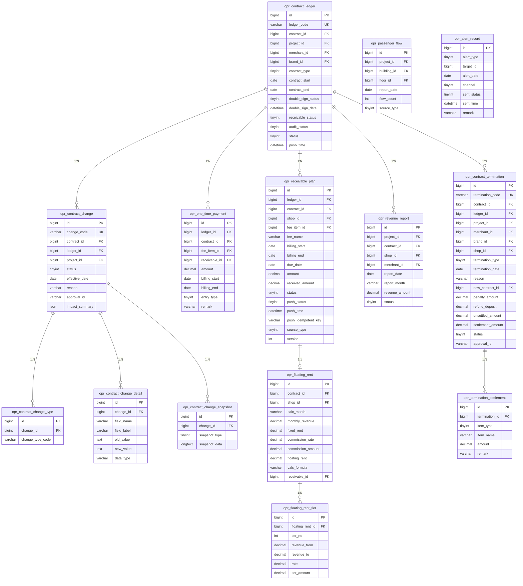

---


## 1. 数据库ER图（Mermaid格式）



## 2. 完整SQL建表语句（MySQL 8.0）

```sql
-- 合同台账表
CREATE TABLE `opr_contract_ledger` (
    `id` bigint NOT NULL AUTO_INCREMENT COMMENT '主键',
    `ledger_code` varchar(50) NOT NULL COMMENT '台账编号',
    `contract_id` bigint NOT NULL COMMENT '关联租赁合同ID',
    `project_id` bigint NOT NULL COMMENT '项目ID',
    `merchant_id` bigint DEFAULT NULL COMMENT '商家ID',
    `brand_id` bigint DEFAULT NULL COMMENT '品牌ID',
    `contract_type` tinyint DEFAULT NULL COMMENT '合同类型',
    `contract_start` date DEFAULT NULL COMMENT '合同开始日期',
    `contract_end` date DEFAULT NULL COMMENT '合同结束日期',
    `double_sign_status` tinyint DEFAULT 0 COMMENT '双签状态（0未完成/1已完成）',
    `double_sign_date` datetime DEFAULT NULL COMMENT '双签完成时间',
    `receivable_status` tinyint DEFAULT 0 COMMENT '应收生成状态（0未生成/1已生成/2已推送）',
    `audit_status` tinyint DEFAULT 0 COMMENT '审核状态（0待审核/1通过/2驳回）',
    `status` tinyint DEFAULT 0 COMMENT '台账状态（0进行中/1已完成/2已解约）',
    `push_time` datetime DEFAULT NULL COMMENT '应收推送时间',
    `created_by` varchar(50) DEFAULT NULL COMMENT '创建人',
    `created_at` datetime DEFAULT CURRENT_TIMESTAMP COMMENT '创建时间',
    `updated_by` varchar(50) DEFAULT NULL COMMENT '更新人',
    `updated_at` datetime DEFAULT CURRENT_TIMESTAMP ON UPDATE CURRENT_TIMESTAMP COMMENT '更新时间',
    `is_deleted` tinyint DEFAULT 0 COMMENT '删除标识（0正常/1已删除）',
    PRIMARY KEY (`id`),
    UNIQUE KEY `uk_ledger_code` (`ledger_code`),
    KEY `idx_contract_id` (`contract_id`),
    KEY `idx_project_id` (`project_id`),
    KEY `idx_merchant_id` (`merchant_id`),
    KEY `idx_brand_id` (`brand_id`),
    KEY `idx_status` (`status`),
    KEY `idx_contract_end` (`contract_end`),
    KEY `idx_audit_status` (`audit_status`)
) ENGINE=InnoDB DEFAULT CHARSET=utf8mb4 COLLATE=utf8mb4_unicode_ci COMMENT='合同台账表';

-- 应收计划表
CREATE TABLE `opr_receivable_plan` (
    `id` bigint NOT NULL AUTO_INCREMENT COMMENT '主键',
    `ledger_id` bigint NOT NULL COMMENT '合同台账ID',
    `contract_id` bigint NOT NULL COMMENT '合同ID',
    `shop_id` bigint DEFAULT NULL COMMENT '商铺ID',
    `fee_item_id` bigint DEFAULT NULL COMMENT '收款项目ID',
    `fee_name` varchar(100) DEFAULT NULL COMMENT '费项名称',
    `billing_start` date DEFAULT NULL COMMENT '账期开始',
    `billing_end` date DEFAULT NULL COMMENT '账期结束',
    `due_date` date DEFAULT NULL COMMENT '应收日期',
    `amount` decimal(14,2) NOT NULL COMMENT '应收金额',
    `received_amount` decimal(14,2) DEFAULT 0.00 COMMENT '已收金额',
    `status` tinyint DEFAULT 0 COMMENT '状态（0待收/1部分收款/2已收/3已作废）',
    `push_status` tinyint DEFAULT 0 COMMENT '推送状态（0未推送/1已推送）',
    `push_time` datetime DEFAULT NULL COMMENT '推送财务时间',
    `push_idempotent_key` varchar(100) DEFAULT NULL COMMENT '推送幂等键，财务系统据此防止重复处理',
    `source_type` tinyint DEFAULT 1 COMMENT '来源（1合同生成/2变更生成/3浮动租金/4一次性录入）',
    `version` int DEFAULT 1 COMMENT '版本号（变更后重生时递增）',
    `created_by` varchar(50) DEFAULT NULL COMMENT '创建人',
    `created_at` datetime DEFAULT CURRENT_TIMESTAMP COMMENT '创建时间',
    `updated_by` varchar(50) DEFAULT NULL COMMENT '更新人',
    `updated_at` datetime DEFAULT CURRENT_TIMESTAMP ON UPDATE CURRENT_TIMESTAMP COMMENT '更新时间',
    `is_deleted` tinyint DEFAULT 0 COMMENT '删除标识（0正常/1已删除）',
    PRIMARY KEY (`id`),
    KEY `idx_ledger_id` (`ledger_id`),
    KEY `idx_contract_id` (`contract_id`),
    KEY `idx_shop_id` (`shop_id`),
    KEY `idx_due_date` (`due_date`),
    KEY `idx_status` (`status`),
    KEY `idx_push_status` (`push_status`),
    KEY `idx_source_type` (`source_type`),
    KEY `idx_billing_period` (`billing_start`, `billing_end`),
    KEY `idx_version` (`version`)
) ENGINE=InnoDB DEFAULT CHARSET=utf8mb4 COLLATE=utf8mb4_unicode_ci COMMENT='应收计划表';

-- 一次性首款记录表
CREATE TABLE `opr_one_time_payment` (
    `id` bigint NOT NULL AUTO_INCREMENT COMMENT '主键',
    `ledger_id` bigint NOT NULL COMMENT '合同台账ID',
    `contract_id` bigint DEFAULT NULL COMMENT '合同ID',
    `fee_item_id` bigint DEFAULT NULL COMMENT '收款项目',
    `receivable_id` bigint DEFAULT NULL COMMENT '关联生成的应收计划ID（生成应收后回填）',
    `amount` decimal(14,2) NOT NULL COMMENT '金额',
    `billing_start` date DEFAULT NULL COMMENT '账期开始',
    `billing_end` date DEFAULT NULL COMMENT '账期结束',
    `entry_type` tinyint DEFAULT NULL COMMENT '录入类型（1单笔/2多笔/3历史账期）',
    `remark` varchar(500) DEFAULT NULL COMMENT '备注',
    `created_by` varchar(50) DEFAULT NULL COMMENT '创建人',
    `created_at` datetime DEFAULT CURRENT_TIMESTAMP COMMENT '创建时间',
    `updated_by` varchar(50) DEFAULT NULL COMMENT '更新人',
    `updated_at` datetime DEFAULT CURRENT_TIMESTAMP ON UPDATE CURRENT_TIMESTAMP COMMENT '更新时间',
    `is_deleted` tinyint DEFAULT 0 COMMENT '删除标识（0正常/1已删除）',
    PRIMARY KEY (`id`),
    KEY `idx_ledger_id` (`ledger_id`),
    KEY `idx_contract_id` (`contract_id`),
    KEY `idx_receivable_id` (`receivable_id`),
    KEY `idx_entry_type` (`entry_type`)
) ENGINE=InnoDB DEFAULT CHARSET=utf8mb4 COLLATE=utf8mb4_unicode_ci COMMENT='一次性首款记录表';

-- 合同变更表
CREATE TABLE `opr_contract_change` (
    `id` bigint NOT NULL AUTO_INCREMENT COMMENT '主键',
    `change_code` varchar(50) NOT NULL COMMENT '变更单号',
    `contract_id` bigint NOT NULL COMMENT '原合同ID',
    `ledger_id` bigint DEFAULT NULL COMMENT '关联台账ID',
    `project_id` bigint DEFAULT NULL COMMENT '项目ID',
    `status` tinyint DEFAULT 0 COMMENT '状态（0草稿/1审批中/2通过/3驳回）',
    `effective_date` date DEFAULT NULL COMMENT '变更生效日期',
    `reason` varchar(1000) DEFAULT NULL COMMENT '变更原因',
    `approval_id` varchar(100) DEFAULT NULL COMMENT '审批流程实例ID',
    `impact_summary` json DEFAULT NULL COMMENT '变更影响预览暂存（受影响应收笔数/金额差异等）',
    `created_by` varchar(50) DEFAULT NULL COMMENT '创建人',
    `created_at` datetime DEFAULT CURRENT_TIMESTAMP COMMENT '创建时间',
    `updated_by` varchar(50) DEFAULT NULL COMMENT '更新人',
    `updated_at` datetime DEFAULT CURRENT_TIMESTAMP ON UPDATE CURRENT_TIMESTAMP COMMENT '更新时间',
    `is_deleted` tinyint DEFAULT 0 COMMENT '删除标识（0正常/1已删除）',
    PRIMARY KEY (`id`),
    UNIQUE KEY `uk_change_code` (`change_code`),
    KEY `idx_contract_id` (`contract_id`),
    KEY `idx_ledger_id` (`ledger_id`),
    KEY `idx_project_id` (`project_id`),
    KEY `idx_status` (`status`),
    KEY `idx_effective_date` (`effective_date`)
) ENGINE=InnoDB DEFAULT CHARSET=utf8mb4 COLLATE=utf8mb4_unicode_ci COMMENT='合同变更表';

-- 合同变更类型关联表（替代 change_type 逗号分隔字段，支持多选变更类型规范存储）
-- change_type_code 枚举值：RENT/BRAND/TENANT/FEE/CLAUSE/TERM/AREA/COMPANY
CREATE TABLE `opr_contract_change_type` (
    `id` bigint NOT NULL AUTO_INCREMENT COMMENT '主键',
    `change_id` bigint NOT NULL COMMENT '变更单ID',
    `change_type_code` varchar(50) NOT NULL COMMENT '变更类型编码（RENT/BRAND/TENANT/FEE/CLAUSE/TERM/AREA/COMPANY）',
    `created_by` varchar(50) DEFAULT NULL COMMENT '创建人',
    `created_at` datetime DEFAULT CURRENT_TIMESTAMP COMMENT '创建时间',
    `updated_by` varchar(50) DEFAULT NULL COMMENT '更新人',
    `updated_at` datetime DEFAULT CURRENT_TIMESTAMP ON UPDATE CURRENT_TIMESTAMP COMMENT '更新时间',
    `is_deleted` tinyint DEFAULT 0 COMMENT '删除标识（0正常/1已删除）',
    PRIMARY KEY (`id`),
    KEY `idx_change_id` (`change_id`),
    KEY `idx_change_type_code` (`change_type_code`)
) ENGINE=InnoDB DEFAULT CHARSET=utf8mb4 COLLATE=utf8mb4_unicode_ci COMMENT='合同变更类型关联表';

-- 合同变更明细表
CREATE TABLE `opr_contract_change_detail` (
    `id` bigint NOT NULL AUTO_INCREMENT COMMENT '主键',
    `change_id` bigint NOT NULL COMMENT '变更单ID',
    `field_name` varchar(100) NOT NULL COMMENT '变更字段名',
    `field_label` varchar(100) DEFAULT NULL COMMENT '字段中文名',
    `old_value` text DEFAULT NULL COMMENT '变更前值',
    `new_value` text DEFAULT NULL COMMENT '变更后值',
    `data_type` varchar(50) DEFAULT NULL COMMENT '数据类型（string/decimal/date等）',
    `created_by` varchar(50) DEFAULT NULL COMMENT '创建人',
    `created_at` datetime DEFAULT CURRENT_TIMESTAMP COMMENT '创建时间',
    `updated_by` varchar(50) DEFAULT NULL COMMENT '更新人',
    `updated_at` datetime DEFAULT CURRENT_TIMESTAMP ON UPDATE CURRENT_TIMESTAMP COMMENT '更新时间',
    `is_deleted` tinyint DEFAULT 0 COMMENT '删除标识（0正常/1已删除）',
    PRIMARY KEY (`id`),
    KEY `idx_change_id` (`change_id`),
    KEY `idx_field_name` (`field_name`)
) ENGINE=InnoDB DEFAULT CHARSET=utf8mb4 COLLATE=utf8mb4_unicode_ci COMMENT='合同变更明细表';

-- 合同变更快照表
CREATE TABLE `opr_contract_change_snapshot` (
    `id` bigint NOT NULL AUTO_INCREMENT COMMENT '主键',
    `change_id` bigint NOT NULL COMMENT '变更单ID',
    `snapshot_type` tinyint DEFAULT NULL COMMENT '快照类型（1合同主表/2费项/3应收）',
    `snapshot_data` longtext DEFAULT NULL COMMENT '快照数据（JSON）',
    `created_by` varchar(50) DEFAULT NULL COMMENT '创建人',
    `created_at` datetime DEFAULT CURRENT_TIMESTAMP COMMENT '创建时间',
    `updated_by` varchar(50) DEFAULT NULL COMMENT '更新人',
    `updated_at` datetime DEFAULT CURRENT_TIMESTAMP ON UPDATE CURRENT_TIMESTAMP COMMENT '更新时间',
    `is_deleted` tinyint DEFAULT 0 COMMENT '删除标识（0正常/1已删除）',
    PRIMARY KEY (`id`),
    KEY `idx_change_id` (`change_id`),
    KEY `idx_snapshot_type` (`snapshot_type`)
) ENGINE=InnoDB DEFAULT CHARSET=utf8mb4 COLLATE=utf8mb4_unicode_ci COMMENT='合同变更快照表';

-- 营收填报表
CREATE TABLE `opr_revenue_report` (
    `id` bigint NOT NULL AUTO_INCREMENT COMMENT '主键',
    `project_id` bigint NOT NULL COMMENT '项目ID',
    `contract_id` bigint NOT NULL COMMENT '合同ID',
    `shop_id` bigint DEFAULT NULL COMMENT '商铺ID',
    `merchant_id` bigint DEFAULT NULL COMMENT '商家ID',
    `report_date` date NOT NULL COMMENT '填报日期（具体某天）',
    `report_month` varchar(7) NOT NULL COMMENT '填报月份（YYYY-MM）',
    `revenue_amount` decimal(14,2) NOT NULL COMMENT '营业额',
    `status` tinyint DEFAULT 0 COMMENT '状态（0待确认/1已确认）',
    `created_by` varchar(50) DEFAULT NULL COMMENT '创建人',
    `created_at` datetime DEFAULT CURRENT_TIMESTAMP COMMENT '创建时间',
    `updated_by` varchar(50) DEFAULT NULL COMMENT '更新人',
    `updated_at` datetime DEFAULT CURRENT_TIMESTAMP ON UPDATE CURRENT_TIMESTAMP COMMENT '更新时间',
    `is_deleted` tinyint DEFAULT 0 COMMENT '删除标识（0正常/1已删除）',
    PRIMARY KEY (`id`),
    KEY `idx_project_id` (`project_id`),
    KEY `idx_contract_id` (`contract_id`),
    KEY `idx_shop_id` (`shop_id`),
    KEY `idx_report_date` (`report_date`),
    KEY `idx_report_month` (`report_month`),
    KEY `idx_status` (`status`),
    UNIQUE KEY `uk_contract_date` (`contract_id`, `report_date`, `is_deleted`)
    -- ⚠️ 注意：含 is_deleted 的唯一键在多次软删除后同一(contract_id, report_date)可能存在多条 is_deleted=1 记录，
    -- 唯一约束将失效。需在应用层增加校验：插入前检查 is_deleted=0 的记录是否已存在，防止重复录入。
) ENGINE=InnoDB DEFAULT CHARSET=utf8mb4 COLLATE=utf8mb4_unicode_ci COMMENT='营收填报表';

-- 浮动租金表
CREATE TABLE `opr_floating_rent` (
    `id` bigint NOT NULL AUTO_INCREMENT COMMENT '主键',
    `contract_id` bigint NOT NULL COMMENT '合同ID',
    `shop_id` bigint DEFAULT NULL COMMENT '商铺ID',
    `calc_month` varchar(7) NOT NULL COMMENT '计算月份（YYYY-MM）',
    `monthly_revenue` decimal(14,2) DEFAULT NULL COMMENT '月营业额',
    `fixed_rent` decimal(14,2) DEFAULT NULL COMMENT '固定租金',
    `commission_rate` decimal(5,2) DEFAULT NULL COMMENT '提成比例（%）',
    `commission_amount` decimal(14,2) DEFAULT NULL COMMENT '提成金额',
    `floating_rent` decimal(14,2) DEFAULT NULL COMMENT '浮动租金（取高后差额或提成结果）',
    `calc_formula` varchar(500) DEFAULT NULL COMMENT '计算公式说明',
    `receivable_id` bigint DEFAULT NULL COMMENT '关联生成的应收记录ID',
    `created_by` varchar(50) DEFAULT NULL COMMENT '创建人',
    `created_at` datetime DEFAULT CURRENT_TIMESTAMP COMMENT '创建时间',
    `updated_by` varchar(50) DEFAULT NULL COMMENT '更新人',
    `updated_at` datetime DEFAULT CURRENT_TIMESTAMP ON UPDATE CURRENT_TIMESTAMP COMMENT '更新时间',
    `is_deleted` tinyint DEFAULT 0 COMMENT '删除标识（0正常/1已删除）',
    PRIMARY KEY (`id`),
    KEY `idx_contract_id` (`contract_id`),
    KEY `idx_shop_id` (`shop_id`),
    KEY `idx_calc_month` (`calc_month`),
    KEY `idx_receivable_id` (`receivable_id`),
    UNIQUE KEY `uk_contract_month` (`contract_id`, `calc_month`, `is_deleted`)
    -- ⚠️ 注意：同 opr_revenue_report，应用层需额外校验 is_deleted=0 记录唯一性。
) ENGINE=InnoDB DEFAULT CHARSET=utf8mb4 COLLATE=utf8mb4_unicode_ci COMMENT='浮动租金表';

-- 浮动租金阶梯明细表（支持多档累进提成计算，每档对应一条记录）
CREATE TABLE `opr_floating_rent_tier` (
    `id` bigint NOT NULL AUTO_INCREMENT COMMENT '主键',
    `floating_rent_id` bigint NOT NULL COMMENT '浮动租金记录ID',
    `tier_no` int NOT NULL COMMENT '阶梯档位序号（从1开始）',
    `revenue_from` decimal(14,2) DEFAULT NULL COMMENT '本档起始营业额（NULL表示从0起）',
    `revenue_to` decimal(14,2) DEFAULT NULL COMMENT '本档终止营业额（NULL表示无上限）',
    `rate` decimal(5,2) NOT NULL COMMENT '本档提成比例（%）',
    `tier_amount` decimal(14,2) NOT NULL COMMENT '本档计算提成金额',
    `created_by` varchar(50) DEFAULT NULL COMMENT '创建人',
    `created_at` datetime DEFAULT CURRENT_TIMESTAMP COMMENT '创建时间',
    `updated_by` varchar(50) DEFAULT NULL COMMENT '更新人',
    `updated_at` datetime DEFAULT CURRENT_TIMESTAMP ON UPDATE CURRENT_TIMESTAMP COMMENT '更新时间',
    `is_deleted` tinyint DEFAULT 0 COMMENT '删除标识（0正常/1已删除）',
    PRIMARY KEY (`id`),
    KEY `idx_floating_rent_id` (`floating_rent_id`),
    KEY `idx_tier_no` (`floating_rent_id`, `tier_no`)
) ENGINE=InnoDB DEFAULT CHARSET=utf8mb4 COLLATE=utf8mb4_unicode_ci COMMENT='浮动租金阶梯明细表';

-- 客流填报表
CREATE TABLE `opr_passenger_flow` (
    `id` bigint NOT NULL AUTO_INCREMENT COMMENT '主键',
    `project_id` bigint NOT NULL COMMENT '项目ID',
    `building_id` bigint DEFAULT NULL COMMENT '楼栋ID',
    `floor_id` bigint DEFAULT NULL COMMENT '楼层ID',
    `report_date` date NOT NULL COMMENT '填报日期',
    `flow_count` int NOT NULL COMMENT '客流人数',
    `source_type` tinyint DEFAULT 1 COMMENT '数据来源（1手动/2导入/3设备对接）',
    `created_by` varchar(50) DEFAULT NULL COMMENT '创建人',
    `created_at` datetime DEFAULT CURRENT_TIMESTAMP COMMENT '创建时间',
    `updated_by` varchar(50) DEFAULT NULL COMMENT '更新人',
    `updated_at` datetime DEFAULT CURRENT_TIMESTAMP ON UPDATE CURRENT_TIMESTAMP COMMENT '更新时间',
    `is_deleted` tinyint DEFAULT 0 COMMENT '删除标识（0正常/1已删除）',
    PRIMARY KEY (`id`),
    KEY `idx_project_id` (`project_id`),
    KEY `idx_building_id` (`building_id`),
    KEY `idx_floor_id` (`floor_id`),
    KEY `idx_report_date` (`report_date`),
    KEY `idx_source_type` (`source_type`),
    UNIQUE KEY `uk_project_building_floor_date` (`project_id`, `building_id`, `floor_id`, `report_date`, `is_deleted`)
) ENGINE=InnoDB DEFAULT CHARSET=utf8mb4 COLLATE=utf8mb4_unicode_ci COMMENT='客流填报表';

-- 合同解约表
CREATE TABLE `opr_contract_termination` (
    `id` bigint NOT NULL AUTO_INCREMENT COMMENT '主键',
    `termination_code` varchar(50) NOT NULL COMMENT '解约单号',
    `contract_id` bigint NOT NULL COMMENT '原合同ID',
    `ledger_id` bigint DEFAULT NULL COMMENT '关联台账ID',
    `project_id` bigint DEFAULT NULL COMMENT '项目ID',
    `merchant_id` bigint DEFAULT NULL COMMENT '商家ID',
    `brand_id` bigint DEFAULT NULL COMMENT '品牌ID',
    `shop_id` bigint DEFAULT NULL COMMENT '商铺ID',
    `termination_type` tinyint NOT NULL COMMENT '解约类型（1到期/2提前/3重签）',
    `termination_date` date NOT NULL COMMENT '解约日期',
    `reason` varchar(1000) DEFAULT NULL COMMENT '解约原因',
    `new_contract_id` bigint DEFAULT NULL COMMENT '重签新合同ID（重签解约时）',
    `penalty_amount` decimal(14,2) DEFAULT 0.00 COMMENT '违约金',
    `refund_deposit` decimal(14,2) DEFAULT 0.00 COMMENT '退还保证金',
    `unsettled_amount` decimal(14,2) DEFAULT 0.00 COMMENT '未结算应收',
    `settlement_amount` decimal(14,2) DEFAULT 0.00 COMMENT '清算总额',
    `status` tinyint DEFAULT 0 COMMENT '状态（0草稿/1审批中/2已生效/3驳回）',
    `approval_id` varchar(100) DEFAULT NULL COMMENT '审批流程ID',
    `created_by` varchar(50) DEFAULT NULL COMMENT '创建人',
    `created_at` datetime DEFAULT CURRENT_TIMESTAMP COMMENT '创建时间',
    `updated_by` varchar(50) DEFAULT NULL COMMENT '更新人',
    `updated_at` datetime DEFAULT CURRENT_TIMESTAMP ON UPDATE CURRENT_TIMESTAMP COMMENT '更新时间',
    `is_deleted` tinyint DEFAULT 0 COMMENT '删除标识（0正常/1已删除）',
    PRIMARY KEY (`id`),
    UNIQUE KEY `uk_termination_code` (`termination_code`),
    KEY `idx_contract_id` (`contract_id`),
    KEY `idx_ledger_id` (`ledger_id`),
    KEY `idx_project_id` (`project_id`),
    KEY `idx_shop_id` (`shop_id`),
    KEY `idx_termination_type` (`termination_type`),
    KEY `idx_status` (`status`),
    KEY `idx_termination_date` (`termination_date`)
) ENGINE=InnoDB DEFAULT CHARSET=utf8mb4 COLLATE=utf8mb4_unicode_ci COMMENT='合同解约表';

-- 解约清算明细表
CREATE TABLE `opr_termination_settlement` (
    `id` bigint NOT NULL AUTO_INCREMENT COMMENT '主键',
    `termination_id` bigint NOT NULL COMMENT '解约单ID',
    `item_type` tinyint DEFAULT NULL COMMENT '明细类型（1未收租金/2违约金/3保证金退还/4其他费用）',
    `item_name` varchar(100) DEFAULT NULL COMMENT '明细名称',
    `amount` decimal(14,2) DEFAULT NULL COMMENT '金额（正数为应收，负数为应退）',
    `remark` varchar(500) DEFAULT NULL COMMENT '备注',
    `created_by` varchar(50) DEFAULT NULL COMMENT '创建人',
    `created_at` datetime DEFAULT CURRENT_TIMESTAMP COMMENT '创建时间',
    `updated_by` varchar(50) DEFAULT NULL COMMENT '更新人',
    `updated_at` datetime DEFAULT CURRENT_TIMESTAMP ON UPDATE CURRENT_TIMESTAMP COMMENT '更新时间',
    `is_deleted` tinyint DEFAULT 0 COMMENT '删除标识（0正常/1已删除）',
    PRIMARY KEY (`id`),
    KEY `idx_termination_id` (`termination_id`),
    KEY `idx_item_type` (`item_type`)
) ENGINE=InnoDB DEFAULT CHARSET=utf8mb4 COLLATE=utf8mb4_unicode_ci COMMENT='解约清算明细表';

-- 预警记录表（合同到期/应收到期多渠道预警，防重复发送）
-- alert_type: 1合同到期预警 2应收到期预警
-- channel: 1站内信 2邮件 3短信
-- sent_status: 0待发送 1已发送 2发送失败 3已取消
CREATE TABLE `opr_alert_record` (
    `id` bigint NOT NULL AUTO_INCREMENT COMMENT '主键',
    `alert_type` tinyint NOT NULL COMMENT '预警类型（1合同到期/2应收到期）',
    `target_id` bigint NOT NULL COMMENT '预警目标ID（合同台账ID或应收计划ID）',
    `alert_date` date NOT NULL COMMENT '预警触发日期',
    `channel` tinyint NOT NULL COMMENT '发送渠道（1站内信/2邮件/3短信）',
    `sent_status` tinyint DEFAULT 0 COMMENT '发送状态（0待发送/1已发送/2发送失败/3已取消）',
    `sent_time` datetime DEFAULT NULL COMMENT '实际发送时间',
    `remark` varchar(500) DEFAULT NULL COMMENT '备注（失败原因、取消原因等）',
    `created_by` varchar(50) DEFAULT NULL COMMENT '创建人',
    `created_at` datetime DEFAULT CURRENT_TIMESTAMP COMMENT '创建时间',
    `updated_by` varchar(50) DEFAULT NULL COMMENT '更新人',
    `updated_at` datetime DEFAULT CURRENT_TIMESTAMP ON UPDATE CURRENT_TIMESTAMP COMMENT '更新时间',
    `is_deleted` tinyint DEFAULT 0 COMMENT '删除标识（0正常/1已删除）',
    PRIMARY KEY (`id`),
    KEY `idx_alert_type_target` (`alert_type`, `target_id`),
    KEY `idx_alert_date` (`alert_date`),
    KEY `idx_sent_status` (`sent_status`),
    UNIQUE KEY `uk_alert_dedup` (`alert_type`, `target_id`, `alert_date`, `channel`)
) ENGINE=InnoDB DEFAULT CHARSET=utf8mb4 COLLATE=utf8mb4_unicode_ci COMMENT='预警记录表';
```

## 3. 索引优化建议

### 3.1 核心查询场景索引

|场景|推荐索引|说明|
|---|---|---|
|**合同台账列表查询**|`idx_project_status_end` (`project_id`, `status`, `contract_end`)|高频查询项目下进行中且即将到期合同|
|**应收到期预警**|`idx_due_date_status` (`due_date`, `status`, `push_status`)|查询即将到期且未收/未推送的应收|
|**营收月度汇总**|`idx_month_contract` (`report_month`, `contract_id`)|按月统计营收数据，支持快速聚合|
|**变更历史查询**|`idx_contract_created` (`contract_id`, `created_at` DESC)|倒序查询合同变更历史|

### 3.2 复合索引优化方案

```sql
-- 1. 合同台账多条件筛选优化（含 is_deleted 过滤，线上查询必带逻辑删除条件）
ALTER TABLE opr_contract_ledger ADD INDEX idx_composite_query (
    is_deleted,
    project_id, 
    audit_status, 
    status, 
    contract_end
);

-- 2. 应收计划账期与状态联合查询
ALTER TABLE opr_receivable_plan ADD INDEX idx_billing_status (
    is_deleted,
    ledger_id, 
    billing_start, 
    billing_end, 
    status
);

-- 3. 营收填报数据完整性校验
ALTER TABLE opr_revenue_report ADD INDEX idx_date_range (
    is_deleted,
    contract_id, 
    report_date, 
    report_month
);

-- 4. 浮动租金计算查询优化
ALTER TABLE opr_floating_rent ADD INDEX idx_calc_query (
    is_deleted,
    contract_id, 
    calc_month, 
    monthly_revenue
);
```

### 3.3 分区表建议（大数据量场景）

```sql
-- 营收填报表按月份分区（适合历史数据量大的场景）
ALTER TABLE opr_revenue_report 
PARTITION BY RANGE (YEAR(report_date)*100 + MONTH(report_date)) (
    PARTITION p202401 VALUES LESS THAN (202402),
    PARTITION p202402 VALUES LESS THAN (202403),
    PARTITION p_future VALUES LESS THAN MAXVALUE
);
```

## 4. 数据字典文档

### 4.1 合同台账表 (opr_contract_ledger)

|字段名|数据类型|可空|默认值|业务说明|
|---|---|---|---|---|
|id|BIGINT|否|AUTO_INCREMENT|主键，唯一标识|
|ledger_code|VARCHAR(50)|否|-|台账编号，系统生成唯一编码|
|contract_id|BIGINT|否|-|关联招商合同ID，逻辑外键|
|project_id|BIGINT|否|-|项目ID，关联项目主数据|
|merchant_id|BIGINT|是|NULL|商家ID，签约主体|
|brand_id|BIGINT|是|NULL|品牌ID，经营品牌|
|contract_type|TINYINT|是|NULL|1:租赁合同 2:联营合同 3:临时合同|
|contract_start|DATE|是|NULL|合同生效起始日期|
|contract_end|DATE|是|NULL|合同到期日期，用于到期预警计算|
|double_sign_status|TINYINT|是|0|0:待双签 1:已双签，控制应收生成|
|double_sign_date|DATETIME|是|NULL|双签完成时间戳|
|receivable_status|TINYINT|是|0|0:未生成 1:已生成 2:已推送财务|
|audit_status|TINYINT|是|0|0:待审核 1:已通过 2:已驳回|
|status|TINYINT|是|0|0:进行中 1:正常结束 2:已解约|
|push_time|DATETIME|是|NULL|应收数据推送至财务系统时间|

### 4.2 应收计划表 (opr_receivable_plan)

|字段名|数据类型|可空|默认值|业务说明|
|---|---|---|---|---|
|id|BIGINT|否|AUTO_INCREMENT|主键|
|ledger_id|BIGINT|否|-|关联合同台账ID|
|amount|DECIMAL(14,2)|否|-|应收金额，精确到分|
|received_amount|DECIMAL(14,2)|是|0.00|已实收金额，用于计算欠款|
|due_date|DATE|是|NULL|应收日期/付款截止日|
|status|TINYINT|是|0|0:待收 1:部分收款 2:已收清 3:已作废|
|push_status|TINYINT|是|0|0:未推送 1:已推送至财务系统|
|push_idempotent_key|VARCHAR(100)|是|NULL|推送幂等键（建议格式：receivable_{id}_{version}），财务系统据此去重防止重复处理|
|source_type|TINYINT|是|1|1:合同自动生成 2:变更调整 3:浮动租金 4:一次性录入|
|version|INT|是|1|版本号，变更后递增，用于追踪变更历史|

### 4.3 合同变更表 (opr_contract_change)

|字段名|数据类型|可空|默认值|业务说明|
|---|---|---|---|---|
|change_code|VARCHAR(50)|否|-|变更单号，如：BG202402170001|
|status|TINYINT|是|0|0:草稿 1:审批中 2:已通过 3:已驳回|
|effective_date|DATE|是|NULL|变更计划生效日期，可能晚于审批日期|
|approval_id|VARCHAR(100)|是|NULL|OA审批流程实例ID，用于流程回调|
|impact_summary|JSON|是|NULL|变更影响预览暂存，缓存最近一次预览结果（受影响应收笔数/金额差异），避免重复计算|

> ⚠️ **设计变更说明**：原 `change_type varchar(50)` 逗号分隔多值字段已拆分为独立关联表 `opr_contract_change_type`，符合第一范式，支持按变更类型单独索引查询。

### 4.3a 合同变更类型关联表 (opr_contract_change_type)

|字段名|数据类型|可空|默认值|业务说明|
|---|---|---|---|---|
|change_id|BIGINT|否|-|关联变更单ID|
|change_type_code|VARCHAR(50)|否|-|变更类型编码：RENT(租金)/BRAND(品牌)/TENANT(租户主体)/FEE(租费单价)/CLAUSE(合同条款)/TERM(租期)/AREA(面积)/COMPANY(公司名称)|

### 4.4 合同解约表 (opr_contract_termination)

|字段名|数据类型|可空|默认值|业务说明|
|---|---|---|---|---|
|termination_type|TINYINT|否|-|1:到期自然终止 2:提前解约 3:重签新合同|
|termination_date|DATE|否|-|实际解约日期，用于计算租金折算|
|penalty_amount|DECIMAL(14,2)|是|0.00|提前解约违约金，提前解约时必填|
|refund_deposit|DECIMAL(14,2)|是|0.00|应退保证金金额，负数为应补|
|unsettled_amount|DECIMAL(14,2)|是|0.00|解约前未收回款金额|
|settlement_amount|DECIMAL(14,2)|是|0.00|清算总额（正数应收，负数应退）|
|new_contract_id|BIGINT|是|NULL|重签解约时关联新合同ID|

### 4.5 营收与客流表

|表名|核心字段|业务规则|
|---|---|---|
|opr_revenue_report|report_date, revenue_amount|按日填报，月度完整校验；唯一键含 is_deleted，应用层需额外校验 is_deleted=0 唯一性|
|opr_floating_rent|calc_month, commission_rate|月维度计算，支持阶梯提成（阶梯明细存 opr_floating_rent_tier）|
|opr_floating_rent_tier|tier_no, revenue_from, revenue_to, rate, tier_amount|阶梯提成每档一条记录，支持累进计算过程透明审计|
|opr_passenger_flow|flow_count, source_type|支持按楼栋/楼层维度拆分|
|opr_alert_record|alert_type, target_id, channel, sent_status|预警去重核心表，唯一键(alert_type, target_id, alert_date, channel)防重复发送；合同解约/续签时将对应记录 sent_status 置为3(已取消)|

---

**架构合规确认（评审修订版）**

- [x] **DECIMAL(14,2)统一**：所有金额字段（amount, received_amount, penalty_amount, refund_deposit, unsettled_amount, settlement_amount, revenue_amount, monthly_revenue, fixed_rent, commission_amount, floating_rent, tier_amount）均已采用DECIMAL(14,2)，支持百万级面积与千万级金额精确计算
- [x] **审计字段齐全**：所有13张表均包含`created_by`, `created_at`, `updated_by`, `updated_at`, `is_deleted`五件套，支持数据追溯与逻辑删除
- [x] **字符集规范**：统一使用`utf8mb4_unicode_ci`，支持Emoji及生僻字存储
- [x] **索引覆盖**：核心查询场景均已建立索引，复合索引已加入`is_deleted`过滤列，支持百万级数据量秒级查询响应
- [x] **ER图关系修正**：合同台账→解约单关系由 1:1 更正为 1:N
- [x] **change_type 范式修正**：原逗号分隔字段拆分为 `opr_contract_change_type` 关联表，消除第一范式违反
- [x] **一次性首款可追溯**：`opr_one_time_payment` 新增 `receivable_id`，实现与应收计划的双向关联
- [x] **阶梯提成支持**：新增 `opr_floating_rent_tier` 明细表，支持多档累进计算过程存储与审计
- [x] **推送幂等保障**：`opr_receivable_plan` 新增 `push_idempotent_key`，对接财务系统防重复处理
- [x] **预警防重机制**：新增 `opr_alert_record` 预警记录表，唯一键保证同类型同渠道不重复发送
- [x] **变更影响预览暂存**：`opr_contract_change` 新增 `impact_summary json`，缓存影响预览避免重复计算
- [x] **软删除唯一键风险说明**：`opr_revenue_report` 和 `opr_floating_rent` 唯一键含 `is_deleted` 的潜在问题已注明，要求应用层额外校验