基于《资产一张图可视化模块技术分析报告》，设计 GIS 可视化层专用数据库表结构。资产一张图的数据主要来源于基础数据、招商、营运、财务模块的汇总数据，可视化层仅存储 **GIS 坐标、快照汇总、趋势数据、看板配置** 等专有数据。

---

## 1. 数据库 ER 图（Mermaid 格式）

```mermaid
erDiagram
    %% 核心表
    gis_project_location {
        bigint id PK "主键"
        bigint project_id FK "项目ID(UK)"
        varchar project_name "项目名称(冗余)"
        varchar province "省份"
        varchar city "城市"
        varchar district "区县"
        varchar address "详细地址"
        decimal longitude "经度"
        decimal latitude "纬度"
        varchar geohash "GeoHash编码"
        varchar resource_type "资源类型"
        tinyint status "状态"
    }

    gis_dashboard_snapshot {
        bigint id PK "主键"
        date stat_date "统计日期"
        tinyint scope_type "范围类型"
        varchar scope_id "范围ID"
        varchar scope_name "范围名称"
        int project_count "项目总数"
        decimal total_area "总租赁面积"
        decimal rented_area "已租面积"
        decimal vacant_area "未租面积"
        int resource_count "资源总数"
        decimal vacancy_rate "空置率%"
        decimal avg_rent_price "出租均价"
        decimal usage_rate "使用率%"
        decimal receivable_amount "应收总额"
        decimal received_amount "已收总额"
        decimal overdue_amount "欠费总额"
        decimal collection_rate "收缴率%"
        int overdue_merchant_count "延迟缴费商家数"
        int risk_expiring "合同到期风险数"
        int risk_overdue "欠费超期风险数"
        int risk_vacancy "空置超限风险数"
    }

    gis_resource_type_stat {
        bigint id PK "主键"
        bigint snapshot_id FK "关联快照ID"
        varchar resource_type "资源类型"
        int count "数量"
        decimal area "面积"
        decimal percentage "占比%"
    }

    gis_trend_data {
        bigint id PK "主键"
        varchar stat_month "统计月份"
        tinyint scope_type "范围类型"
        varchar scope_id "范围ID"
        varchar metric_type "指标类型"
        decimal metric_value "指标值"
    }

    gis_area_ranking {
        bigint id PK "主键"
        bigint snapshot_id FK "关联快照ID"
        bigint project_id FK "项目ID"
        varchar project_name "项目名称"
        decimal rented_area "已租面积"
        decimal total_area "总面积"
        decimal rental_rate "出租率%"
        int ranking "排名"
    }

    gis_risk_detail {
        bigint id PK "主键"
        bigint snapshot_id FK "关联快照ID"
        varchar risk_type "风险类型"
        bigint project_id FK "项目ID"
        varchar project_name "项目名称"
        bigint business_id "业务单据ID"
        varchar business_desc "业务描述"
        varchar risk_level "风险等级"
        decimal amount "涉及金额"
        date due_date "到期日期"
        int overdue_days "逾期天数"
    }

    gis_dashboard_config {
        bigint id PK "主键"
        varchar dashboard_code "看板编码(UK)"
        varchar dashboard_name "看板名称"
        text layout_config "布局配置JSON"
        int refresh_interval "刷新间隔秒"
        varchar theme "主题"
        tinyint status "状态"
    }

    gis_snapshot_log {
        bigint id PK "主键"
        date stat_date "统计日期"
        varchar trigger_type "触发类型"
        tinyint status "状态"
        int duration_ms "耗时毫秒"
        varchar error_msg "错误信息"
        datetime created_at "创建时间"
    }

    %% 关联关系
    gis_project_location ||--o{ gis_dashboard_snapshot : "项目→快照(scope_type=4)"
    gis_dashboard_snapshot ||--o{ gis_resource_type_stat : "快照→资源类型"
    gis_dashboard_snapshot ||--o{ gis_area_ranking : "快照→面积排行"
    gis_dashboard_snapshot ||--o{ gis_risk_detail : "快照→风险明细"
```



---

## 2. 表结构详细设计

### 2.1 gis_project_location — 项目 GIS 坐标表

存储项目的地理坐标信息，用于 GIS 地图标注和空间查询。

| 字段名 | 类型 | 约束 | 默认值 | 说明 |
|--------|------|------|--------|------|
| id | BIGINT UNSIGNED | PK, AUTO_INCREMENT | - | 主键 |
| project_id | BIGINT | NOT NULL, UK | - | 关联 biz_project.id |
| project_name | VARCHAR(200) | NOT NULL | - | 项目名称（冗余，便于地图查询免 JOIN） |
| province | VARCHAR(50) | | - | 省份 |
| city | VARCHAR(50) | | - | 城市 |
| district | VARCHAR(50) | | - | 区县 |
| address | VARCHAR(500) | | - | 详细地址 |
| longitude | DECIMAL(10,6) | NOT NULL | - | 经度（GCJ02 坐标系） |
| latitude | DECIMAL(10,6) | NOT NULL | - | 纬度（GCJ02 坐标系） |
| geohash | VARCHAR(12) | | - | GeoHash 编码（用于空间范围查询和聚合） |
| resource_type | VARCHAR(100) | | - | 资源类型（商业/办公/产业等） |
| status | TINYINT | NOT NULL | 1 | 状态：0=禁用 1=正常 |
| created_by | VARCHAR(64) | | - | 创建人 |
| created_at | DATETIME | NOT NULL | CURRENT_TIMESTAMP | 创建时间 |
| updated_by | VARCHAR(64) | | - | 更新人 |
| updated_at | DATETIME | | CURRENT_TIMESTAMP ON UPDATE | 更新时间 |
| is_deleted | TINYINT | NOT NULL | 0 | 逻辑删除 |

**索引设计：**

| 索引名 | 类型 | 字段 | 用途 |
|--------|------|------|------|
| uk_project_id | UNIQUE | project_id | 一个项目一条坐标记录 |
| idx_province_city | INDEX | province, city | 按区域筛选项目 |
| idx_geohash | INDEX | geohash | GeoHash 空间查询（聚合/范围） |
| idx_resource_type | INDEX | resource_type | 按资源类型筛选 |
| idx_lng_lat | INDEX | longitude, latitude | 经纬度范围查询 |

> **坐标系约定：** 统一使用 GCJ02（国测局坐标），与高德地图一致。若从 GPS 设备或百度地图获取坐标，需先转换。

---

### 2.2 gis_dashboard_snapshot — 看板快照表

按日期+范围维度存储汇总指标快照，支持全国/省/城市/项目四级钻取。

| 字段名 | 类型 | 约束 | 默认值 | 说明 |
|--------|------|------|--------|------|
| id | BIGINT UNSIGNED | PK, AUTO_INCREMENT | - | 主键 |
| stat_date | DATE | NOT NULL | - | 统计日期 |
| scope_type | TINYINT | NOT NULL | - | 范围类型：1=全国 2=省 3=城市 4=项目 |
| scope_id | VARCHAR(50) | | - | 范围 ID（省编码/城市编码/项目ID），全国级为 NULL |
| scope_name | VARCHAR(200) | | - | 范围名称（如"广东省"/"深圳市"/"XX园区"） |
| project_count | INT | | 0 | 项目总数 |
| total_area | DECIMAL(14,2) | | 0.00 | 总租赁面积（㎡） |
| rented_area | DECIMAL(14,2) | | 0.00 | 已租面积（㎡） |
| vacant_area | DECIMAL(14,2) | | 0.00 | 未租面积（㎡） |
| resource_count | INT | | 0 | 资源（商铺）总数 |
| rented_count | INT | | 0 | 已租资源数 |
| vacant_count | INT | | 0 | 空置资源数 |
| vacancy_rate | DECIMAL(5,2) | | 0.00 | 空置率（%） |
| avg_rent_price | DECIMAL(10,2) | | 0.00 | 出租均价（元/㎡/月） |
| usage_rate | DECIMAL(5,2) | | 0.00 | 使用率（%） |
| receivable_amount | DECIMAL(14,2) | | 0.00 | 应收总额 |
| received_amount | DECIMAL(14,2) | | 0.00 | 已收总额 |
| overdue_amount | DECIMAL(14,2) | | 0.00 | 欠费总额 |
| collection_rate | DECIMAL(5,2) | | 0.00 | 收缴率（%） |
| overdue_merchant_count | INT | | 0 | 延迟缴费商家数 |
| risk_expiring | INT | | 0 | 合同到期风险数（30天内到期） |
| risk_overdue | INT | | 0 | 欠费超期风险数（逾期>30天） |
| risk_vacancy | INT | | 0 | 空置超限风险数（空置>90天） |
| created_at | DATETIME | NOT NULL | CURRENT_TIMESTAMP | 创建时间 |

**索引设计：**

| 索引名 | 类型 | 字段 | 用途 |
|--------|------|------|------|
| uk_date_scope | UNIQUE | stat_date, scope_type, scope_id | 同一日期+范围唯一 |
| idx_stat_date | INDEX | stat_date | 按日期查询 |
| idx_scope | INDEX | scope_type, scope_id | 按范围类型钻取 |

> **数据来源：** 定时任务每日凌晨从 biz_project / biz_shop / fin_receivable / inv_lease_contract 等表汇总生成；关键指标每小时增量更新。

---

### 2.3 gis_resource_type_stat — 资源类型统计表

快照的子表，存储各资源类型的数量和面积占比。

| 字段名 | 类型 | 约束 | 默认值 | 说明 |
|--------|------|------|--------|------|
| id | BIGINT UNSIGNED | PK, AUTO_INCREMENT | - | 主键 |
| snapshot_id | BIGINT | NOT NULL | - | 关联 gis_dashboard_snapshot.id |
| resource_type | VARCHAR(100) | NOT NULL | - | 资源类型（商业/办公/产业/仓储等） |
| count | INT | | 0 | 该类型数量 |
| area | DECIMAL(14,2) | | 0.00 | 该类型面积（㎡） |
| percentage | DECIMAL(5,2) | | 0.00 | 占比（%） |

**索引设计：**

| 索引名 | 类型 | 字段 | 用途 |
|--------|------|------|------|
| idx_snapshot_id | INDEX | snapshot_id | 按快照查询明细 |
| uk_snapshot_type | UNIQUE | snapshot_id, resource_type | 快照内类型唯一 |

---

### 2.4 gis_trend_data — 趋势数据表

存储月度趋势指标，用于折线图展示 12 个月变化趋势。

| 字段名 | 类型 | 约束 | 默认值 | 说明 |
|--------|------|------|--------|------|
| id | BIGINT UNSIGNED | PK, AUTO_INCREMENT | - | 主键 |
| stat_month | VARCHAR(7) | NOT NULL | - | 统计月份（YYYY-MM） |
| scope_type | TINYINT | NOT NULL | - | 范围类型：1=全国 2=省 3=城市 4=项目 |
| scope_id | VARCHAR(50) | | - | 范围 ID |
| metric_type | VARCHAR(50) | NOT NULL | - | 指标类型（见下方枚举） |
| metric_value | DECIMAL(14,2) | | 0.00 | 指标值 |
| created_at | DATETIME | NOT NULL | CURRENT_TIMESTAMP | 创建时间 |

**metric_type 枚举值：**

| 值 | 含义 | 单位 |
|----|------|------|
| receivable | 应收金额 | 元 |
| received | 已收金额 | 元 |
| overdue | 欠费金额 | 元 |
| vacancy_rate | 空置率 | % |
| rental_rate | 出租率 | % |
| avg_rent_price | 出租均价 | 元/㎡/月 |
| collection_rate | 收缴率 | % |
| usage_rate | 使用率 | % |
| resource_count | 资源总数 | 个 |
| rented_area | 已租面积 | ㎡ |

**索引设计：**

| 索引名 | 类型 | 字段 | 用途 |
|--------|------|------|------|
| uk_month_scope_metric | UNIQUE | stat_month, scope_type, scope_id, metric_type | 唯一约束 |
| idx_stat_month | INDEX | stat_month | 按月查询 |
| idx_scope_metric | INDEX | scope_type, scope_id, metric_type | 按范围+指标查询趋势 |

---

### 2.5 gis_area_ranking — 租赁面积排行表

快照子表，存储按项目排名的租赁面积 Top N 数据。

| 字段名 | 类型 | 约束 | 默认值 | 说明 |
|--------|------|------|--------|------|
| id | BIGINT UNSIGNED | PK, AUTO_INCREMENT | - | 主键 |
| snapshot_id | BIGINT | NOT NULL | - | 关联 gis_dashboard_snapshot.id |
| project_id | BIGINT | NOT NULL | - | 项目 ID |
| project_name | VARCHAR(200) | | - | 项目名称（冗余） |
| rented_area | DECIMAL(14,2) | | 0.00 | 已租面积（㎡） |
| total_area | DECIMAL(14,2) | | 0.00 | 总面积（㎡） |
| rental_rate | DECIMAL(5,2) | | 0.00 | 出租率（%） |
| ranking | INT | NOT NULL | - | 排名 |

**索引设计：**

| 索引名 | 类型 | 字段 | 用途 |
|--------|------|------|------|
| idx_snapshot_id | INDEX | snapshot_id | 按快照查询排行 |
| uk_snapshot_project | UNIQUE | snapshot_id, project_id | 快照内项目唯一 |

---

### 2.6 gis_risk_detail — 风险明细表

快照子表，存储合同到期/欠费超期/空置超限等风险明细记录。

| 字段名 | 类型 | 约束 | 默认值 | 说明 |
|--------|------|------|--------|------|
| id | BIGINT UNSIGNED | PK, AUTO_INCREMENT | - | 主键 |
| snapshot_id | BIGINT | NOT NULL | - | 关联 gis_dashboard_snapshot.id |
| risk_type | VARCHAR(30) | NOT NULL | - | 风险类型：EXPIRING / OVERDUE / VACANCY |
| risk_level | VARCHAR(10) | NOT NULL | - | 风险等级：RED / YELLOW / GREEN |
| project_id | BIGINT | NOT NULL | - | 项目 ID |
| project_name | VARCHAR(200) | | - | 项目名称（冗余） |
| business_id | BIGINT | | - | 关联业务单据 ID（合同ID/应收ID/商铺ID） |
| business_desc | VARCHAR(500) | | - | 业务描述（合同编号/商铺编号等） |
| amount | DECIMAL(14,2) | | 0.00 | 涉及金额 |
| due_date | DATE | | - | 到期日期 |
| overdue_days | INT | | 0 | 逾期天数 |
| created_at | DATETIME | NOT NULL | CURRENT_TIMESTAMP | 创建时间 |

**risk_type 枚举值：**

| 值 | 含义 | 触发条件 |
|----|------|---------|
| EXPIRING | 合同到期风险 | 合同在 30 天内到期且未续签 |
| OVERDUE | 欠费超期风险 | 应收账款逾期超过 30 天 |
| VACANCY | 空置超限风险 | 商铺空置超过 90 天 |

**risk_level 枚举值：**

| 值 | 颜色 | 含义 |
|----|------|------|
| RED | 红灯 | 高风险（到期<7天 / 逾期>90天 / 空置>180天） |
| YELLOW | 黄灯 | 中风险（到期7~30天 / 逾期30~90天 / 空置90~180天） |
| GREEN | 绿灯 | 低风险/正常 |

**索引设计：**

| 索引名 | 类型 | 字段 | 用途 |
|--------|------|------|------|
| idx_snapshot_id | INDEX | snapshot_id | 按快照查询 |
| idx_risk_type | INDEX | risk_type, risk_level | 按风险类型+等级筛选 |
| idx_project_id | INDEX | project_id | 按项目查询风险 |

---

### 2.7 gis_dashboard_config — 看板配置表

存储看板布局、刷新间隔、主题等用户可配置项。

| 字段名 | 类型 | 约束 | 默认值 | 说明 |
|--------|------|------|--------|------|
| id | BIGINT UNSIGNED | PK, AUTO_INCREMENT | - | 主键 |
| dashboard_code | VARCHAR(50) | NOT NULL, UK | - | 看板编码 |
| dashboard_name | VARCHAR(200) | NOT NULL | - | 看板名称 |
| layout_config | TEXT | | - | 布局配置（JSON：卡片位置/大小/图表类型） |
| refresh_interval | INT | NOT NULL | 60 | 自动刷新间隔（秒），可选 30/60/300 |
| theme | VARCHAR(20) | NOT NULL | 'dark' | 主题：dark（深色大屏）/ light（浅色） |
| is_fullscreen | TINYINT | NOT NULL | 0 | 是否全屏模式 |
| status | TINYINT | NOT NULL | 1 | 状态：0=禁用 1=启用 |
| created_by | VARCHAR(64) | | - | 创建人 |
| created_at | DATETIME | NOT NULL | CURRENT_TIMESTAMP | 创建时间 |
| updated_by | VARCHAR(64) | | - | 更新人 |
| updated_at | DATETIME | | CURRENT_TIMESTAMP ON UPDATE | 更新时间 |
| is_deleted | TINYINT | NOT NULL | 0 | 逻辑删除 |

**layout_config JSON 结构示例：**

```json
{
  "cards": [
    { "key": "project_count", "x": 0, "y": 0, "w": 3, "h": 1, "type": "stat_card" },
    { "key": "rented_area",   "x": 3, "y": 0, "w": 3, "h": 1, "type": "stat_card" },
    { "key": "vacancy_rate",  "x": 6, "y": 0, "w": 3, "h": 1, "type": "stat_card" },
    { "key": "collection_rate","x": 9, "y": 0, "w": 3, "h": 1, "type": "gauge" }
  ],
  "charts": [
    { "key": "resource_type_pie",  "x": 0, "y": 1, "w": 6, "h": 3, "type": "pie" },
    { "key": "area_ranking_bar",   "x": 6, "y": 1, "w": 6, "h": 3, "type": "bar" },
    { "key": "finance_stack_bar",  "x": 0, "y": 4, "w": 6, "h": 3, "type": "stacked_bar" },
    { "key": "trend_line",         "x": 6, "y": 4, "w": 6, "h": 3, "type": "line" },
    { "key": "risk_panel",         "x": 0, "y": 7, "w": 6, "h": 2, "type": "traffic_light" },
    { "key": "collection_gauge",   "x": 6, "y": 7, "w": 6, "h": 2, "type": "gauge" }
  ],
  "map": { "x": 0, "y": 0, "w": 12, "h": 8, "center": [116.397, 39.908], "zoom": 5 }
}
```

---

### 2.8 gis_snapshot_log — 快照生成日志表

记录快照定时任务的执行情况，便于运维监控。

| 字段名 | 类型 | 约束 | 默认值 | 说明 |
|--------|------|------|--------|------|
| id | BIGINT UNSIGNED | PK, AUTO_INCREMENT | - | 主键 |
| stat_date | DATE | NOT NULL | - | 统计日期 |
| trigger_type | VARCHAR(20) | NOT NULL | - | 触发类型：SCHEDULED（定时）/ MANUAL（手动）/ INCREMENTAL（增量） |
| scope_type | TINYINT | | - | 执行范围（NULL=全量） |
| snapshot_count | INT | | 0 | 生成快照数 |
| status | TINYINT | NOT NULL | - | 状态：0=执行中 1=成功 2=失败 |
| duration_ms | INT | | - | 执行耗时（毫秒） |
| error_msg | VARCHAR(1000) | | - | 错误信息 |
| created_at | DATETIME | NOT NULL | CURRENT_TIMESTAMP | 创建时间 |

**索引设计：**

| 索引名 | 类型 | 字段 | 用途 |
|--------|------|------|------|
| idx_stat_date | INDEX | stat_date | 按日期查询日志 |
| idx_status | INDEX | status | 查询失败记录 |

---

## 3. 数据库总览

### 3.1 表清单

| 序号 | 表名 | 中文名 | 记录量级 | 数据来源 |
|------|------|--------|---------|---------|
| 1 | gis_project_location | 项目 GIS 坐标表 | 百级（项目数） | 人工录入/地理编码 |
| 2 | gis_dashboard_snapshot | 看板快照表 | 万级（日期×范围） | 定时任务汇总 |
| 3 | gis_resource_type_stat | 资源类型统计表 | 万级（快照×类型） | 随快照生成 |
| 4 | gis_trend_data | 趋势数据表 | 万级（月份×范围×指标） | 定时任务汇总 |
| 5 | gis_area_ranking | 租赁面积排行表 | 万级（快照×项目） | 随快照生成 |
| 6 | gis_risk_detail | 风险明细表 | 万级（快照×风险） | 随快照生成 |
| 7 | gis_dashboard_config | 看板配置表 | 个位（看板数） | 管理员配置 |
| 8 | gis_snapshot_log | 快照生成日志表 | 千级（日期×任务） | 定时任务记录 |

### 3.2 表前缀约定

所有表统一使用 `gis_` 前缀，存储在 `asset_db` 数据库中（与基础/招商/营运/财务模块共库）。

### 3.3 通用约定（与系统其他模块一致）

| 约定 | 说明 |
|------|------|
| 逻辑删除 | `is_deleted = 0/1`，MyBatis-Plus `@TableLogic` 自动过滤 |
| 审计字段 | `created_by / created_at / updated_by / updated_at`，AuditMetaObjectHandler 自动注入 |
| 主键策略 | `BIGINT UNSIGNED AUTO_INCREMENT` |
| 字符集 | `utf8mb4_unicode_ci` |
| 存储引擎 | InnoDB |

> **注意：** 快照表（gis_dashboard_snapshot）及其子表（resource_type_stat / area_ranking / risk_detail）和趋势表（gis_trend_data）为统计数据，不设审计字段和逻辑删除，仅保留 created_at。

---

## 4. 数据流转与 ETL 策略

### 4.1 快照生成流程

```
                  每日凌晨 02:00 全量 / 每小时增量
┌──────────┐    ┌──────────┐    ┌──────────┐    ┌──────────┐
│ biz_project│    │ biz_shop  │    │inv_lease  │    │fin_receiv │
│ biz_building│   │ (状态统计) │    │_contract │    │able      │
└─────┬──────┘    └─────┬──────┘    └─────┬──────┘    └─────┬──────┘
      │                 │                 │                 │
      └────────────┬────┘─────────────────┘─────────────────┘
                   ▼
        ┌─────────────────────┐
        │  GIS ETL 汇总任务    │
        │  (XXL-Job 定时任务)   │
        └──────────┬──────────┘
                   │
      ┌────────────┼────────────┬────────────┐
      ▼            ▼            ▼            ▼
gis_dashboard  gis_resource  gis_area    gis_risk
_snapshot      _type_stat    _ranking    _detail
```

### 4.2 定时任务计划

| 任务 | 频率 | 说明 |
|------|------|------|
| 全量快照生成 | 每日 02:00 | 遍历所有范围（全国→省→市→项目），全量计算所有指标 |
| 增量更新 | 每小时整点 | 仅更新当日快照中变化的关键指标（收款/空置率） |
| 趋势数据归档 | 每月 1 日 | 将上月日快照数据汇总为月度趋势数据 |
| 风险扫描 | 每日 06:00 | 扫描合同到期/欠费超期/空置超限，生成风险明细 |

### 4.3 数据权限

看板数据遵循系统 RBAC 数据权限模型：

- **管理员**：可查看全国所有项目数据
- **公司级用户**：仅能查看所属公司管辖项目的汇总数据
- **项目级用户**：仅能查看所属项目的数据

数据权限通过 `@DataScope` 注解在 API 层过滤，快照查询时自动追加 `scope_id IN (用户可见项目列表)` 条件。

---

## 5. 与其他模块的数据关联

| 数据项 | 来源模块 | 来源表 | 用途 |
|--------|---------|--------|------|
| 项目信息 | 基础数据 | biz_project | 项目坐标、名称、省市区 |
| 商铺信息 | 基础数据 | biz_shop | 资源总数、面积、状态、业态 |
| 楼栋/楼层 | 基础数据 | biz_building / biz_floor | 面积汇总 |
| 租赁合同 | 招商管理 | inv_lease_contract | 已租面积、合同到期统计 |
| 应收/收款 | 财务管理 | fin_receivable / fin_receipt | 应收/已收/欠费金额 |
| 品牌 | 基础数据 | biz_brand | 品牌维度统计 |
| 商家 | 基础数据 | biz_merchant | 延迟缴费商家统计 |

> GIS 模块**只读**访问其他模块的数据表（通过汇总 SQL 或跨服务 Feign 调用），不直接写入其他模块的表。

---

## 6. SQL 初始化脚本说明

初始化脚本为 `sql/gis_init.sql`，包含：

1. 8 张 `gis_*` 表的 CREATE TABLE 语句
2. 默认看板配置种子数据（1 条默认看板配置）
3. 项目坐标种子数据（从 biz_project 同步已有项目，坐标需人工补录）

执行顺序：在 `sql/init.sql`（基础数据）之后执行。
